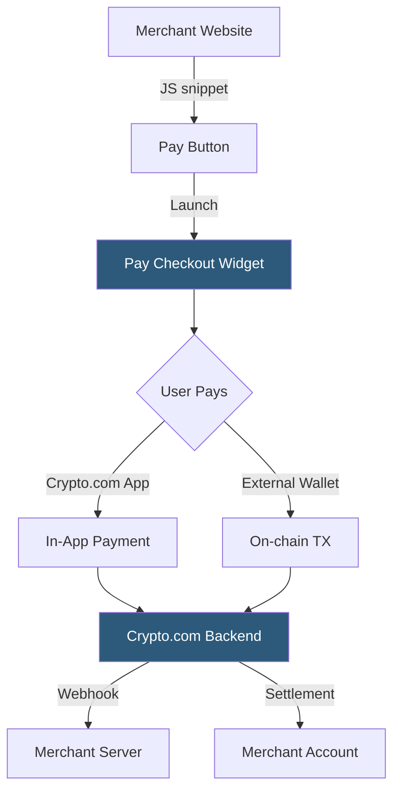

**Category:** Cryptocurrency & Web3 Payments
**Difficulty:** Intermediate
**Reading time:** 5 min read

---

Crypto.com Pay is a payment gateway integrated into the Crypto.com ecosystem, allowing merchants to accept over 20 cryptocurrencies with settlement options in crypto or fiat. It leverages the Crypto.com App's large user base and offers cashback incentives in CRO tokens to drive adoption.

- **CRO token** — Crypto.com's native utility token used for cashback and fee discounts
- **Pay Checkout** — hosted or embeddable payment widget supporting multiple coins
- **Settlement currency** — merchant's chosen settlement asset (fiat or crypto)
- **CRO cashback** — buyer reward mechanism that incentivizes Crypto.com Pay over alternatives
- **Merchant Portal** — dashboard for transaction history, refunds, and API key management
- **Pay Button** — JavaScript snippet for embedding on any web page
- **Webhook notification** — HTTP POST on payment status changes

Merchants register a business account on the Crypto.com Merchant Portal and obtain API keys. Integration is accomplished via a JavaScript Pay Button snippet or a server-side API call to create a payment order. Each order specifies the fiat amount, currency, and a callback URL; Crypto.com calculates the equivalent crypto amount at current rates.

When a customer clicks Pay, the widget presents a QR code and deep-link for the Crypto.com App or any compatible wallet. If the customer pays through the Crypto.com App, the transaction settles instantly within the platform's internal ledger. For external wallet payments, the standard on-chain confirmation process applies.

On payment confirmation, Crypto.com fires a webhook to the merchant's server with a cryptographically signed payload. Merchants can verify the signature and proceed with order fulfillment. Settlement occurs in the merchant's configured currency — fiat settlements hit linked bank accounts on a rolling basis, while crypto settlements are available in the Merchant Portal for withdrawal. The CRO cashback program rewards buyers with a percentage of their transaction value in CRO, which reduces friction for customers already holding Crypto.com assets.

- E-commerce stores targeting the Crypto.com App's user base
- Gaming and digital goods platforms offering CRO cashback as a feature
- Subscription services accepting recurring crypto payments
- Travel booking platforms targeting crypto-wealthy travelers
- Merchandise stores for crypto-native brands and projects

| Advantage | Disadvantage |
|-----------|--------------|
| Access to Crypto.com's large user base | Ecosystem lock-in with CRO incentives |
| CRO cashback drives buyer conversion | Less widely recognized than Coinbase Commerce |
| Broad coin support (20+) | Requires Crypto.com business account verification |
| Simple Pay Button embed | On-chain payments still subject to network delays |
| Fiat or crypto settlement options | CRO token value adds complexity to accounting |

- [Coinbase Commerce Integration](coinbase-commerce-integration.md)
- [Binance Pay Integration](binance-pay-integration.md)
- [Stablecoin Payments (USDC, USDT)](stablecoin-payments-usdc-usdt.md)

---
*Part of the [Cryptocurrency & Web3 Payments](index.md) category · [Back to Master Index](../../index.md)*
