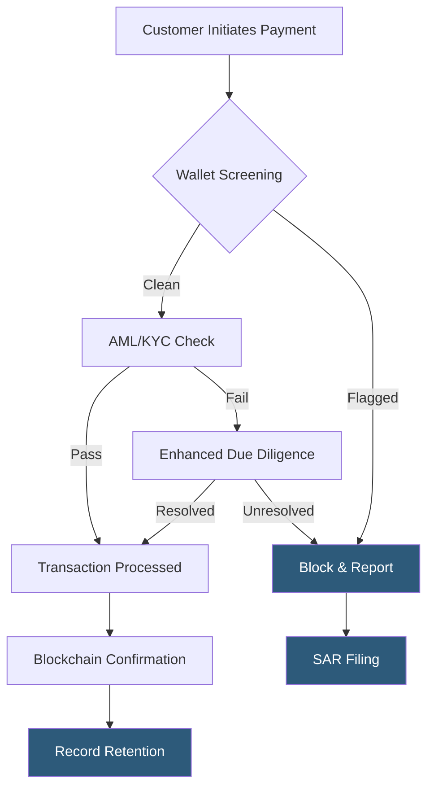

**Category:** Cryptocurrency & Web3 Payments
**Difficulty:** Advanced
**Reading time:** 6 min read

---

Crypto payment compliance encompasses the legal and regulatory obligations merchants and processors must satisfy when accepting digital asset payments. It spans anti-money laundering (AML), counter-terrorist financing (CTF), and data privacy frameworks that apply regardless of the underlying blockchain. Staying compliant protects businesses from enforcement actions and enables integration with traditional banking rails.

- **VASP (Virtual Asset Service Provider)** — FATF designation for businesses that exchange, transfer, or custody virtual assets; triggers AML obligations
- **Travel Rule** — FATF Recommendation 16 requiring originators and beneficiaries of crypto transfers above a threshold to share identifying information
- **FinCEN** — U.S. Financial Crimes Enforcement Network; MSBs accepting crypto must register and file SARs
- **AMLD5/6** — EU Anti-Money Laundering Directives that brought crypto exchanges under AML supervision
- **MiCA** — EU Markets in Crypto-Assets Regulation; comprehensive licensing framework for crypto-asset service providers from 2024
- **Sanctions screening** — real-time checking of wallet addresses against OFAC/SDN lists before processing transactions
- **SAR (Suspicious Activity Report)** — mandatory filing with FinCEN when suspicious transactions are detected
- **Choke points** — on/off ramps (exchanges, payment processors) where compliance controls are most effective

Crypto payment compliance operates across three layers: customer identity, transaction monitoring, and reporting.

At the customer layer, merchants must implement Know Your Customer (KYC) procedures for transactions above jurisdictional thresholds—typically $1,000–$3,000 in the U.S. This involves collecting government-issued ID, proof of address, and in high-risk cases, source-of-funds documentation. Identity verification is typically automated through providers like Jumio, Onfido, or Persona.

At the transaction layer, each payment is screened before and after settlement. Wallet addresses are checked against blockchain analytics databases (Chainalysis, Elliptic, TRM Labs) that score addresses based on their transaction history and known associations with illicit activity. Transactions linked to darknet markets, mixers, or sanctioned entities are blocked automatically. The FATF Travel Rule requires that transfers above $1,000 (U.S.) or €1,000 (EU) include originator and beneficiary information transmitted to the counterparty VASP.

At the reporting layer, businesses must file Currency Transaction Reports (CTRs) for cash-equivalent transactions above $10,000 and Suspicious Activity Reports (SARs) for suspicious patterns regardless of amount. Records must typically be retained for five years. MiCA in the EU adds passporting rights for licensed CASPs but requires robust governance frameworks including conflict-of-interest policies and capital reserves.

- E-commerce platforms accepting Bitcoin or stablecoins from global customers
- Crypto payment processors building compliance into their hosted checkout flows
- NFT marketplaces implementing AML controls to avoid VASP designation
- DeFi protocols evaluating front-end-level sanctions screening obligations
- Fintech companies building crypto on/off ramps with full KYC/AML stacks

| Advantage | Disadvantage |
|-----------|--------------|
| Enables banking partnerships and institutional adoption | Increases onboarding friction, reducing conversion rates |
| Protects against enforcement actions and license revocations | Compliance tooling (Chainalysis etc.) adds significant per-transaction cost |
| Builds customer trust through transparent privacy practices | Rules vary by jurisdiction, requiring multi-framework compliance programs |
| Automated screening catches illicit flows at scale | Pseudonymous nature of blockchain creates attribution challenges |

- [AML/KYC for Crypto Payments](aml-kyc-for-crypto-payments.md)
- [Blockchain Payment Auditing](blockchain-payment-auditing.md)
- [Crypto Tax Reporting](crypto-tax-reporting.md)

---
*Part of the [Cryptocurrency & Web3 Payments](index.md) category · [Back to Master Index](../../index.md)*
