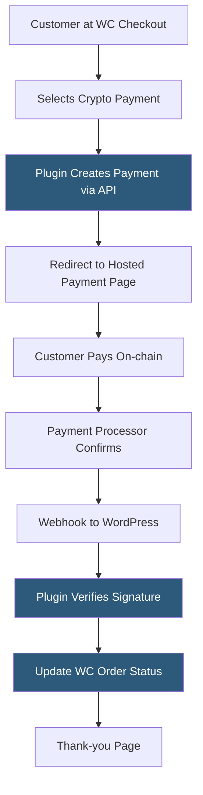

**Category:** Cryptocurrency & Web3 Payments
**Difficulty:** Beginner
**Reading time:** 5 min read

---

Crypto payment plugins for WooCommerce integrate established payment gateways like Coinbase Commerce, BitPay, BTCPay, and NOWPayments directly into the WordPress checkout flow, enabling crypto acceptance without custom development by extending WooCommerce's payment gateway API.

- **WooCommerce payment gateway** — PHP class extending `WC_Payment_Gateway` that registers in checkout
- **Order status** — WooCommerce state machine: pending → processing → completed; plugins update this via webhooks
- **IPN verification** — plugin middleware that validates incoming webhook signatures before changing order status
- **Thank-you page** — WooCommerce redirect after payment; plugins customize this for blockchain confirmation messaging
- **Plugin dependencies** — most crypto plugins require WooCommerce 5.x+ and PHP 7.4+
- **Webhook endpoint** — WordPress route registered by the plugin to receive payment processor callbacks
- **Auto-complete** — plugin setting to automatically mark orders complete upon payment confirmation

WooCommerce crypto plugins register as standard payment gateways by defining a class that extends `WC_Payment_Gateway`. The plugin's `process_payment()` method fires when the customer submits the checkout form: it calls the payment processor's API (Coinbase Commerce, BitPay, NOWPayments, etc.) to create a charge or invoice, then returns a redirect response pointing the customer to the hosted payment page.

While the customer completes the crypto payment, the processor's backend monitors the blockchain. On payment events, the processor calls the webhook endpoint registered by the plugin (typically `/?wc-api=plugin_name`). WordPress routes this request to the plugin's `webhook_callback()` method, which verifies the request signature against the shared secret and updates the WooCommerce order status accordingly.

Popular plugins include:
- **Coinbase Commerce for WooCommerce** — official plugin, supports ETH, BTC, USDC
- **BTCPay for WooCommerce** — official plugin; requires self-hosted BTCPay instance; zero fees
- **NOWPayments for WooCommerce** — 200+ coins; non-custodial
- **CoinGate for WooCommerce** — Lightning Network support built-in

Plugin settings panels expose API keys, webhook secrets, confirmation thresholds, settlement currency, and whether to auto-complete orders. Most plugins log IPN events to WooCommerce's order notes for debugging. Testing is done against processor sandbox/testnet environments before going live.

- WordPress e-commerce stores adding crypto as a checkout option
- Digital download shops accepting Bitcoin or Ethereum payments
- Membership sites gating content behind crypto payments
- Print-on-demand stores serving crypto-native customers
- Subscription box services accepting stablecoin recurring payments

| Advantage | Disadvantage |
|-----------|--------------|
| Zero custom code — install and configure | Plugin quality varies; some are poorly maintained |
| Official plugins for all major processors | Conflicts possible with other WooCommerce extensions |
| Same checkout UX as card payments | Processor dependency; outages affect checkout |
| Webhook logging aids debugging | PHP timeouts can miss webhook deliveries |
| Free plugins for most processors | Transaction fees still apply from processors |

- [Coinbase Commerce Integration](coinbase-commerce-integration.md)
- [BTCPay Server Self-Hosted](btcpay-server-self-hosted.md)
- [NOWPayments Crypto Processor](nowpayments-crypto-processor.md)

---
*Part of the [Cryptocurrency & Web3 Payments](index.md) category · [Back to Master Index](../../index.md)*
