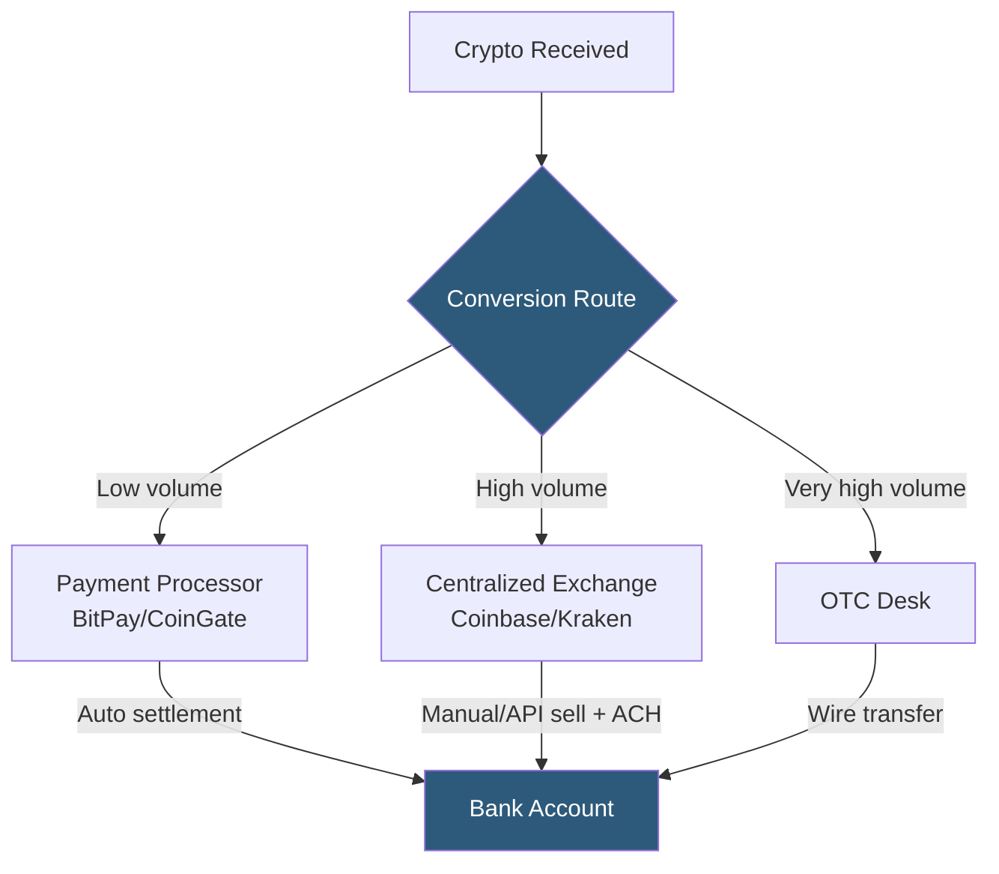

**Category:** Cryptocurrency & Web3 Payments
**Difficulty:** Intermediate
**Reading time:** 6 min read

---

Crypto-to-fiat conversion is the process of exchanging cryptocurrency for traditional currency (USD, EUR, etc.) via exchanges, payment processors, or OTC desks, and delivering those funds to a bank account. The method chosen affects speed, fees, rates, and regulatory compliance requirements.

- **Off-ramp** — service converting crypto to fiat and depositing to bank (opposite of on-ramp)
- **Exchange withdrawal** — selling crypto on a centralized exchange and withdrawing fiat via ACH/wire
- **Processor settlement** — payment processor (BitPay, CoinGate) automatically converts and settles on schedule
- **OTC desk** — over-the-counter broker for large conversions (typically $50K+) with negotiated rates
- **ACH transfer** — US domestic bank transfer settling in 1–3 business days; common for exchange withdrawals
- **SEPA transfer** — European equivalent of ACH for EUR-denominated settlements
- **Spread** — implicit cost in bid/ask difference; distinct from explicit trading fee
- **KYC tier** — identity verification level at the exchange determining withdrawal limits

The most hands-off conversion path uses payment processors with built-in settlement: BitPay and CoinGate accept crypto, convert immediately at spot minus spread, and transfer accumulated fiat to the merchant's bank account on a daily or weekly basis. This requires no exchange account, but the processor's spread (0.5–1%) is the effective conversion cost.

For merchants with higher volumes or who want more control over conversion timing, exchange-based conversion is preferable. Crypto is transferred to a Coinbase, Kraken, or Binance account (each requiring KYC verification). Sell orders are placed via the exchange UI or API, converting crypto to USD/EUR at market price. Fiat is then withdrawn via ACH (Coinbase uses ACH for US accounts) or SEPA, arriving in 1–3 business days. Exchange trading fees range from 0.05–0.25% for market orders vs. processor spreads of 0.5–1%, making exchanges more economical at scale.

OTC desks (Genesis, Cumberland, Wintermute) serve institutional volumes. They provide quoted rates for specific trade sizes, avoiding the market impact of large orders moving exchange prices. Trades settle same-day or next-day via wire transfer. OTC relationships typically require AML due diligence and minimum trade sizes.

Tax timing matters: in most jurisdictions, conversion to fiat is a taxable disposal event with gain or loss calculated from the cost basis (the value at time of receipt). Automated export of trade history from exchanges to tax software (Koinly, CoinTracker) is essential for compliance.

- Merchants converting crypto payments to operational fiat currency
- Remote workers receiving crypto salaries and needing local currency
- DAOs converting treasury crypto to fund fiat-denominated operations
- DeFi protocols converting protocol fee income to stablecoins
- Individuals rebalancing crypto portfolios into cash positions

| Advantage | Disadvantage |
|-----------|--------------|
| Processor settlement is fully automated | Processor spreads are higher than exchange fees |
| Exchange conversion offers better rates at scale | Exchange KYC and withdrawal limits can be restrictive |
| OTC desks minimize market impact for large trades | OTC requires institutional relationships and AML process |
| Stablecoin intermediate step avoids price risk | ACH/SEPA delays mean 1–3 days to receive fiat |
| API automation enables systematic DCA selling | Taxable event at each conversion step |

- [Cryptocurrency Price Volatility Handling](cryptocurrency-price-volatility-handling.md)
- [Crypto Tax Reporting](crypto-tax-reporting.md)
- [Crypto Payment Compliance](crypto-payment-compliance.md)

---
*Part of the [Cryptocurrency & Web3 Payments](index.md) category · [Back to Master Index](../../index.md)*
