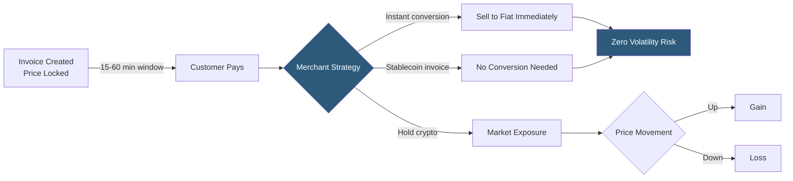

**Category:** Cryptocurrency & Web3 Payments
**Difficulty:** Intermediate
**Reading time:** 6 min read

---

Price volatility is the primary operational risk for merchants accepting cryptocurrency payments. Effective handling strategies include rate locking during checkout, instant conversion to stablecoins or fiat, using stablecoin-denominated invoices, and hedging excess crypto exposure through exchange sell orders.

- **Rate lock window** — the period (typically 10–60 minutes) during which the quoted crypto amount is guaranteed
- **Instant conversion** — selling received crypto to fiat immediately via a payment processor or exchange API
- **Stablecoin invoicing** — denominating and accepting payment in USDC/DAI, bypassing volatility entirely
- **Spread** — difference between buy and sell price a processor charges when converting crypto to fiat
- **Over-the-counter (OTC)** — large-volume crypto sales executed outside exchange order books to minimize market impact
- **DCA sell (Dollar Cost Average selling)** — automatically selling a fixed dollar amount of crypto at regular intervals
- **Hedging** — taking an offsetting position (e.g., short perpetual futures) to neutralize price exposure

The first line of defense is rate locking: when an invoice is created, the crypto equivalent of the fiat price is calculated at the current rate and locked for a short window. Coinbase Commerce locks for 60 minutes; BitPay for 15 minutes. If payment arrives within the window, the merchant receives the quoted fiat value regardless of subsequent price moves. Expiry means the customer must request a new invoice at the current rate.

For merchants wanting zero exposure, instant conversion is offered by BitPay, Coinbase Commerce, and CoinGate: received crypto is immediately sold on the processor's internal exchange, and fiat is credited to the merchant's account. The processor absorbs the conversion spread (typically 0.5–1%), which is the merchant's cost for volatility elimination.

Stablecoin invoicing is the cleanest solution: if the merchant denominated all prices in USDC and only accepted USDC, no conversion is ever needed. The limitation is customer friction — many crypto users prefer to pay in BTC or ETH.

For merchants holding crypto on their balance sheet, hedging via perpetual futures on FTX's successor exchanges or delta-neutral strategies neutralizes price risk while retaining the crypto for strategic reasons. Exchange API integrations can automate DCA sell orders that gradually convert holdings to fiat on a schedule, reducing the psychological and operational burden of manual selling.

Tax treatment is affected by conversion timing — in most jurisdictions, receiving crypto creates a taxable event at the spot price, and converting to fiat at a different price creates a second event.

- E-commerce stores accepting BTC/ETH without crypto treasury management experience
- High-volume merchants needing predictable fiat revenue
- B2B invoicing where crypto payment is offered but fiat budgeting is required
- Payroll processors receiving crypto and disbursing fiat salaries
- Token-based businesses managing treasury price exposure

| Advantage | Disadvantage |
|-----------|--------------|
| Instant conversion provides guaranteed fiat revenue | Spread cost (0.5–1%) reduces effective margin |
| Stablecoin invoicing eliminates conversion entirely | Reduces customer payment coin flexibility |
| Rate locking provides predictable invoice value | Short windows create UX pressure on customers |
| DCA hedging automates ongoing exposure management | Hedging via futures requires exchange account and maintenance |
| Processor-managed conversion simplifies operations | Custodial processors introduce counterparty risk |

- [Crypto-to-Fiat Conversion](crypto-to-fiat-conversion.md)
- [Stablecoin Payments (USDC, USDT)](stablecoin-payments-usdc-usdt.md)
- [Crypto Tax Reporting](crypto-tax-reporting.md)

---
*Part of the [Cryptocurrency & Web3 Payments](index.md) category · [Back to Master Index](../../index.md)*
