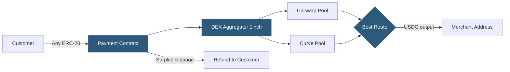

**Category:** Cryptocurrency & Web3 Payments
**Difficulty:** Advanced
**Reading time:** 7 min read

---

DeFi payment integration connects applications to decentralized finance protocols — enabling token swaps, yield-bearing payment routing, and automated market maker liquidity — allowing merchants to accept any token and receive any token by routing payments through on-chain liquidity pools.

- **AMM (Automated Market Maker)** — smart contract pool (Uniswap, Curve) providing token swap liquidity via mathematical pricing formula
- **Swap-to-settle** — customer pays in Token A, Uniswap swaps it to Token B (e.g., USDC) before delivering to merchant
- **Slippage** — difference between quoted and executed swap price due to liquidity depth
- **DEX aggregator** — service (1inch, Paraswap) routing swaps across multiple pools for best price
- **Flash loan** — uncollateralized loan within a single transaction block; repaid before block ends
- **Liquidity pool** — smart contract holding two token reserves; traders swap against it and pay LP fees
- **Price oracle** — on-chain price feed (Chainlink, Uniswap TWAP) providing reliable token valuations

DeFi payment integration typically implements a "pay with any token, settle in any token" pattern. A custom smart contract receives the customer's payment token, immediately routes it through a DEX aggregator like 1inch to find the best swap path, executes the swap against on-chain liquidity pools, and delivers the output token (usually USDC or ETH) to the merchant — all within a single transaction.

The payment contract uses the aggregator's API to pre-compute the swap route and expected output off-chain, then passes the route data as calldata. Slippage tolerance (typically 0.5–1%) is set by the contract; if the actual received amount falls below `expectedOutput * (1 - slippage)`, the transaction reverts, protecting both parties.

Price validation uses Chainlink's decentralized oracle network or Uniswap's TWAP (time-weighted average price) to verify that the swap rate is within acceptable bounds relative to market price, preventing oracle manipulation attacks.

For yield-routing, incoming payments can be deposited into Aave or Compound before the merchant withdraws — earning yield on pending settlements. This is complex to implement safely but enables passive yield on float.

Flash loans provide advanced payment mechanics: a single transaction can borrow assets, execute complex multi-step payment logic, and repay within the block. This enables atomic arbitrage-funded payments and complex treasury operations.

Gas optimization is critical: DeFi payment contracts should use EIP-2612 permit signatures (avoiding separate approval transactions), optimize calldata encoding, and consider batching multiple payments via ERC-4337 account abstraction.

- Protocols enabling any-token checkout (pay with SHIB, receive USDC)
- DAO treasury automation routing protocol fees to yield protocols
- Cross-chain payment routing via bridge + swap combinations
- Yield-optimized payment processing for high-volume platforms
- Automated payroll systems converting ETH to stablecoins before disbursement

| Advantage | Disadvantage |
|-----------|--------------|
| Accept any token without manual configuration | Higher gas costs due to swap overhead |
| Swap-to-settle eliminates merchant volatility | Slippage introduces price uncertainty |
| On-chain, auditable payment logic | Smart contract complexity increases attack surface |
| Composable with yield protocols | DEX liquidity can be insufficient for large trades |
| No intermediary or centralized exchange needed | Requires MEV protection (private mempool) for large swaps |

- [Smart Contract Payment Automation](smart-contract-payment-automation.md)
- [Layer 2 Scaling for Payments](layer-2-scaling-for-payments.md)
- [Gas Fee Management](gas-fee-management.md)

---
*Part of the [Cryptocurrency & Web3 Payments](index.md) category · [Back to Master Index](../../index.md)*
