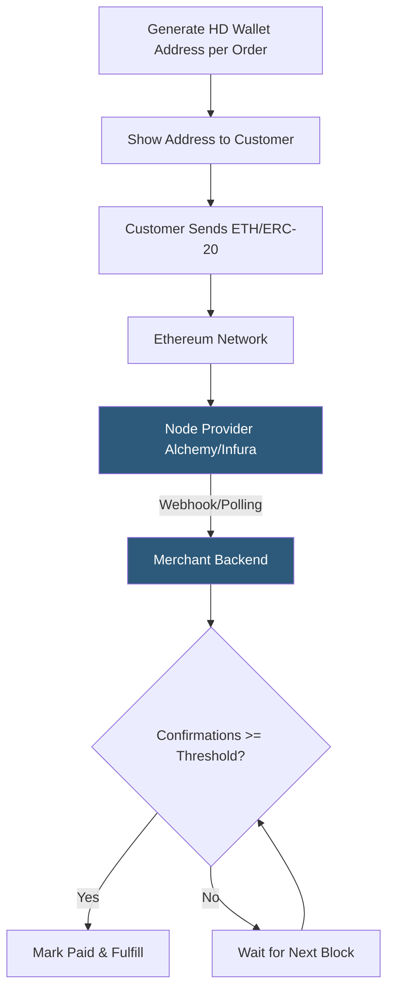

**Category:** Cryptocurrency & Web3 Payments
**Difficulty:** Intermediate
**Reading time:** 6 min read

---

Integrating Ethereum payments involves detecting on-chain ETH or ERC-20 token transfers to merchant addresses, managing confirmation thresholds, and handling the complexities of gas fees and transaction finality. Direct integration bypasses processors but requires managing wallet infrastructure and blockchain monitoring.

- **ERC-20** — token standard on Ethereum; includes USDC, USDT, DAI, and thousands of other fungible tokens
- **Gas** — computational fee paid in ETH for any Ethereum transaction
- **Finality** — probabilistic on Ethereum PoS; 2 epochs (~12 min) for economic finality, 1 confirmation (~12 sec) for most commerce
- **Web3.js / ethers.js** — JavaScript libraries for interacting with Ethereum nodes
- **Event log** — Ethereum's mechanism for emitting on-chain events; ERC-20 transfers emit a `Transfer(from, to, amount)` log
- **HD wallet** — hierarchical deterministic wallet generating unique addresses per customer from a single seed
- **Alchemy / Infura** — managed Ethereum node providers used in lieu of running a full node

Direct Ethereum payment integration starts with HD wallet derivation (BIP-44 path `m/44'/60'/0'/0/n`) to generate a unique deposit address per order from a single master seed. This allows the backend to deterministically derive which address corresponds to which order without storing individual private keys.

Transaction monitoring is typically delegated to managed node providers (Alchemy, Infura, QuickNode) via their webhook services or WebSocket subscriptions to `eth_subscribe('newHeads')` or `eth_subscribe('logs')`. When a payment arrives, the provider fires a webhook with the transaction details. For ERC-20 tokens, the system monitors `Transfer` event logs filtered by the `to` address and the token contract address.

Confirmation requirements depend on transaction value: 1 confirmation (~12 seconds on Ethereum PoS) is sufficient for small amounts; 6–20 confirmations for medium values; full economic finality (2 epochs, ~12 minutes) for high-value transactions. The `eth_getTransactionReceipt` endpoint returns receipt status and block number for confirmation calculation.

Amount validation must account for ERC-20 token decimals (USDC uses 6 decimals, DAI uses 18) when comparing received amounts against expected values. Gas fees are paid by the customer; merchants receive the net amount. For ETH denominated invoices, exchange rate volatility between order creation and payment requires either short expiry windows or stablecoin-denominated pricing.

- DeFi-native applications accepting ETH and ERC-20 tokens natively
- NFT marketplace payment flows for primary sales
- DAO treasury management accepting ETH contributions
- Platforms accepting USDC/DAI for stablecoin-denominated pricing
- Web3 SaaS tools monetizing via on-chain subscriptions

| Advantage | Disadvantage |
|-----------|--------------|
| No third-party payment processor dependency | Gas fee variability affects customer UX |
| Accept any ERC-20 token without configuration | 12-second block times limit real-time confirmation |
| Full control over funds and settlement | Requires managed node or full node infrastructure |
| Smart contract automation possible | ETH price volatility if not using stablecoins |
| Large user base with MetaMask/wallets | Higher dev complexity vs. hosted processors |

- [Stablecoin Payments (USDC, USDT)](stablecoin-payments-usdc-usdt.md)
- [Web3 Wallet Connection (MetaMask)](web3-wallet-connection-metamask.md)
- [Gas Fee Management](gas-fee-management.md)

---
*Part of the [Cryptocurrency & Web3 Payments](index.md) category · [Back to Master Index](../../index.md)*
