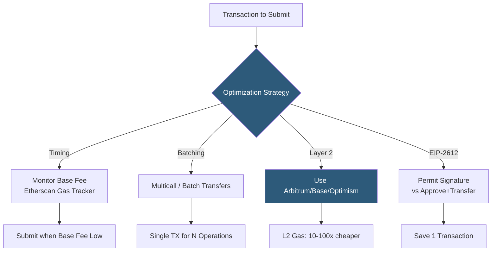

**Category:** Cryptocurrency & Web3 Payments
**Difficulty:** Intermediate
**Reading time:** 6 min read

---

Gas fees are the computational cost of Ethereum transactions, denominated in gwei (10^-9 ETH). Effective gas management involves monitoring base fee trends, using EIP-1559 fee estimation, batching transactions, and choosing optimal timing to minimize costs for both merchants and users.

- **Gas limit** — maximum computational units a transaction may consume; set by the sender
- **Base fee** — protocol-determined fee per gas unit that is burned; adjusts ±12.5% per block based on demand
- **Priority fee (tip)** — additional fee paid directly to validators to incentivize transaction inclusion
- **Max fee** — sender's ceiling: `base fee + priority fee`; excess refunded
- **EIP-1559** — Ethereum upgrade (London fork) replacing fixed gas price with base fee + tip model
- **Gas estimation** — `eth_estimateGas` RPC call returning expected gas units for a transaction
- **Multicall** — batching multiple contract reads or writes into a single transaction to amortize gas cost
- **EIP-2612 permit** — gasless ERC-20 approval via signed message; eliminates separate approve transaction

Under EIP-1559, each Ethereum block has a target gas usage (15M gas). If the previous block used more than the target, the base fee increases by up to 12.5%; if less, it decreases. This makes base fee somewhat predictable short-term. The base fee is burned (removed from supply), while the priority fee goes to validators.

For timing-based optimization, gas prices follow diurnal patterns: US/European market hours drive highest demand; late night UTC (off-peak in all major time zones) sees base fees 30–70% lower. Tools like ETH Gas Station, Blocknative, and Alchemy's Gas Manager API provide historical and real-time base fee data.

For contract interaction optimization, Multicall3 (deployed on most EVM chains) allows batching multiple `eth_call` reads into a single RPC request and multiple `eth_sendTransaction` writes into a single transaction. Batch transfer contracts (like Disperse.app for ETH/ERC-20 distributions) amortize fixed per-transaction costs across many recipients.

EIP-2612 permit signatures eliminate the separate `approve` transaction required before `transferFrom`. Users sign an off-chain EIP-712 typed message authorizing spend; the permit signature is passed alongside the actual transfer calldata, combining two transactions into one. USDC and DAI support this standard.

Layer 2 networks are the most impactful gas optimization: Arbitrum, Base, Optimism, and Polygon offer 10–100x lower fees than Ethereum mainnet by batching execution off-chain and posting compressed data to L1.

For users, wallet EIP-1559 fee estimation (ethers.js `getFeeData()`, MetaMask's fee market API) automatically sets competitive fees without overpaying.

- DeFi protocols optimizing treasury management transaction costs
- NFT minting contracts batching reveals and distributions
- Payment processors minimizing sweep transaction costs
- Token distribution contracts using Multicall for airdrops
- B2B payment platforms timing settlement during low-fee periods

| Advantage | Disadvantage |
|-----------|--------------|
| EIP-1559 makes fees more predictable | Base fee can spike 10x during demand surges |
| Layer 2 reduces fees by 10–100x | L2 adds complexity and withdrawal delays |
| Batching amortizes fixed costs efficiently | Multicall reverts if any sub-call fails |
| EIP-2612 permit saves one approval transaction | Not all tokens implement EIP-2612 |
| Gas monitoring enables cost savings via timing | Off-peak windows may not align with operational needs |

- [Ethereum Payment Integration](ethereum-payment-integration.md)
- [Layer 2 Scaling for Payments](layer-2-scaling-for-payments.md)
- [On-Chain vs Off-Chain Payments](on-chain-vs-off-chain-payments.md)

---
*Part of the [Cryptocurrency & Web3 Payments](index.md) category · [Back to Master Index](../../index.md)*
