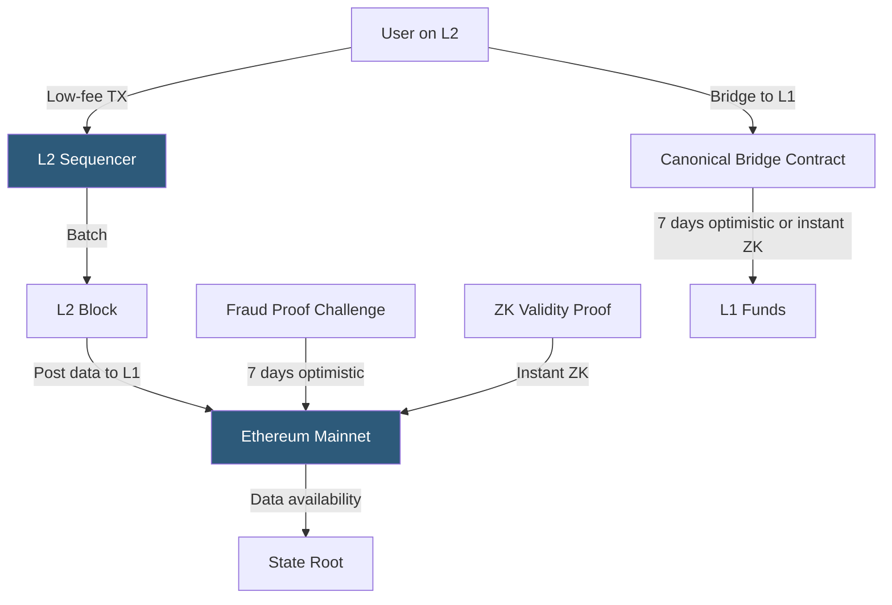

**Category:** Cryptocurrency & Web3 Payments
**Difficulty:** Advanced
**Reading time:** 7 min read

---

Layer 2 (L2) networks are payment and execution layers built on top of Ethereum that achieve 10–1000x lower transaction costs and higher throughput by processing transactions off the main chain while inheriting Ethereum's security through periodic on-chain data posting or cryptographic proofs.

- **Optimistic rollup** — executes transactions off-chain; posts transaction data to L1; assumes validity unless challenged within a fraud-proof window (Arbitrum, Optimism, Base)
- **ZK rollup** — executes off-chain and posts cryptographic validity proofs (ZK-SNARKs/STARKs) to L1; no challenge period (zkSync Era, Starknet, Polygon zkEVM)
- **Sequencer** — centralized (currently) node that orders and batches L2 transactions before submitting to L1
- **Canonical bridge** — official protocol bridge for moving assets between L1 and L2
- **Challenge period** — 7-day window for optimistic rollup fraud proofs; delays L2→L1 withdrawals
- **Data availability** — requirement that L2 transaction data be available on-chain so anyone can reconstruct state
- **EIP-4844 (blob transactions)** — Ethereum upgrade dramatically reducing rollup data costs via temporary blob storage

Rollup networks execute transactions in their own EVM-compatible environment, typically with block times of 250ms–2 seconds. Transaction fees on rollups are paid in ETH but calculated based on L2 execution costs plus a fraction of the L1 data posting cost. EIP-4844 "blobs" (introduced in the Dencun upgrade, March 2024) reduced rollup data posting costs by 10–100x, pushing base fees on Arbitrum and Base to fractions of a cent.

Optimistic rollups (Arbitrum One, Optimism, Base) work by publishing transaction data to Ethereum without proof of validity. A 7-day challenge window allows fraud proofs to be submitted if invalid state transitions are detected. This means deposits to L2 are fast (minutes), but withdrawals back to L1 are delayed 7 days unless the user uses a third-party bridge that provides liquidity (Hop Protocol, Across) in exchange for a fee.

ZK rollups (zkSync Era, Starknet, Polygon zkEVM) generate validity proofs (ZK-SNARKs or STARKs) for each batch, which are verified on L1. Withdrawals are finalized as soon as the proof is posted and verified on L1, typically within minutes to hours. The tradeoff is computational overhead for proof generation, which is decreasing rapidly with better hardware and algorithms.

For payment applications, L2s are selected based on ecosystem (Base for Coinbase integration, Arbitrum for DeFi), fee levels, and withdrawal requirements. Bridges introduce smart contract risk; canonical bridges are more secure but slower. Cross-L2 payments require going through L1 or using specialized cross-chain messaging (LayerZero, Wormhole).

- Micropayment platforms where Ethereum mainnet fees would exceed transaction value
- High-frequency trading and DeFi applications needing fast block times
- Gaming payments requiring sub-second UX with blockchain settlement
- NFT minting platforms reducing gas cost per mint from $5 to $0.05
- Stablecoin payment networks using USDC natively on Base or Arbitrum

| Advantage | Disadvantage |
|-----------|--------------|
| 10–1000x lower fees than Ethereum mainnet | Centralized sequencer (currently) is a trust assumption |
| EVM-compatible; existing contracts deploy unchanged | Optimistic rollup 7-day withdrawal delay |
| Inherits Ethereum security via L1 posting | Bridge smart contracts are high-value attack targets |
| ZK rollups achieve near-instant finality | ZK proof generation adds latency and computational cost |
| EIP-4844 blobs further reduce costs dramatically | Cross-L2 payments require bridging through L1 or third-party |

- [Gas Fee Management](gas-fee-management.md)
- [On-Chain vs Off-Chain Payments](on-chain-vs-off-chain-payments.md)
- [Polygon Payment Integration](polygon-payment-integration.md)

---
*Part of the [Cryptocurrency & Web3 Payments](index.md) category · [Back to Master Index](../../index.md)*
