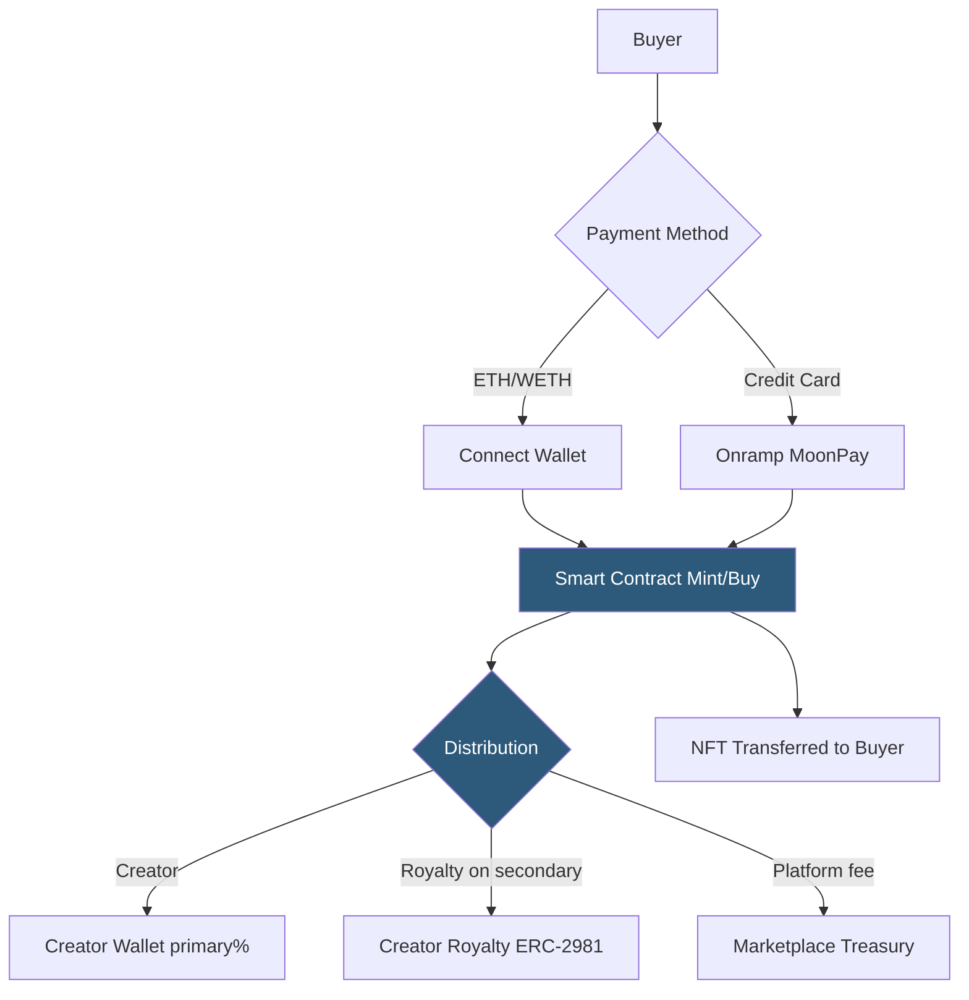

**Category:** Cryptocurrency & Web3 Payments
**Difficulty:** Advanced
**Reading time:** 7 min read

---

NFT marketplace payment systems combine on-chain token transfers with smart contract escrow for primary sales and royalty enforcement, supporting ETH, wrapped ETH (WETH), ERC-20 tokens, and credit card onramps. Protocols like Seaport (OpenSea) define standardized order schemas for decentralized trading.

- **Seaport** — open-source NFT marketplace protocol by OpenSea; defines order structs and fulfillment logic
- **WETH (Wrapped ETH)** — ERC-20 version of ETH enabling approvals for smart contract pulls in offers
- **Royalty** — percentage of secondary sale proceeds directed to original creator; ERC-2981 standardizes on-chain royalty info
- **ERC-2981** — NFT royalty standard; `royaltyInfo(tokenId, salePrice)` returns receiver and amount
- **Lazy minting** — NFT minted on-chain only when purchased, deferring gas costs to buyers
- **Onramp** — service converting credit/debit card payments to crypto for NFT purchase (MoonPay, Coinbase Pay)
- **Aggregate marketplace** — platform (Blur, Gem) that aggregates listings from multiple marketplaces

Primary NFT sales use a minting contract where buyers call a `mint()` function, sending ETH value with the transaction. The contract validates payment, mints the token to the buyer's address, and distributes proceeds. The contract owner configures price, supply cap, and wallet allowances. For ERC-20 payment, buyers first approve the contract to pull tokens, then call the mint function.

Secondary sales use an order-book or AMM model. Seaport's order protocol allows sellers to sign off-chain typed data (EIP-712) describing their offer — token ID, price, accepted payment token, expiry. Buyers fulfill orders by submitting the signed order and payment to Seaport's on-chain contract, which atomically transfers the NFT to the buyer and ETH/WETH to the seller, collecting platform fees and enforcing royalties.

WETH is required for "offers" (bids): since smart contracts cannot pull native ETH without the user calling them, bidders wrap ETH into WETH ERC-20 and approve the marketplace contract to pull it. Sellers can accept outstanding offers without waiting for buyers to be online.

Royalties are either enforced by marketplace smart contract code (checking ERC-2981 before settlement) or enforced by operator filter registries. Post-2023, royalty enforcement has become contested — Blur popularized optional royalties; creator-enforced mechanisms via `transferFrom` overrides have emerged as a counter-strategy.

Credit card onramps (MoonPay, Transak, Coinbase Pay) accept card payments and deliver ETH or specific NFTs directly, abstracting wallet setup for new users.

- NFT art platforms with primary drop mechanics and creator royalties
- Gaming item marketplaces with in-game asset trading
- Music NFT platforms distributing royalties to collaborators via splits
- Generative PFP collections with mint pages and secondary trading
- Real-world asset tokenization platforms requiring compliant payment rails

| Advantage | Disadvantage |
|-----------|--------------|
| Atomic swap eliminates counterparty risk | Gas fees on Ethereum mainnet impact small sales |
| ERC-2981 enables creator royalties on-chain | Royalty enforcement is not universally respected |
| Credit card onramps expand buyer accessibility | Onramp services charge 2–4% additional fees |
| WETH enables bid-without-buy mechanics | WETH wrapping adds UX complexity for new users |
| Seaport is open-source and audited | Smart contract vulnerabilities can drain user approvals |

- [Web3 Wallet Connection (MetaMask)](web3-wallet-connection-metamask.md)
- [Smart Contract Payment Automation](smart-contract-payment-automation.md)
- [Gas Fee Management](gas-fee-management.md)

---
*Part of the [Cryptocurrency & Web3 Payments](index.md) category · [Back to Master Index](../../index.md)*
