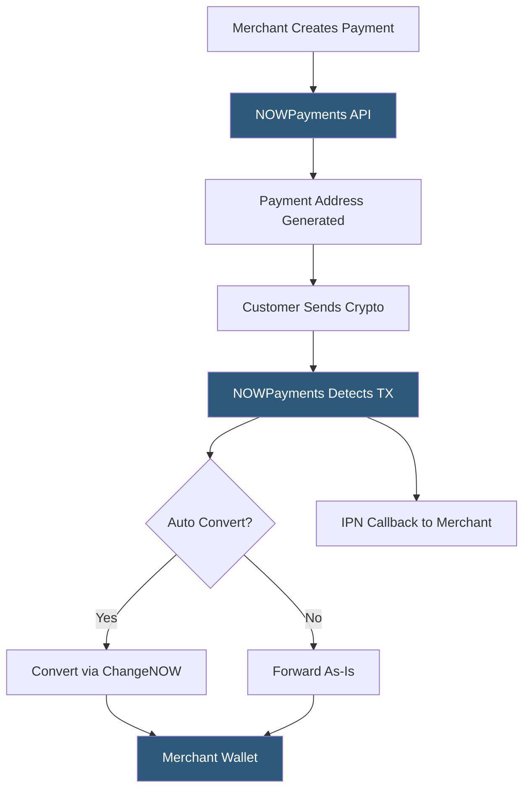

**Category:** Cryptocurrency & Web3 Payments
**Difficulty:** Beginner
**Reading time:** 5 min read

---

NOWPayments is a non-custodial cryptocurrency payment gateway that forwards received crypto directly to the merchant's wallet rather than holding funds, offering integration via API, payment buttons, invoices, and donation widgets across 200+ supported coins.

- **Non-custodial** — funds flow directly to merchant's wallet; NOWPayments never holds crypto
- **Payment** — API object for one-time crypto transaction processing
- **Invoice** — shareable payment link with amount and coin pre-filled
- **Payout** — API endpoint for mass sending of crypto from merchant's account
- **Auto coin conversion** — NOWPayments can receive one coin and forward a different coin
- **IPN (Instant Payment Notification)** — signed callback on payment status changes
- **Donation widget** — embeddable UI for accepting variable-amount crypto donations

NOWPayments operates on a non-custodial model: the merchant provides their own wallet addresses for each coin they accept, and NOWPayments routes incoming payments directly to those addresses after collecting a 0.5% service fee. This means merchants retain custody throughout and are not exposed to exchange counterparty risk.

When a merchant creates a payment via the API, NOWPayments generates a receiving address (or uses a pre-configured merchant address) and returns a payment ID and status URL. The IPN callback delivers payment status updates signed with HMAC-SHA512, which merchants verify before fulfilling orders.

A key feature is auto coin conversion powered by ChangeNOW, NOWPayments' sister exchange service. Merchants can configure receipt in BTC while accepting ETH payments — NOWPayments handles the swap and forwards BTC to the merchant's wallet. This enables merchants to accept 200+ coins while only managing a handful of wallets.

The platform provides embeddable widgets for donations and payments, WooCommerce and Shopify plugins, a hosted invoice page, and a Payout API for bulk disbursements. The sub-0.5% fee and non-custodial model make it particularly attractive for merchants prioritizing self-sovereignty and minimizing counterparty risk.

- Content creators and streamers accepting donations across many coins
- Privacy-focused merchants preferring non-custodial processing
- High-volume platforms needing the 200+ coin breadth
- Nonprofits and charities using donation widgets
- Developers building custom crypto payment flows with the Payout API

| Advantage | Disadvantage |
|-----------|--------------|
| Non-custodial — funds go to merchant wallet | Merchant must manage their own wallet security |
| 200+ supported coins | Auto-conversion introduces spread/slippage |
| Low 0.5% processing fee | IPN can be delayed for slow-confirming coins |
| Donation widget and invoice tools | Brand less recognized than Coinbase/BitPay |
| Mass payout API for disbursements | No built-in fiat settlement |

- [BTCPay Server Self-Hosted](btcpay-server-self-hosted.md)
- [Coinbase Commerce Integration](coinbase-commerce-integration.md)
- [Cryptocurrency Price Volatility Handling](cryptocurrency-price-volatility-handling.md)

---
*Part of the [Cryptocurrency & Web3 Payments](index.md) category · [Back to Master Index](../../index.md)*
