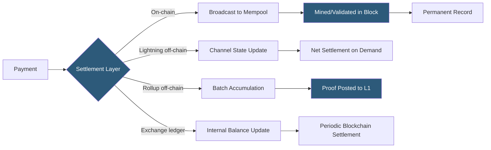

**Category:** Cryptocurrency & Web3 Payments
**Difficulty:** Intermediate
**Reading time:** 6 min read

---

On-chain payments settle directly on a blockchain with full transparency and security guarantees, while off-chain payments route through intermediary systems (Lightning channels, exchange ledgers, Layer 2 rollups) for speed and lower cost, settling to the base chain periodically or on demand.

- **On-chain** — transaction broadcast to the blockchain, included in a block, and permanently recorded
- **Off-chain** — transaction that occurs outside the main blockchain, with only net settlement touching the chain
- **State channel** — off-chain channel where parties exchange signed state updates; only opening and closing transactions are on-chain (Lightning Network)
- **Rollup** — Layer 2 that batches many off-chain transactions and posts a compressed proof or data to the base chain
- **Optimistic rollup** — assumes transactions valid by default; fraud proofs challenge invalid batches (Arbitrum, Optimism)
- **ZK rollup** — uses cryptographic validity proofs (ZKP) to prove off-chain batch correctness (zkSync, Starknet)
- **Custodial off-chain** — exchange internal ledger; fastest but requires trust in the custodian

On-chain payments broadcast a signed transaction to the network's mempool. Validators (or miners in PoW) include it in a block, providing the first confirmation. Subsequent blocks increase settlement finality. On-chain payments are trustless (no counterparty holds funds), transparent (verifiable by anyone), and permanent — but cost gas fees and require waiting for block inclusion.

Off-chain payment channels (Lightning) allow unlimited microtransactions between two parties after an initial on-chain channel opening. Each payment updates a signed commitment transaction held by both parties, without broadcasting to the chain. The channel closes with an on-chain transaction broadcasting the final balance. Routing networks extend this to multi-hop payments without direct channels between all parties.

Rollup-based off-chain payments (Arbitrum, Optimism, Base, zkSync) operate as separate execution environments with their own block times (typically < 1 second), posting transaction data or proofs to Ethereum L1 periodically. Users pay L2 gas (much cheaper than L1) for immediate settlement on the rollup. Withdrawal to L1 takes 7 days for optimistic rollups (challenge period) or minutes for ZK rollups after proof verification.

Exchange-internal off-chain payments (Binance Pay user-to-user) are fastest (milliseconds) but fully custodial — users trust the exchange to maintain accurate balances. Settlement to the blockchain occurs only on deposit/withdrawal.

The choice depends on the trust model required, transaction frequency, value, and user wallet context.

- On-chain for high-value, trustless B2B settlements requiring auditability
- Lightning off-chain for micropayments, tips, and high-frequency retail
- Rollups for DeFi and dApp transactions needing ETH security without L1 fees
- Exchange-internal for trading pairs and peer transfers within the same platform
- Hybrid: accept off-chain for speed, batch settle on-chain at end of day

| Advantage | Disadvantage |
|-----------|--------------|
| On-chain: trustless and permanently verifiable | On-chain: slow, expensive gas fees |
| Lightning: near-zero fees and instant for BTC | Lightning: requires channel liquidity management |
| Rollups: L1 security with L2 cost | Optimistic rollup withdrawal: 7-day delay to L1 |
| Exchange ledger: millisecond settlement | Exchange ledger: custodial counterparty risk |
| Rollups: EVM-compatible, broad tooling support | ZK rollups: proving time and computational overhead |

- [Bitcoin Lightning Network Payments](bitcoin-lightning-network-payments.md)
- [Layer 2 Scaling for Payments](layer-2-scaling-for-payments.md)
- [Gas Fee Management](gas-fee-management.md)

---
*Part of the [Cryptocurrency & Web3 Payments](index.md) category · [Back to Master Index](../../index.md)*
