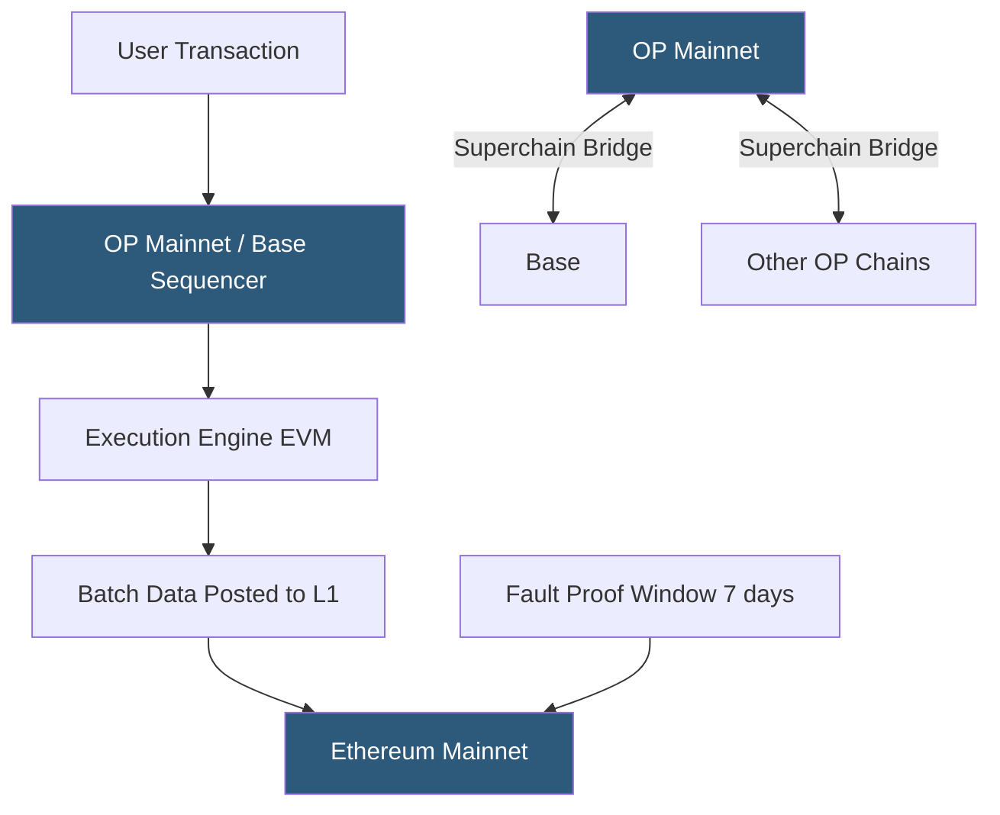

**Category:** Cryptocurrency & Web3 Payments
**Difficulty:** Advanced
**Reading time:** 6 min read

---

Optimism (OP Mainnet) is an optimistic rollup on Ethereum developed by OP Labs, featuring full EVM equivalence and sub-cent transaction fees. The OP Stack — the open-source rollup framework powering Optimism — enables Coinbase's Base network and can be used to launch custom L2 chains, making it a foundational payment infrastructure component.

- **OP Stack** — open-source modular rollup framework; powers Optimism and Base; enables the "Superchain" vision
- **Superchain** — OP Labs' vision for interoperable OP Stack chains sharing security and messaging
- **Bedrock** — Optimism's architecture upgrade that achieved EVM equivalence and reduced fees 40%
- **Fault proofs** — Optimism's fraud-proof system (Stage 1 decentralization achieved 2024) allowing permissionless challenge
- **OP token** — Optimism's governance token; not required for gas (ETH is used for fees)
- **Base** — Coinbase-operated L2 built on OP Stack; largest OP Stack chain by TVL
- **Interop messaging** — cross-chain messaging within the OP Superchain (in development)

Optimism's Bedrock architecture separates the execution layer (standard EVM via op-geth), consensus layer, and settlement layer (Ethereum). Transactions are executed locally by the sequencer, batched, compressed using Zlib, and posted to Ethereum as calldata (or EIP-4844 blobs since Dencun). The batch includes enough data to reconstruct the full L2 state, ensuring data availability.

Fault proofs (deployed June 2024) enable permissionless dispute of invalid state roots. Any party can initiate a bisection game to identify the disputed instruction and verify it on-chain, replacing the previous permissioned proof system. This advances Optimism toward Stage 2 decentralization.

For payment integration, Optimism is functionally identical to Ethereum: same contract bytecode, same JSON-RPC API, chain ID 10. Block time is 2 seconds. Gas costs for an ERC-20 transfer are typically $0.005–0.05. EIP-4844 blobs cut data costs by approximately 10x when usage is below the blob target.

Base (Coinbase's OP Stack chain, chain ID 8453) deserves special mention for payments: Coinbase's onramp infrastructure enables direct purchase of ETH or USDC onto Base, and Coinbase Wallet has native Base support. This dramatically reduces the friction for fiat-to-crypto-to-Base payment flows. Coinbase's institutional trust also enables regulatory-friendly crypto payment flows.

Cross-chain interoperability within the Superchain is an active development area. OP Labs' interop system (targeting 2025) will enable instant cross-OP-chain asset transfers without third-party bridges, beneficial for payments spanning multiple OP Stack chains.

- Coinbase-integrated payment flows leveraging Base's onramp
- Social and consumer apps building on the OP Stack ecosystem
- DAO governance platforms with frequent on-chain voting (cheap transactions)
- Developer platforms using Superchain for multi-chain payment routing
- NFT and gaming platforms migrating from Polygon to OP Stack for stronger security

| Advantage | Disadvantage |
|-----------|--------------|
| OP Stack enables custom chain deployment | 7-day canonical bridge withdrawal delay |
| Base provides Coinbase institutional trust | Sequencer centralization (Optimism and Base are single-sequencer) |
| Sub-cent fees after EIP-4844 | No native fault proofs until Bedrock upgrade (since resolved) |
| Superchain vision enables future interop | OP governance token adds complexity to ecosystem |
| Full EVM equivalence; minimal migration effort | Competing with Arbitrum for DeFi TVL and ecosystem depth |

- [Arbitrum Payment Solutions](arbitrum-payment-solutions.md)
- [Layer 2 Scaling for Payments](layer-2-scaling-for-payments.md)
- [Ethereum Payment Integration](ethereum-payment-integration.md)

---
*Part of the [Cryptocurrency & Web3 Payments](index.md) category · [Back to Master Index](../../index.md)*
