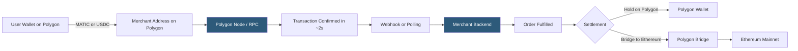

**Category:** Cryptocurrency & Web3 Payments
**Difficulty:** Intermediate
**Reading time:** 6 min read

---

Polygon is an EVM-compatible sidechain and L2 ecosystem offering sub-cent transaction fees and 2-second block times for MATIC, ETH, and ERC-20 payments. Its widespread wallet support and USDC native issuance make it a popular choice for Web3 payment integration at scale.

- **Polygon PoS** — Proof-of-Stake sidechain; most widely deployed Polygon network for payments today
- **MATIC** — Polygon's native token used for gas fees on PoS chain
- **Polygon zkEVM** — ZK rollup version of Polygon with Ethereum-level security and near-zero fees
- **Native USDC on Polygon** — Circle-issued USDC (not bridged); available as `0x3c499c...` on Polygon PoS
- **Polygon Bridge** — official bridge for moving assets between Ethereum mainnet and Polygon PoS
- **Checkpoint** — Polygon PoS checkpoints its state root to Ethereum every ~30 minutes
- **Mumbai testnet** — Polygon's test network (replaced by Amoy testnet in 2024)

Polygon PoS shares the same address format and contract ABI as Ethereum, making integration nearly identical to Ethereum payment integration. The key difference is the RPC endpoint (e.g., Alchemy Polygon endpoint, `https://polygon-rpc.com`) and chain ID (137 for mainnet, 80002 for Amoy testnet). Merchants generate deposit addresses using the same BIP-44 HD wallet derivation path but with chain ID 137.

Transaction monitoring uses `eth_subscribe('logs')` or Alchemy/Infura webhook services filtered to the deposit address. Polygon PoS achieves ~2-second block times with near-instant practical finality (128 block confirmations = ~4 minutes for high-value). For most commerce, 5–20 confirmations (10–40 seconds) is sufficient.

Gas on Polygon PoS costs MATIC, typically $0.001–0.005 per ERC-20 transfer — making it viable for sub-$1 transactions where Ethereum fees would be impractical. Users must hold MATIC to pay gas, which creates friction for new users. Account abstraction (ERC-4337) with Polygon's gas station network enables gas sponsorship, allowing merchants to pay users' gas fees and improve UX.

Native USDC on Polygon (Circle's canonical issuance since 2023) removes bridged USDC smart contract risk. Merchants specifying the native USDC contract address ensure they accept properly issued tokens.

Polygon zkEVM integration differs: it uses Ethereum mainnet chain ID for final settlement but requires bridging assets to the zkEVM network. Its 7-day optimistic-equivalent withdrawal and longer proof generation cycles make it more suitable for DeFi than payments.

- NFT gaming platforms with frequent in-game micropayments
- Ticketing and event platforms accepting crypto at low cost
- Creator monetization platforms with per-content micropayments
- Supply chain platforms recording asset transfers on-chain affordably
- Loyalty and rewards token distributions to large user bases

| Advantage | Disadvantage |
|-----------|--------------|
| Sub-cent transaction fees | Polygon PoS is a sidechain, not a true L2 |
| Full EVM compatibility — identical code to Ethereum | MATIC gas requirement creates user friction |
| 2-second block times for fast confirmation | Checkpointing to Ethereum is periodic, not per-block |
| Wide wallet support (MetaMask, Trust, Coinbase) | Bridge between Ethereum and Polygon has smart contract risk |
| Native USDC available without bridging | Network congestion spikes during high-demand periods |

- [Layer 2 Scaling for Payments](layer-2-scaling-for-payments.md)
- [Arbitrum Payment Solutions](arbitrum-payment-solutions.md)
- [Stablecoin Payments (USDC, USDT)](stablecoin-payments-usdc-usdt.md)

---
*Part of the [Cryptocurrency & Web3 Payments](index.md) category · [Back to Master Index](../../index.md)*
