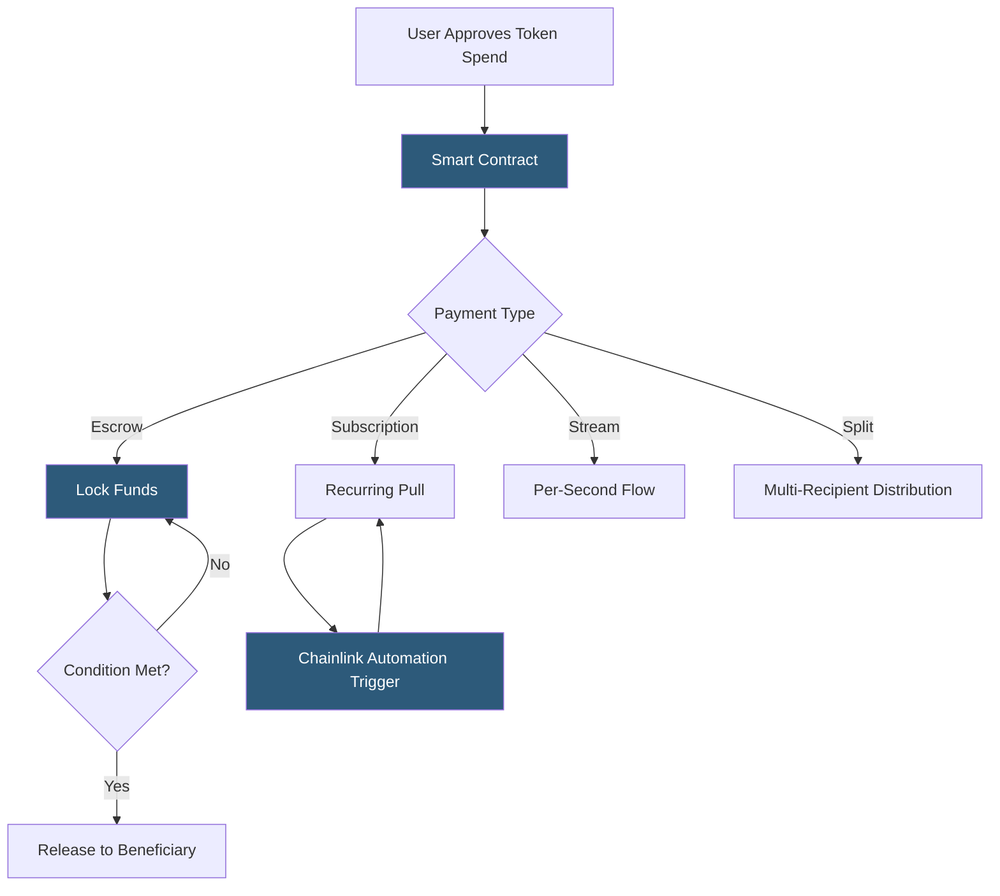

**Category:** Cryptocurrency & Web3 Payments
**Difficulty:** Advanced
**Reading time:** 7 min read

---

Smart contracts enable programmable, trustless payment automation on blockchains — including escrow, subscription billing, revenue splits, vesting schedules, and conditional release — without requiring intermediaries or manual processing.

- **Escrow contract** — holds funds until predefined conditions are met, then releases to beneficiary
- **Pull payment pattern** — recipient withdraws funds rather than contract pushing to prevent reentrancy attacks
- **Reentrancy attack** — vulnerability where a malicious contract recursively calls the paying contract before state updates; mitigated by Checks-Effects-Interactions pattern
- **ERC-20 approve/transferFrom** — two-step authorization allowing contracts to pull tokens from a user's wallet
- **Stream** — continuous token flow (e.g., Superfluid streams) paying per second rather than per period
- **Chainlink Automation** — decentralized keeper network for triggering smart contract functions on schedule
- **Multisig** — contract requiring M-of-N signature approval before executing payments

Smart contract payment automation begins with users granting token approval: calling `approve(contractAddress, amount)` on an ERC-20 token contract authorizes the payment contract to pull up to `amount` tokens from the user's wallet using `transferFrom`. This separation of approval and execution is the foundation of DeFi payment mechanics.

Escrow patterns lock funds in the contract and define release conditions in Solidity logic: deadline passed, oracle condition met (e.g., Chainlink price feed), or multisig approval received. The pull payment pattern (user calls `withdraw()` to claim funds) is preferred over push (contract calls `transfer`) because it prevents reentrancy vulnerabilities and gas estimation failures from unexpected recipients.

Subscription billing on-chain uses either recurring approved pulls (requiring periodic keeper triggers) or continuous streaming protocols like Superfluid. Superfluid streams update in real time — a $100/month subscription flows as ~$0.0000038/second directly to the recipient. Superfluid's constant flow agreements use a novel accounting mechanism that avoids per-block transactions.

Revenue split contracts (e.g., 0xSplits) receive payments and distribute proportionally to multiple recipients based on configured shares. This is widely used in creator economies and protocol fee distribution. Chainlink Automation (formerly Keepers) enables time-based triggers without centralized cron jobs, important for subscription renewals and vesting unlocks.

Security audits are mandatory before deploying payment contracts holding significant value; common patterns like OpenZeppelin's payment modules are preferred over custom implementations.

- Freelance escrow platforms with milestone-based payment release
- On-chain subscription services with streaming payment protocols
- DAO treasury payroll with vesting and cliff schedules
- NFT royalty distribution to multiple creators via split contracts
- Decentralized insurance payout automation via oracle conditions

| Advantage | Disadvantage |
|-----------|--------------|
| Trustless execution without intermediary | Smart contract bugs are irreversible without upgrades |
| Transparent, auditable payment logic | Gas costs make small payments expensive on mainnet |
| Atomic multi-party payments possible | Users must approve token spend before each payment contract |
| Programmable conditions replace legal contracts | Chainlink/oracle dependency introduces new failure point |
| Revenue splits eliminate manual accounting | Complexity requires security audits |

- [Ethereum Payment Integration](ethereum-payment-integration.md)
- [DeFi Payment Integration](defi-payment-integration.md)
- [Layer 2 Scaling for Payments](layer-2-scaling-for-payments.md)

---
*Part of the [Cryptocurrency & Web3 Payments](index.md) category · [Back to Master Index](../../index.md)*
