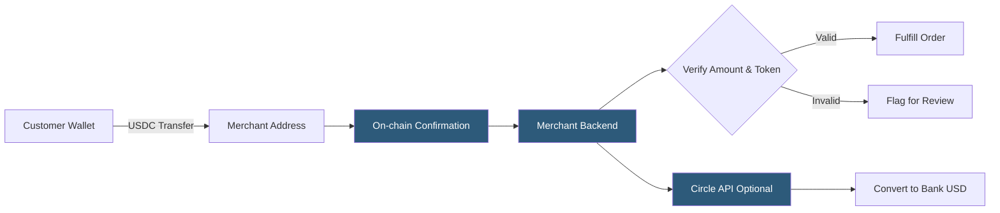

**Category:** Cryptocurrency & Web3 Payments
**Difficulty:** Intermediate
**Reading time:** 6 min read

---

Stablecoins like USDC and USDT combine the settlement speed and programmability of blockchain with price stability pegged to fiat currencies, making them the preferred medium for crypto commerce that eliminates exchange-rate volatility risk for both merchants and customers.

- **USDC (USD Coin)** — fully-reserved, regulated stablecoin issued by Circle; available on Ethereum, Solana, Avalanche, and others
- **USDT (Tether)** — largest stablecoin by market cap; issued by Tether on many chains
- **1:1 peg** — each stablecoin unit represents one USD held in reserve (cash and equivalents)
- **Native USDC** — Circle's multi-chain issuance vs. bridged USDC; native avoids bridge smart contract risk
- **Cross-chain USDC** — Circle's CCTP (Cross-Chain Transfer Protocol) for native burn-and-mint bridging
- **ERC-20 decimals** — USDC uses 6 decimal places; USDT also 6; DAI uses 18
- **Attestation** — Circle's published proof-of-reserve reports verifying USDC backing

Stablecoin payments behave identically to standard ERC-20 token transfers but remove volatility risk. When a merchant receives USDC, the received value equals the dollar amount sent — no exchange rate calculation needed beyond token decimal normalization.

USDC integration uses the ERC-20 `Transfer` event log for detection: filter `Transfer(address indexed from, address indexed to, uint256 value)` events from the USDC contract address (`0xA0b86991c6218b36c1d19D4a2e9Eb0cE3606eB48` on Ethereum mainnet) where `to` equals the merchant's deposit address. Divide the `value` by 10^6 to get the USD amount.

Circle's Business Account and API provide an additional layer: merchants can programmatically move USDC from deposit addresses to their treasury account, generate wallet addresses, and initiate bank withdrawals. The Circle Payments API abstracts on-chain complexity into REST calls for platforms that don't want to build their own blockchain monitoring.

USDC is available natively on Ethereum, Solana, Avalanche, Base, Arbitrum, Polygon, and others. Merchants accepting cross-chain payments must specify which chain's USDC they accept or use Circle's CCTP for unified settlement. USDT is available on more chains but is less audited; many enterprise merchants prefer USDC's regulatory transparency and Circle's attestation reports.

Network choice matters: Ethereum USDC is most widely held but carries higher gas fees; Solana, Base, and Polygon offer sub-cent fees suitable for micropayments.

- E-commerce stores wanting crypto payments with USD pricing stability
- B2B invoicing with instant global settlement and no FX fees
- Payroll and contractor payments to international workers
- DeFi protocols using USDC as their unit of account
- Remittance services avoiding traditional wire transfer costs

| Advantage | Disadvantage |
|-----------|--------------|
| No exchange rate risk — 1:1 USD value | Centralized issuers (Circle, Tether) can freeze addresses |
| Widely held across crypto users | Smart contract risk on non-native bridged versions |
| Programmable via smart contracts | On-chain fees vary by network |
| Regulatory-friendly with attestation reports | USDT's reserve composition less transparent than USDC |
| Native multi-chain availability | Requires correct token contract address validation |

- [Ethereum Payment Integration](ethereum-payment-integration.md)
- [Smart Contract Payment Automation](smart-contract-payment-automation.md)
- [USDC Circle API](usdc-circle-api.md)

---
*Part of the [Cryptocurrency & Web3 Payments](index.md) category · [Back to Master Index](../../index.md)*
