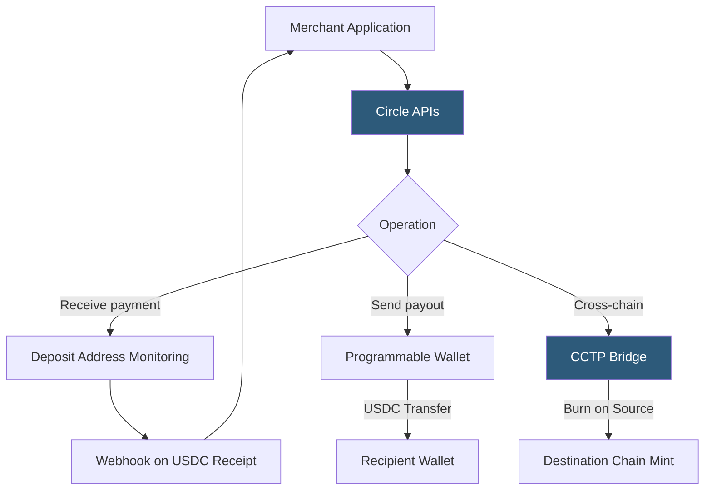

**Category:** Cryptocurrency & Web3 Payments
**Difficulty:** Intermediate
**Reading time:** 6 min read

---

Circle's Web3 Services API provides programmatic access to USDC issuance, custody, transfer, and cross-chain bridge functionality. It enables businesses to accept, hold, and disburse USDC across multiple blockchains without directly managing private keys or blockchain infrastructure.

- **Circle Payments API** — REST API for accepting USDC via on-chain deposit addresses
- **Circle Payouts API** — API for sending USDC to external wallets or bank accounts
- **Programmable wallets** — Circle-hosted wallets (EOA or smart contract wallets) managed via API
- **CCTP (Cross-Chain Transfer Protocol)** — Circle's native bridge for burning USDC on one chain and minting on another
- **Entity secret** — merchant-held encryption key for signing wallet operations; Circle never holds it
- **Gas abstraction** — Circle pays gas fees for wallet operations; merchants pay in USDC
- **Verite credentials** — Circle's W3C verifiable credential standard for compliance-friendly identity in DeFi

Circle's developer platform provides a unified API abstracting blockchain complexity. Merchants authenticate with an API key and entity secret (stored by the merchant, never Circle). The entity secret signs sensitive wallet operations, providing a second factor that Circle cannot act on unilaterally.

For accepting payments, the Payments API creates a unique on-chain USDC deposit address per transaction. Circle monitors the address across supported chains (Ethereum, Arbitrum, Polygon, Solana, Base, Avalanche) and delivers webhook notifications when USDC is received, with transfer status updates (pending → confirmed). The merchant's USDC accumulates in a Circle business account.

Programmable Wallets are Circle-hosted wallets (user or developer-controlled) secured with threshold signing (TSS/MPC) rather than single private keys. They support gasless transactions — Circle's gas credits system means merchants pay gas in USDC rather than native tokens, eliminating the need to hold ETH/MATIC/SOL for fees. Wallets can be EOA (externally owned accounts) or smart contract wallets with advanced features.

CCTP (Cross-Chain Transfer Protocol) is Circle's canonical USDC bridge, using a burn-and-mint mechanism: USDC is burned on the source chain (reducing total supply), Circle's attestation service observes the burn and signs a message, the destination chain contract verifies the attestation and mints equivalent USDC. This ensures no bridge contract holds USDC in escrow, eliminating bridge smart contract risk. CCTP is available between Ethereum, Arbitrum, Base, Optimism, Polygon, Avalanche, and Solana.

- Fintech platforms building USDC-denominated payment rails
- Crypto payroll services distributing USDC to global workers
- DeFi protocols requiring institutional USDC custody
- Cross-chain e-commerce accepting USDC from any supported network
- Remittance apps leveraging CCTP for instant cross-chain settlement

| Advantage | Disadvantage |
|-----------|--------------|
| No private key management for merchants | Circle API availability is a dependency |
| Gas abstraction eliminates native token requirements | Programmable wallets are custodial with Circle |
| CCTP eliminates bridge smart contract risk | CCTP attestation adds a step vs. direct transfer |
| Multi-chain monitoring via single API | Monthly platform fees for higher API tiers |
| Regulatory-friendly with Circle's compliance framework | Entity secret management adds operational complexity |

- [Stablecoin Payments (USDC, USDT)](stablecoin-payments-usdc-usdt.md)
- [Ethereum Payment Integration](ethereum-payment-integration.md)
- [Crypto Payment Compliance](crypto-payment-compliance.md)

---
*Part of the [Cryptocurrency & Web3 Payments](index.md) category · [Back to Master Index](../../index.md)*
