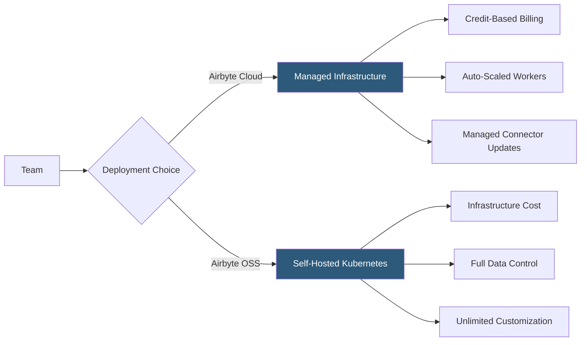

**Category:** Data Integration & ETL Automation
**Difficulty:** Beginner
**Reading time:** 5 min read

---

Airbyte Cloud is the fully managed version of the Airbyte open-source platform, eliminating the need to deploy and operate Airbyte infrastructure. It offers the same 300+ connector library with credit-based pricing, automated maintenance, and a polished UI, making it accessible to teams that want Airbyte's flexibility without DevOps overhead.

- **Airbyte Credits** — pricing unit where one credit equals one gigabyte of data synced (after compression); cloud functions, support SLAs, and connector maintenance are included
- **Managed connectors** — all connectors in Airbyte Cloud are maintained by Airbyte, with bug fixes and API updates applied automatically
- **Connection** — a configured source-to-destination sync with defined schedule, sync mode, and field selection
- **Workspace** — organizational unit in Airbyte Cloud grouping connections, users, and billing
- **SSO/RBAC** — enterprise features for single sign-on integration and role-based access control on connection management
- **Private link** — network feature allowing Airbyte Cloud to connect to data warehouses via AWS PrivateLink or GCP Private Service Connect without exposing ports publicly
- **Audit logs** — record of all user actions in the workspace for compliance and change management
- **Resumable streams** — Airbyte Cloud's ability to resume interrupted syncs from checkpoints rather than restarting from scratch

Airbyte Cloud hosts the Airbyte server, scheduler, and worker infrastructure on Airbyte's cloud (currently AWS). Users interact exclusively through the Airbyte web UI or API to configure sources, destinations, and connection schedules. Airbyte Cloud handles auto-scaling workers based on sync concurrency demand, rotating credentials securely, and applying connector updates without downtime.

Credit consumption is metered per sync run based on the compressed size of data transferred from source to destination. Airbyte applies normalization (dbt-based transformation) to raw loaded data automatically when enabled, and normalization runs are included in the credit calculation.

Data in transit is encrypted with TLS. Credentials are stored in Airbyte's secret manager (AWS Secrets Manager) with customer-managed encryption key options available on enterprise plans. PrivateLink options let Airbyte Cloud connect to private VPC resources (Snowflake, Redshift, databases) without traversing the public internet.

Teams using CI/CD can manage Airbyte Cloud configurations via the Airbyte Terraform provider or the Octavia CLI, enabling GitOps workflows where connection configurations are version-controlled and deployed through pipelines.

Enterprise plans add SAML SSO, custom roles (Workspace Admin, Connection Builder, Viewer), priority support, and dedicated infrastructure options for compliance-sensitive workloads.

- Small data teams that want Airbyte's open connector ecosystem without Kubernetes expertise
- Organizations migrating from Stitch or Fivetran seeking lower per-row pricing
- Teams needing private networking to connect Airbyte to VPC-hosted databases
- Engineering teams that want GitOps control over pipeline configs via Terraform
- Companies evaluating ELT platforms before committing to self-hosting

| Advantage | Disadvantage |
|-----------|--------------|
| Zero infrastructure management; Airbyte handles all ops | Data transits Airbyte's cloud, which may conflict with strict data residency policies |
| Credit pricing often cheaper than Fivetran MAR pricing at scale | Credit cost unpredictable without careful monitoring of sync volumes |
| All connectors maintained and updated automatically | Less customization than self-hosted; cannot modify connector internals |
| PrivateLink enables secure access to private data sources | Enterprise features (SSO, RBAC, PrivateLink) gated behind premium tiers |

- [Airbyte Open-Source Data Integration](airbyte-open-source-data-integration.md)
- [Airbyte Connector Development Kit](airbyte-connector-development-kit.md)
- [Fivetran Automated Data Pipelines](fivetran-automated-data-pipelines.md)

---
*Part of the [Data Integration & ETL Automation](index.md) category · [Back to Master Index](../../index.md)*
