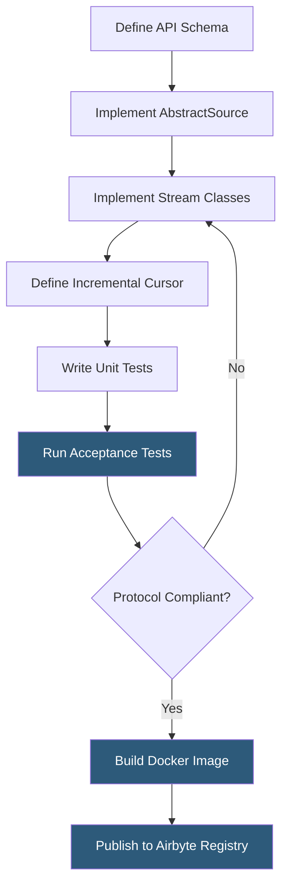

**Category:** Data Integration & ETL Automation
**Difficulty:** Advanced
**Reading time:** 6 min read

---

The Airbyte Connector Development Kit (CDK) is a Python framework that abstracts away the boilerplate of implementing the Airbyte protocol, enabling developers to build production-grade source connectors by focusing only on the API-specific extraction logic. CDK connectors can be contributed to Airbyte's open-source library or deployed privately for internal sources.

- **Airbyte protocol** — JSON-based message specification defining AirbyteRecordMessage, AirbyteStateMessage, AirbyteLogMessage, and AirbyteErrorMessage formats
- **Source** — connector implementation that reads data from an external system; inherits from `AbstractSource` in CDK
- **Stream** — logical unit of data (equivalent to a table) within a source; each stream has a schema and a `read_records` method
- **Declarative manifest** — YAML-based low-code approach for REST APIs where extraction logic is defined as configuration rather than Python code
- **Incremental cursor** — field used to track sync progress; CDK manages state serialization automatically
- **Catalog** — discovery output listing all available streams with their JSON schemas, used by Airbyte to present field selection UI
- **Acceptance tests** — standardized test suite (`connector-acceptance-test`) that validates connector behavior against the Airbyte protocol spec
- **Airbyte CDK source tester** — local CLI tool for testing connectors against real credentials before publishing

Building a connector with the CDK starts by subclassing `AbstractSource` and implementing `streams()` to return a list of `Stream` objects. Each `Stream` subclass defines `primary_key` (for deduplication), `cursor_field` (for incremental sync), a `path()` method returning the API endpoint, and `read_records()` for pagination logic.

The CDK handles the lower-level protocol concerns: it serializes each record from `read_records()` into an AirbyteRecordMessage, manages state checkpointing by calling the cursor at configurable intervals, and emits AirbyteStateMessage objects that Airbyte stores for subsequent incremental runs. Authentication is handled via declarative auth strategies (OAuth2, API Key, Bearer Token) that CDK injects into HTTP requests automatically.

For REST APIs with standard patterns (cursor pagination, offset pagination, OAuth2 PKCE), the declarative manifest approach eliminates even the Python code layer. A YAML manifest describes the API's structure, authentication flow, pagination strategy, and field mappings. The manifest is interpreted at runtime by CDK's `ManifestDeclarativeSource`, making connectors maintainable by analysts who don't write Python.

Testing uses a two-layer approach: unit tests against mocked API responses, and acceptance tests that validate the connector against the real API using credentials provided via a `secrets/config.json` file. The acceptance test suite checks that `spec()`, `check()`, `discover()`, and `read()` all behave according to the protocol spec. Connectors that pass acceptance tests can be contributed upstream via pull request to the airbyte-connectors monorepo.

Private connectors are packaged as Docker images and registered in Airbyte's custom connector registry, making them available in the UI alongside community connectors.

- Building a connector for an internal microservice's REST API that Airbyte doesn't support natively
- Creating a custom connector for a niche SaaS tool with non-standard pagination
- Contributing a new connector to Airbyte's open-source library for the community
- Extending an existing CDK connector with additional streams not in the official implementation
- Replacing a one-off Python script that manually calls an API and loads to a database

| Advantage | Disadvantage |
|-----------|--------------|
| CDK abstracts protocol boilerplate; focus only on API logic | Still requires Python expertise and understanding of Airbyte's stream model |
| Declarative manifests reduce code for standard REST APIs to zero Python | Complex APIs (GraphQL, binary protocols, stateful sessions) require full Python implementation |
| Standardized acceptance tests ensure protocol compliance | Local testing requires Docker and real API credentials |
| Private connectors integrate seamlessly with Airbyte Cloud or OSS | Custom connectors don't receive Airbyte's managed maintenance; owner must update for API changes |

- [Airbyte Open-Source Data Integration](airbyte-open-source-data-integration.md)
- [Airbyte Cloud Hosted Service](airbyte-cloud-hosted-service.md)
- [Fivetran Connector Library](fivetran-connector-library.md)

---
*Part of the [Data Integration & ETL Automation](index.md) category · [Back to Master Index](../../index.md)*
