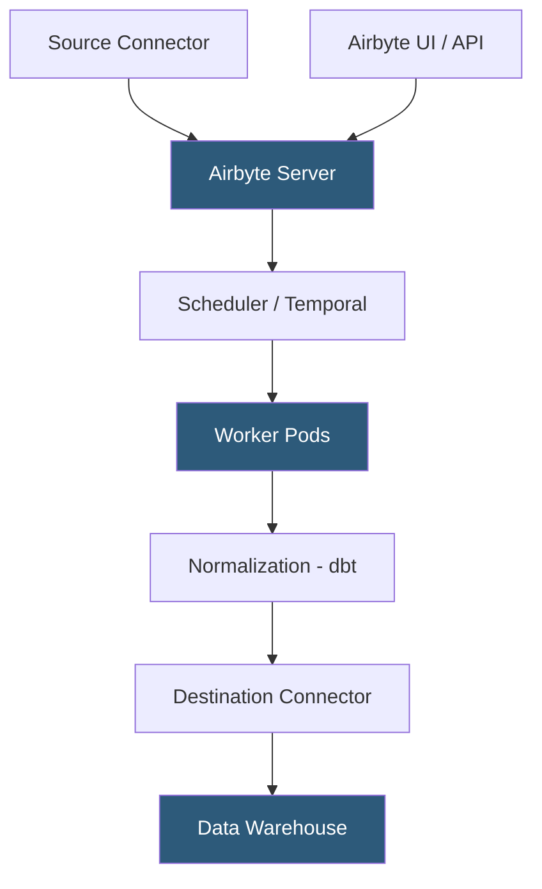

**Category:** Data Integration & ETL Automation
**Difficulty:** Intermediate
**Reading time:** 6 min read

---

Airbyte is an open-source ELT platform that provides a self-hostable alternative to managed pipeline services like Fivetran. With 300+ connectors and an extensible Connector Development Kit, Airbyte lets engineering teams build, customize, and deploy data pipelines on their own infrastructure while maintaining full control over data residency, connector behavior, and sync scheduling.

- **Airbyte OSS** — self-hostable version of Airbyte deployable via Docker Compose or Kubernetes, free to use without per-row pricing
- **Airbyte Cloud** — managed hosted version with per-credit pricing, eliminating infrastructure management
- **Connector** — Docker image implementing the Airbyte protocol (spec, check, discover, read operations)
- **Airbyte protocol** — JSON-based message format defining how connectors emit records, state, and log messages
- **Normalization** — optional post-sync step that transforms raw JSON blobs into structured tables using dbt under the hood
- **Full refresh** — sync mode that replaces all destination data with a fresh extract from the source
- **Incremental append** — sync mode that appends new/updated records without deleting historical data
- **Octavia CLI** — command-line tool for managing Airbyte configurations as YAML files for GitOps workflows

Airbyte's architecture separates concerns into a server, scheduler, and worker layer. The server handles API requests and connection configuration. The scheduler (built on Temporal for workflow orchestration) manages sync timing, retries, and state persistence. Worker pods are ephemeral containers that pull the relevant source and destination connector Docker images and execute the sync.

Each connector is a Docker image implementing the Airbyte protocol. A sync begins when the worker spins up the source connector, calls its `read` command with the configured catalog and state, and receives a stream of AirbyteRecordMessages over stdout. The destination connector simultaneously reads those messages and writes them to the target system. This Docker-based architecture means any language can be used to write connectors—most are Python, Java, or Go.

State management enables incremental syncs. After each successful sync, the source connector emits an AirbyteStateMessage representing the cursor position (e.g., last updated_at timestamp). The worker stores this state in Airbyte's database. On the next sync, the state is passed back to the connector, which uses it to fetch only records created or modified since the last sync.

Normalization runs as a post-sync dbt job that transforms the raw JSON records loaded into staging tables into properly typed, deduplicated relational tables. This step is optional but recommended for analytical use cases.

Airbyte can be deployed on a single VM (development), Docker Compose (small teams), or Kubernetes (production scale). Kubernetes deployments support horizontal pod autoscaling for workers to handle parallel syncs.

- Self-hosting data pipelines in an air-gapped environment where data cannot leave the private network
- Building custom connectors for proprietary internal systems without paying per-row pricing
- Running data replication for a startup with tight budget constraints using the free OSS version
- Organizations requiring full audit logs and configuration management via GitOps with Octavia CLI
- Migrating from a legacy homegrown ETL system to a standardized open-source platform

| Advantage | Disadvantage |
|-----------|--------------|
| Open-source with no per-row pricing; self-host at infrastructure cost only | Requires DevOps effort to deploy, monitor, and scale on Kubernetes |
| Full data residency control; data never leaves your infrastructure | Fewer managed connectors than Fivetran; some connectors are community-maintained |
| Extensible connector framework supports any programming language | Normalization step adds latency and complexity compared to native warehouse loading |
| Active open-source community with rapid connector development | Debugging connector failures requires familiarity with Docker and Airbyte internals |

- [Airbyte Cloud Hosted Service](airbyte-cloud-hosted-service.md)
- [Airbyte Connector Development Kit](airbyte-connector-development-kit.md)
- [Fivetran Automated Data Pipelines](fivetran-automated-data-pipelines.md)

---
*Part of the [Data Integration & ETL Automation](index.md) category · [Back to Master Index](../../index.md)*
