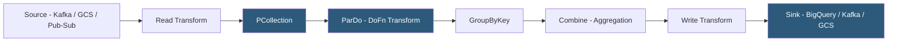

**Category:** Data Integration & ETL Automation
**Difficulty:** Advanced
**Reading time:** 6 min read

---

Apache Beam is a unified programming model for defining both batch and streaming data processing pipelines, with a portability layer that allows the same pipeline code to run on multiple execution engines (Apache Flink, Apache Spark, Google Dataflow). It abstracts the runner implementation, enabling teams to write portable data processing logic without coupling it to a specific infrastructure platform.

- **Pipeline** — a Beam program representing a directed graph of data transformations from inputs to outputs
- **PCollection** — Beam's distributed data abstraction; an immutable, potentially unbounded collection of elements processed in parallel
- **PTransform** — a transformation applied to one or more PCollections, producing output PCollections (ParDo, GroupByKey, Combine, Flatten)
- **Runner** — execution engine that runs a Beam pipeline: DirectRunner (local), DataflowRunner (GCP), FlinkRunner, SparkRunner
- **Windowing** — partitioning a PCollection by time window (fixed, sliding, session) for aggregating streaming data
- **Watermark** — Beam's mechanism for tracking event-time progress in streaming pipelines, handling late-arriving data
- **DoFn** — user-defined function applied element-by-element in a ParDo transform; Beam's unit of parallel processing
- **Unified batch/stream model** — Beam's core design principle: a pipeline reads a bounded (batch) or unbounded (stream) PCollection using the same code; only the runner and source differ

A Beam pipeline begins by reading data from a source using a Read transform, which returns a PCollection. For bounded sources (Cloud Storage files, database exports), the PCollection represents a finite dataset. For unbounded sources (Kafka topics, Pub/Sub subscriptions), it represents a continuous stream of elements.

Transformations are applied to PCollections using PTransforms. ParDo applies a DoFn function to each element in parallel across the runner's worker pool—equivalent to a map operation in MapReduce. GroupByKey shuffles elements by key across workers, similar to a SQL GROUP BY, enabling joins and aggregations. Combine applies associative and commutative reduction functions (Sum, Mean, Top-N) efficiently using partial aggregations before the final merge.

For streaming pipelines, windowing partitions the unbounded PCollection into discrete windows based on event time. A fixed 1-hour window groups all events with timestamps within each hour into a separate window that can be aggregated independently. Triggers define when to emit window results—by default, when the watermark passes the window's end—but Beam supports early firings (speculative results before the window closes) and late firings (updates when late data arrives).

Runners compile the Beam pipeline graph into runner-native execution plans. DataflowRunner converts the graph into a Google Dataflow job, handling worker autoscaling, distributed execution, and fault tolerance. FlinkRunner submits the pipeline as a Flink job. The same pipeline code runs on both without modification—a critical advantage for portability and testing (DirectRunner runs locally for unit tests).

The Python and Java SDKs are first-class citizens; the cross-language transforms feature allows Java and Python transforms to be combined in a single pipeline through the Portability Framework.

- Building a single ETL pipeline that runs as batch (nightly) against historical GCS data and as streaming (real-time) against Pub/Sub
- Writing a portable data processing job that runs on Dataflow in production but on DirectRunner for local testing
- Stream processing clickstream data with sessionization windowing to compute per-session engagement metrics
- Real-time fraud detection pipeline applying ML model scoring to payment events with sub-second latency
- Large-scale batch data processing (terabyte-scale log parsing) leveraging Spark or Dataflow autoscaling

| Advantage | Disadvantage |
|-----------|--------------|
| Runner portability prevents infrastructure lock-in; swap runner without rewriting logic | Higher abstraction layer introduces debugging complexity compared to native Flink or Spark jobs |
| Unified batch/stream model eliminates code duplication for pipelines that need both modes | Beam's windowing and watermark model has a steep learning curve for engineers new to event-time processing |
| Google Dataflow runner provides fully managed, autoscaled execution | Beam overhead vs native Flink/Spark is measurable for very high-throughput, low-latency requirements |
| Python and Java SDKs with cross-language transform support cover most use cases | Smaller ecosystem than Spark; fewer managed deployment options outside Google Cloud |

- [Apache Flink Stream Processing](apache-flink-stream-processing.md)
- [Apache Kafka Data Streaming](apache-kafka-data-streaming.md)
- [Confluent Cloud Managed Kafka](confluent-cloud-managed-kafka.md)

---
*Part of the [Data Integration & ETL Automation](index.md) category · [Back to Master Index](../../index.md)*
