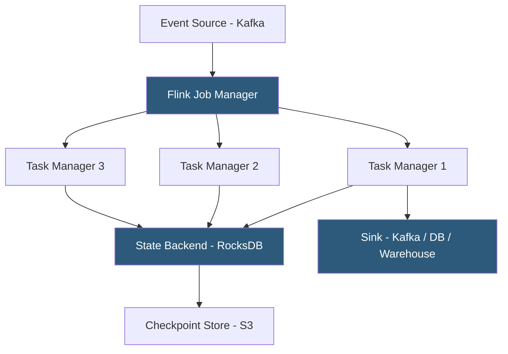

**Category:** Data Integration & ETL Automation
**Difficulty:** Advanced
**Reading time:** 7 min read

---

Apache Flink is a distributed stream processing framework designed for high-throughput, low-latency, stateful event-driven applications. Unlike batch-oriented systems, Flink treats streaming as the primary paradigm and batch processing as a special case of bounded streams, enabling unified pipelines with exactly-once semantics and millisecond-latency event processing at petabyte scale.

- **DataStream API** — Flink's primary API for writing Java/Python/Scala streaming applications with transformations (map, filter, keyBy, window, process)
- **Table API / Flink SQL** — higher-level SQL and relational API that compiles to the DataStream API; accessible to data engineers without Java expertise
- **Stateful operator** — Flink transformation that maintains state across events (e.g., count of events per user since pipeline start); state persists in RocksDB
- **Checkpointing** — Flink's distributed snapshot mechanism that periodically saves operator state to durable storage (S3, HDFS), enabling recovery without reprocessing
- **Savepoint** — manually triggered checkpoint; used for planned maintenance, version upgrades, and scaling without losing in-flight state
- **Watermark** — timestamp marker in the event stream indicating that all events with earlier timestamps have been received; triggers window calculations
- **Keyed stream** — events partitioned by a key (user_id, session_id); all events with the same key are processed by the same operator instance
- **Exactly-once semantics** — guarantee that each event affects downstream state and outputs exactly once, achieved via checkpointing and two-phase commit to sinks

Flink's execution model separates orchestration (Job Manager) from execution (Task Managers). The Job Manager receives a compiled job graph, allocates execution slots across Task Managers, and coordinates checkpointing. Task Managers are JVM processes that host operator instances and execute transformations in parallel.

A Flink job starts by reading from a source connector (Kafka, Kinesis, file system). Events flow through a pipeline of operators. `keyBy()` partitions the stream by a key field, ensuring all events for a given key (e.g., user_id) are processed by the same operator instance with shared state. This enables per-entity aggregations—running totals, sessionization, pattern detection—without global locking.

Stateful operators maintain state in an embedded RocksDB instance on the Task Manager, allowing state sizes that exceed JVM heap. State is accessed by key in O(log n) time. Flink checkpointing asynchronously snapshots all operator states to distributed storage at configurable intervals (every 30 seconds is common). If a Task Manager fails, the Job Manager restarts it from the last checkpoint, and processing resumes from the saved state with exactly-once guarantees.

Flink SQL allows defining streaming pipelines in standard SQL syntax. A query like `SELECT user_id, COUNT(*) as clicks FROM clickstream_kafka GROUP BY user_id, TUMBLE(event_time, INTERVAL '1' HOUR)` defines a one-hour tumbling window aggregation over a Kafka source—Flink compiles it to a DataStream job automatically.

Managed Flink services (Confluent Cloud for Flink, Amazon Managed Service for Apache Flink, Ververica Platform) handle cluster provisioning, auto-scaling, and checkpoint management, eliminating the operational overhead of self-hosted Flink clusters.

- Real-time fraud detection processing 500K payment events/second with per-user stateful risk scoring
- Session analytics: computing user session boundaries from unbounded clickstream events using session windows
- Change data capture processing: enriching CDC events with lookup tables and routing to multiple downstream systems
- Real-time recommendation engines that maintain per-user feature vectors updated on every interaction event
- Streaming ETL pipelines replacing batch-hourly jobs with continuous per-record processing

| Advantage | Disadvantage |
|-----------|--------------|
| Exactly-once semantics with checkpointing ensures data accuracy even under failures | Operational complexity; self-hosted Flink requires expertise in JVM tuning, state management, and checkpoint sizing |
| Native stateful processing enables complex per-entity aggregations without external state stores | Stateful job upgrades require savepoints; code changes that alter state schema require careful migration |
| Flink SQL makes stream processing accessible without DataStream API expertise | Cold start from a checkpoint on recovery adds latency for pipelines with large state |
| Sub-millisecond processing latency for stateless pipelines; low latency for windowed aggregations | Resource requirements are substantial; production clusters typically require dedicated cloud instances |

- [Apache Beam Unified Data Processing](apache-beam-unified-data-processing.md)
- [Apache Kafka Data Streaming](apache-kafka-data-streaming.md)
- [Confluent Cloud Managed Kafka](confluent-cloud-managed-kafka.md)

---
*Part of the [Data Integration & ETL Automation](index.md) category · [Back to Master Index](../../index.md)*
