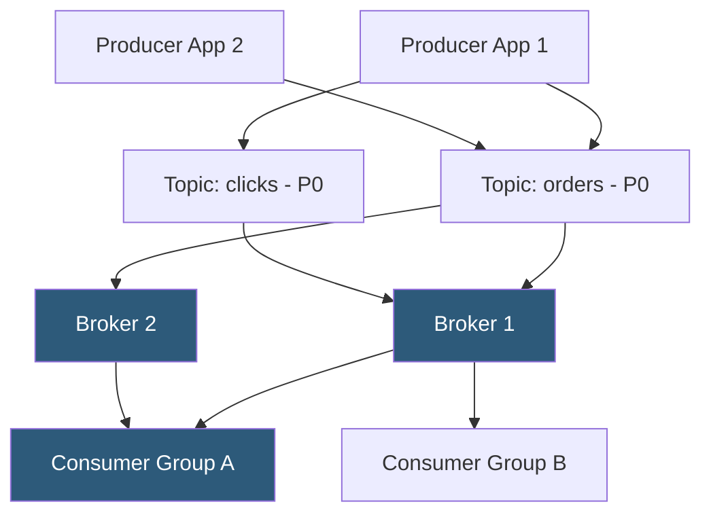

**Category:** Data Integration & ETL Automation
**Difficulty:** Advanced
**Reading time:** 7 min read

---

Apache Kafka is a distributed event streaming platform designed for high-throughput, fault-tolerant, real-time data pipelines and stream processing. It functions as a durable, replicated commit log that decouples data producers from consumers, enabling asynchronous event-driven architectures that process millions of events per second at sub-millisecond latency.

- **Topic** — named, ordered, immutable log of events; producers publish to topics, consumers subscribe to them
- **Partition** — horizontal subdivision of a topic enabling parallel processing; each partition is an ordered, replicated log
- **Broker** — individual Kafka server in a cluster; partitions are distributed across brokers for fault tolerance
- **Producer** — application that publishes events to a Kafka topic; supports synchronous and asynchronous delivery
- **Consumer group** — set of consumers cooperatively consuming a topic; each partition is assigned to exactly one consumer in the group
- **Offset** — unique sequential ID for each message within a partition; consumers track their read position via committed offsets
- **Replication factor** — number of copies of each partition maintained across brokers; typical production setting is 3
- **Retention** — configurable time or size-based policy controlling how long messages are retained; default 7 days

Kafka's core abstraction is the partitioned, replicated log. Each topic is divided into partitions, and each partition is replicated across multiple brokers. One broker is designated the leader for a partition and handles all reads and writes; follower brokers replicate the log asynchronously. If the leader fails, ZooKeeper (or KRaft in modern deployments) promotes a follower to leader without data loss.

Producers write events in batches to minimize network overhead. Each event can include a key, a value (typically serialized as Avro, Protobuf, or JSON), and optional headers. If a key is provided, Kafka hashes it to a partition, ensuring all events with the same key land in the same partition and are thus ordered relative to each other. Keyless events are distributed round-robin.

Consumers operate in consumer groups. Kafka distributes partitions evenly across group members—a group with 3 consumers reading a 6-partition topic receives 2 partitions each. When a consumer joins or leaves, Kafka rebalances partition assignments across the group. Each consumer commits its offset to Kafka's internal `__consumer_offsets` topic, enabling recovery from failures without reprocessing from the beginning.

Message retention is independent of consumption. Kafka retains messages according to retention policy (time or size), regardless of whether consumers have read them. This allows new consumers to replay historical events—unlike traditional message queues that delete messages after acknowledgment. Compacted topics retain only the latest value per key indefinitely, making them suitable for change tables and materializing current state.

KRaft mode (Kafka 3.x+) eliminates the ZooKeeper dependency, simplifying cluster management. Brokers elect a controller from among themselves using the Raft consensus protocol, reducing operational complexity significantly.

- Real-time fraud detection pipeline processing payment events at 500K events/second
- Change data capture (CDC) bus receiving database changelogs and routing them to multiple consumers
- Event sourcing backbone where all application state changes are written as immutable events
- Log aggregation from distributed microservices into a central analytics sink
- Stream processing pipeline for real-time dashboards and alerting using Kafka Streams or Flink

| Advantage | Disadvantage |
|-----------|--------------|
| Extremely high throughput (millions of events/second per cluster) | Operationally complex; ZooKeeper/KRaft, replication, and partition management require expertise |
| Durable event log enables consumer replay and exactly-once semantics | High memory and storage requirements; not suitable for single-server deployments |
| Decouples producers and consumers enabling independent scaling | At-least-once delivery by default; exactly-once requires careful producer/consumer configuration |
| Sub-millisecond end-to-end latency at scale | Schema management requires separate schema registry (Confluent Schema Registry) |

- [Kafka Connect Framework](kafka-connect-framework.md)
- [Confluent Cloud Managed Kafka](confluent-cloud-managed-kafka.md)
- [Debezium Change Data Capture](debezium-change-data-capture.md)

---
*Part of the [Data Integration & ETL Automation](index.md) category · [Back to Master Index](../../index.md)*
