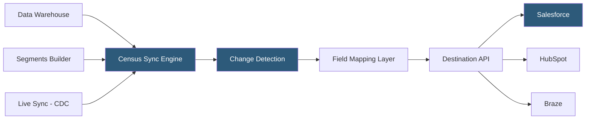

**Category:** Data Integration & ETL Automation
**Difficulty:** Intermediate
**Reading time:** 5 min read

---

Census is a Reverse ETL platform that syncs data from cloud data warehouses to 200+ business tools, positioning itself as the data activation layer for data teams that want to operationalize their warehouse investments. It differentiates from Hightouch with features like Segments (audience builder), Live Syncs for near-real-time activation, and Entities (a graph of related objects) for complex B2B data models.

- **Sync** — Census job mapping a warehouse SQL model to a destination with field mappings and sync behavior
- **Live Sync** — Census feature for near-real-time warehouse-to-destination syncing using CDC or streaming change detection
- **Entities** — Census's object graph that models relationships between business objects (accounts, contacts, deals) for complex syncs
- **Segments** — Census's visual audience builder for creating user/account cohorts without SQL
- **Enrichment** — Census feature that augments warehouse records with third-party data (Clearbit, ZoomInfo) before syncing downstream
- **Observability** — Census's sync monitoring layer showing record counts, error rates, and field-level sync health
- **Git-based workflow** — Census supports storing sync configurations in Git for version control and GitOps deployment
- **Warehouse-native enrichment** — pattern of enriching data within the warehouse before activation rather than enriching at the destination API level

Census connects to the data warehouse via read-only credentials and executes SQL models to extract the dataset for each sync. Change detection compares results against Census's internal snapshot table (stored in the customer's warehouse itself—Census creates a `census` schema with state tracking tables) to identify delta records. By storing state in the warehouse, Census avoids maintaining a separate external state store and enables customers to inspect sync state directly with SQL.

Live Syncs extend this to near-real-time by using warehouse-native streaming: for Snowflake Dynamic Tables, Databricks Delta Streaming, or BigQuery Continuous Queries, Census subscribes to change streams rather than polling on a schedule. This reduces activation latency from 15–60 minutes (scheduled) to under 5 minutes for tools that require fresher data.

Entities allow teams to model complex B2B data relationships. Rather than treating contacts and accounts as independent flat syncs, Entities define the parent-child relationship and resolve references across objects—ensuring that when a contact syncs to Salesforce, Census correctly links it to the parent account record using warehouse-computed foreign keys.

Enrichment integrates third-party data providers into the activation pipeline. Census can call Clearbit or ZoomInfo APIs for company information and merge the results with warehouse data before syncing to CRM, preventing the need to maintain enrichment logic in multiple downstream tools.

- B2B SaaS companies syncing account health scores and product usage metrics to Salesforce for CS team workflows
- Activating warehouse-defined ICP (ideal customer profile) segments in LinkedIn Matched Audiences
- Near-real-time user state syncing for feature flag systems based on warehouse-computed eligibility criteria
- Enriching contact records with company firmographics before syncing to HubSpot
- Data teams wanting sync state stored in their warehouse for auditability and debugging

| Advantage | Disadvantage |
|-----------|--------------|
| Sync state stored in the warehouse enables SQL-based debugging | Storing state in the warehouse adds tables and storage overhead |
| Live Syncs achieve near-real-time activation without external queues | Live Syncs require warehouse features (Snowflake Dynamic Tables, etc.) not available on all plans |
| Entity graph handles complex B2B relationship models natively | Entities add configuration complexity compared to simple flat syncs |
| Warehouse-native enrichment keeps third-party data fresh in one place | Enrichment API calls add latency and cost to sync runs |

- [Hightouch Reverse ETL](hightouch-reverse-etl.md)
- [Polytomic Reverse ETL](polytomic-reverse-etl.md)
- [dbt (Data Build Tool) Transformations](dbt-data-build-tool-transformations.md)

---
*Part of the [Data Integration & ETL Automation](index.md) category · [Back to Master Index](../../index.md)*
