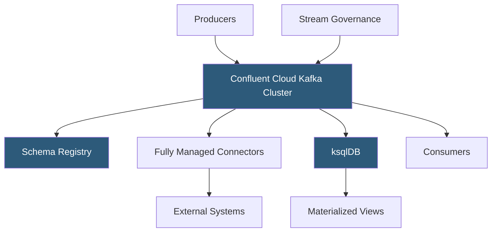

**Category:** Data Integration & ETL Automation
**Difficulty:** Intermediate
**Reading time:** 6 min read

---

Confluent Cloud is a fully managed Apache Kafka service that eliminates broker provisioning, replication management, and operational overhead. Built by the creators of Kafka, it provides an enterprise-grade streaming platform with Schema Registry, Kafka Connect, ksqlDB, and Stream Governance fully managed in a multi-cloud environment across AWS, GCP, and Azure.

- **Confluent Cloud Kafka** — managed Kafka clusters available as Basic, Standard, or Dedicated tiers with automated scaling and zero-downtime upgrades
- **Confluent Schema Registry** — managed schema store for Avro, Protobuf, and JSON Schema; enforces compatibility rules across producers and consumers
- **Fully Managed Connectors** — Confluent-managed Kafka Connect connectors deployed in Confluent's infrastructure without running Connect workers
- **ksqlDB** — streaming SQL engine built on Kafka Streams; allows creating materialized views, filters, and joins over Kafka topics using SQL syntax
- **Stream Governance** — Confluent's suite for schema management, data discovery, and data lineage across Kafka topics
- **CKU (Confluent Kafka Unit)** — billing unit representing a fixed amount of throughput capacity; clusters scale by adding CKUs
- **Multi-cloud clusters** — Confluent's capability to span a single Kafka cluster across multiple cloud providers or regions
- **Cluster linking** — mirror topics from one Kafka cluster to another (on-premises to cloud, or cloud-to-cloud) with automatic offset translation

Confluent Cloud provisions Kafka clusters on demand across AWS, GCP, or Azure. The underlying Kafka brokers, ZooKeeper/KRaft, and storage are all managed by Confluent—customers interact only with the Kafka API and Confluent Control Center (the management UI). Cluster scaling is transparent: Confluent automatically adds brokers and rebalances partitions as throughput grows.

Schema Registry runs as a sidecar service alongside each cluster. Producers register schemas before publishing; Confluent Schema Registry validates schema compatibility (backward, forward, or full) and assigns a schema ID embedded in each message. Consumers look up the schema by ID before deserializing. This contract-based approach prevents schema mismatches that cause consumer failures.

Fully Managed Connectors deploy without operating Connect workers. Teams configure source or sink connectors via the Confluent Cloud UI or Terraform provider, and Confluent runs the connector in its own managed infrastructure, auto-scaling tasks based on throughput. 120+ managed connectors cover databases (PostgreSQL, MySQL, MongoDB), data warehouses (Snowflake, BigQuery), and SaaS tools.

ksqlDB enables SQL-based stream processing. Teams write continuous queries: `CREATE TABLE order_counts AS SELECT user_id, COUNT(*) FROM orders GROUP BY user_id EMIT CHANGES;`. ksqlDB maintains a stateful materialized view backed by RocksDB in Kafka Streams. Results are pushed to a new Kafka topic and can be queried interactively or consumed by downstream applications.

Cluster linking enables hybrid architectures: mirror on-premises Kafka topics to Confluent Cloud for cloud processing without migrating producers, or replicate between cloud regions for disaster recovery.

- Replacing self-managed Kafka clusters to eliminate broker patching, rebalancing, and storage management
- Building a unified event streaming platform across AWS and GCP with multi-cloud clusters
- Stream processing with ksqlDB for real-time fraud scoring without writing Kafka Streams Java code
- CDC pipelines using managed Debezium connector to capture database changes without running Connect infrastructure
- Gradual cloud migration using cluster linking to mirror on-premises topics to Confluent Cloud

| Advantage | Disadvantage |
|-----------|--------------|
| Zero operational overhead for Kafka cluster management | CKU-based pricing is significantly more expensive than self-hosted EC2 Kafka at high throughput |
| Schema Registry prevents schema compatibility issues at scale | Confluent-specific features (ksqlDB, Stream Governance) create vendor lock-in |
| Multi-cloud clusters simplify global distribution | Dedicated cluster tiers required for BYOC (Bring Your Own Cloud) data residency compliance |
| 120+ managed connectors eliminate Connect worker management | Managed connector coverage still less than Kafka Connect community ecosystem |

- [Apache Kafka Data Streaming](apache-kafka-data-streaming.md)
- [Kafka Connect Framework](kafka-connect-framework.md)
- [Debezium Change Data Capture](debezium-change-data-capture.md)

---
*Part of the [Data Integration & ETL Automation](index.md) category · [Back to Master Index](../../index.md)*
