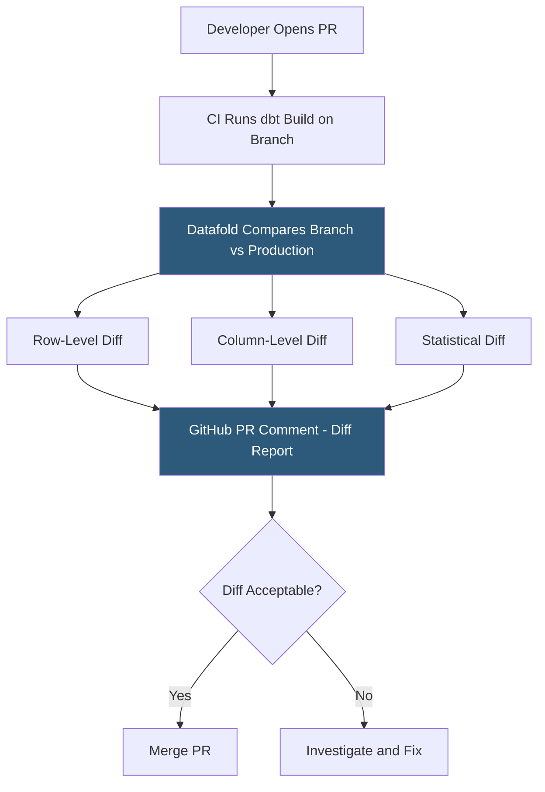

**Category:** Data Integration & ETL Automation
**Difficulty:** Advanced
**Reading time:** 5 min read

---

Datafold is a data reliability platform built around data diffing—algorithmically comparing two versions of a dataset to surface row-level, column-level, and statistical differences. It integrates with dbt and CI/CD pipelines to automatically generate diff reports for every pull request, giving data engineers confidence that transformation changes produce expected output before they reach production.

- **Data diff** — comparison of two datasets (e.g., production table vs PR branch table) showing added, removed, and changed rows
- **Column-level diff** — percentage of rows where each column value changed, enabling pinpointing which fields are affected by a code change
- **Statistical diff** — comparison of distribution statistics (mean, median, min, max, null rate, cardinality) between two dataset versions
- **CI integration** — Datafold plugin that automatically runs diffs on dbt model changes in PRs and posts results as a GitHub comment
- **Deployment diff** — diff between the current production table and the result of a dbt run from the proposed branch, executed in an isolated warehouse schema
- **Primary key analysis** — Datafold identifies which rows are present in one dataset but not the other using primary key matching
- **Datafold Cloud** — managed SaaS version; Datafold OSS is the open-source CLI tool for running diffs programmatally
- **Data catalog** — Datafold's supplementary feature for browsing table schemas, statistics, and lineage alongside diff history

Datafold's core algorithm—data-diff—runs efficient comparison queries using the database itself rather than extracting and comparing data in Python. For large tables (millions of rows), Datafold uses a binary tree hashing approach: it computes hash values for subsets of rows at multiple levels of granularity, identifying which segments have differences, and then drills down only into differing segments. This makes diffing a 100M-row table practical in minutes rather than hours.

In CI mode, Datafold integrates with dbt Cloud or dbt Core running in GitHub Actions/GitLab CI. When a PR is opened, the CI pipeline runs `dbt build` to materialize changed models in an ephemeral schema (e.g., `ci_pr_123`). Datafold then compares each changed table in the PR schema against its production counterpart, generating a diff report. The report is posted as a GitHub check comment showing: percentage of rows changed, column-by-column change rates, and distribution statistics for numeric columns.

The statistical diff is particularly valuable for regression detection. If a PR accidentally changes a SUM aggregation (revenue model), Datafold's statistical diff immediately shows that the `revenue` column mean dropped 15% between production and the PR—a clear signal of a bug before the change ships.

Datafold OSS provides the same diffing algorithm as a Python library (`data-diff`) that can be used in custom scripts, allowing teams to run diffs outside of CI against any SQLAlchemy-supported database.

- Validating that a refactored dbt model produces identical output to the original before deployment
- Detecting unintended fan-out from a JOIN change that caused a revenue fact table to inflate
- Comparing an initial data migration result to the source to verify row counts and value accuracy
- Running automated diffs in production after each dbt run to catch unexpected anomalies vs yesterday's data
- Auditing a warehouse-to-warehouse migration by diffing source and destination tables at the column level

| Advantage | Disadvantage |
|-----------|--------------|
| Binary tree hashing enables efficient diffing of large tables without full scans | Requires a second schema for the PR branch materialization, doubling warehouse compute during CI |
| GitHub PR comment integration makes diffs part of the review workflow without extra steps | Statistical diffs for very large tables can still be expensive in warehouse credits |
| Open-source CLI enables integration into any pipeline without SaaS subscription | CI integration requires dbt Cloud or a configured dbt CI runner; adds setup complexity |
| Column-level change rates pinpoint exactly which fields are affected by code changes | Not a replacement for behavioral/integration testing; only surfaces output differences, not correctness |

- [Monte Carlo Data Observability](monte-carlo-data-observability.md)
- [Great Expectations Data Quality](great-expectations-data-quality.md)
- [dbt Cloud Orchestration](dbt-cloud-orchestration.md)

---
*Part of the [Data Integration & ETL Automation](index.md) category · [Back to Master Index](../../index.md)*
