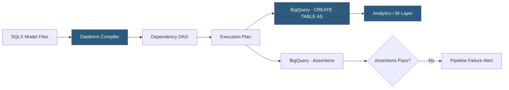

**Category:** Data Integration & ETL Automation
**Difficulty:** Intermediate
**Reading time:** 5 min read

---

Dataform is a data transformation framework (now part of Google Cloud) that enables teams to define and manage SQL transformations in BigQuery using a code-based approach similar to dbt. It provides SQLX—an extension of SQL with JavaScript templating, inline documentation, and dependency declarations—and integrates natively with Google Cloud Workflows and BigQuery for managed orchestration.

- **SQLX** — Dataform's extended SQL format that combines SQL queries with JavaScript config blocks, enabling inline documentation, dependency refs, and pre/post-operation hooks
- **config block** — SQLX header defining table type (table, view, incremental, assertion), description, tags, and dependencies
- **ref()** — Dataform's dependency reference (similar to dbt's ref()); enables automatic topological ordering of table builds
- **Assertion** — Dataform's equivalent of dbt tests; SQL queries that should return zero rows; violations fail the pipeline
- **Workflow** — Dataform's execution unit; runs selected tables/assertions on schedule or trigger; maps to Google Cloud Workflows
- **Tag** — metadata applied to tables for selective execution (e.g., run only tables tagged `hourly` on hourly schedules)
- **JavaScript includes** — reusable JavaScript functions and macros shared across SQLX files for DRY templating
- **Dataform Core** — open-source CLI and framework that powers both Dataform Cloud and BigQuery Studio integration

Dataform projects are collections of SQLX files stored in a Git repository. Each SQLX file contains a config block (JavaScript object specifying the table type, name, and metadata) followed by a SQL SELECT statement. The SELECT statement can reference other tables using `${ref("table_name")}`, which Dataform resolves to the fully qualified BigQuery table name at compile time.

Dataform's compiler parses all SQLX files, resolves dependencies, and builds a directed acyclic graph (DAG) of tables in topological order. When a workflow runs, Dataform executes CREATE OR REPLACE TABLE statements against BigQuery for each node in the DAG, respecting dependency order and running independent tables in parallel.

Assertions are SQLX files with `type: "assertion"`. The SQL query should return zero rows when data is valid. For example, an assertion checking uniqueness would be `SELECT user_id FROM my_table GROUP BY 1 HAVING COUNT(*) > 1`. If this returns rows, the assertion fails and the workflow reports an error. Assertions run after the tables they depend on complete.

Incremental tables use Dataform's `${when(incremental(), "WHERE updated_at > ...", "")}` pattern: on the first run, the full table is built; on subsequent runs, only new records are processed and merged. Dataform passes an `incremental()` boolean to SQLX so the same file handles both full refresh and incremental modes.

In Google Cloud, Dataform integrates with BigQuery Studio as a native feature, eliminating separate infrastructure—teams access Dataform directly in the BigQuery console with Git connectivity to Cloud Source Repositories or GitHub.

- BigQuery-native teams wanting a dbt-like transformation framework without leaving the Google Cloud ecosystem
- Teams leveraging BigQuery's Dataform integration in the BigQuery Studio console for a zero-setup transformation environment
- Building data pipelines with inline column-level documentation maintained alongside the SQL in SQLX files
- Using JavaScript templating in SQLX for generating repetitive SQL patterns across many similar tables
- Organizations already using Google Cloud Workflows for orchestration who want native integration

| Advantage | Disadvantage |
|-----------|--------------|
| Native BigQuery integration with zero infrastructure for Google Cloud users | Primarily designed for BigQuery; other warehouse support exists but is less polished |
| SQLX inline documentation keeps column descriptions co-located with transformation logic | SQLX syntax is less widely known than dbt's standard SQL + YAML approach |
| Open-source core (Dataform Core) enables self-hosting without SaaS dependency | Smaller community and ecosystem than dbt; fewer packages and integrations available |
| Native Google Cloud Workflows integration for orchestration | JavaScript templating complexity can reduce readability for SQL-focused analysts |

- [dbt (Data Build Tool) Transformations](dbt-data-build-tool-transformations.md)
- [dbt Cloud Orchestration](dbt-cloud-orchestration.md)
- [Matillion Data Transformation](matillion-data-transformation.md)

---
*Part of the [Data Integration & ETL Automation](index.md) category · [Back to Master Index](../../index.md)*
