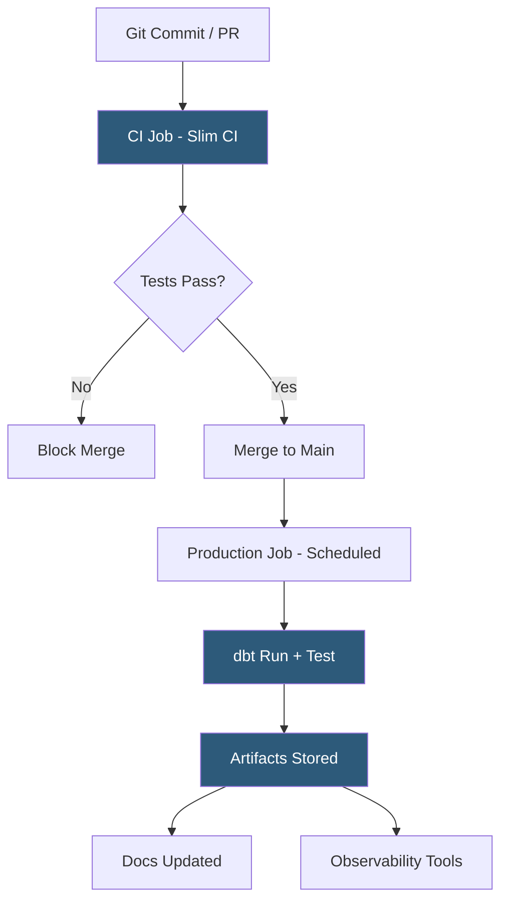

**Category:** Data Integration & ETL Automation
**Difficulty:** Intermediate
**Reading time:** 5 min read

---

dbt Cloud is the hosted platform for running dbt projects, adding job scheduling, a web-based IDE, CI/CD integration, and team collaboration features on top of the open-source dbt Core framework. Its orchestration layer enables teams to schedule transformation runs, trigger jobs from external events, and chain multiple jobs with dependency awareness.

- **Job** — a configured execution of `dbt run`, `dbt test`, `dbt snapshot`, or any combination of dbt commands on a schedule or trigger
- **Environment** — dbt Cloud configuration connecting a job to a specific warehouse schema (dev, staging, production) and Git branch
- **Continuous Integration (CI) job** — automatically triggered job that runs on every pull request to test model changes in an ephemeral schema before merge
- **Webhook trigger** — API endpoint that allows external systems (Fivetran, Airflow, GitHub Actions) to trigger dbt Cloud jobs programmatically
- **Slim CI** — dbt Cloud optimization that only runs models affected by changed files in a PR rather than the full project
- **Job run** — a single execution of a job; includes command logs, model timing, test results, and artifact storage
- **Artifacts** — dbt Cloud stores run artifacts (manifest.json, catalog.json, run_results.json) accessible via API for downstream tools (data observability, documentation)
- **Semantic Layer** — dbt Cloud feature for defining reusable metrics and dimensions consumed by BI tools via a consistent query API

dbt Cloud connects to Git repositories (GitHub, GitLab, Bitbucket, Azure DevOps) and data warehouses. Each environment configures the target warehouse credentials, schema, and Git branch. Production environments typically point to the main branch and a production schema; developer environments point to personal feature branches and isolated schemas.

Job scheduling uses cron expressions or API triggers. A typical setup runs the production job daily at 6 AM to refresh mart tables before analysts arrive. Webhook triggers allow event-driven execution: when Fivetran signals that a Salesforce sync completed, a webhook fires to trigger the dbt Cloud job that processes the freshly loaded raw data. This eliminates time-based polling and ensures transformations run immediately on new data.

CI jobs run automatically when a developer opens a pull request. dbt Cloud checks out the PR branch, compiles the project, runs `dbt build --select state:modified+` (Slim CI—only changed models and their descendants), and reports results as a GitHub check status. Failing tests block the PR from merging, enforcing data quality gates in the development workflow.

The Semantic Layer (MetricFlow integration) allows teams to define metrics (`revenue`, `active_users`) and dimensions once in YAML and expose them through a unified query API. BI tools (Tableau, Looker, Metabase) query the Semantic Layer rather than writing metric SQL independently, ensuring consistent definitions across every report.

dbt Cloud's artifact API enables integration with data observability tools (Monte Carlo, Datafold) and data catalogs that consume manifest.json and catalog.json to understand lineage, schema, and freshness.

- Scheduling daily production transformation jobs triggered immediately after upstream ELT syncs complete
- Running CI tests on every PR to catch breaking model changes before they reach production
- Using the Semantic Layer to ensure `revenue` is calculated identically in Tableau, Looker, and ad-hoc SQL
- Triggering dbt Cloud from Airflow for complex multi-system orchestration with shared DAG context
- Providing a browser-based IDE so analysts can develop and test dbt models without local setup

| Advantage | Disadvantage |
|-----------|--------------|
| Web IDE and CI/CD lower the barrier for analysts to contribute to transformation code | Subscription cost adds to the data stack; open-source dbt Core + Airflow is free but more complex to operate |
| Slim CI dramatically reduces PR test run time for large projects | Webhook-based orchestration is simpler than Airflow but less capable for complex multi-system DAGs |
| Artifact API enables rich ecosystem integrations for observability and catalogs | Team-tier features (SSO, advanced governance) require enterprise plan pricing |
| dbt Cloud manages environment isolation automatically | Semantic Layer requires MetricFlow and is still maturing for complex multi-hop metric definitions |

- [dbt (Data Build Tool) Transformations](dbt-data-build-tool-transformations.md)
- [Fivetran Transformation dbt Integration](fivetran-transformation-dbt-integration.md)
- [Dataform Data Transformation](dataform-data-transformation.md)

---
*Part of the [Data Integration & ETL Automation](index.md) category · [Back to Master Index](../../index.md)*
