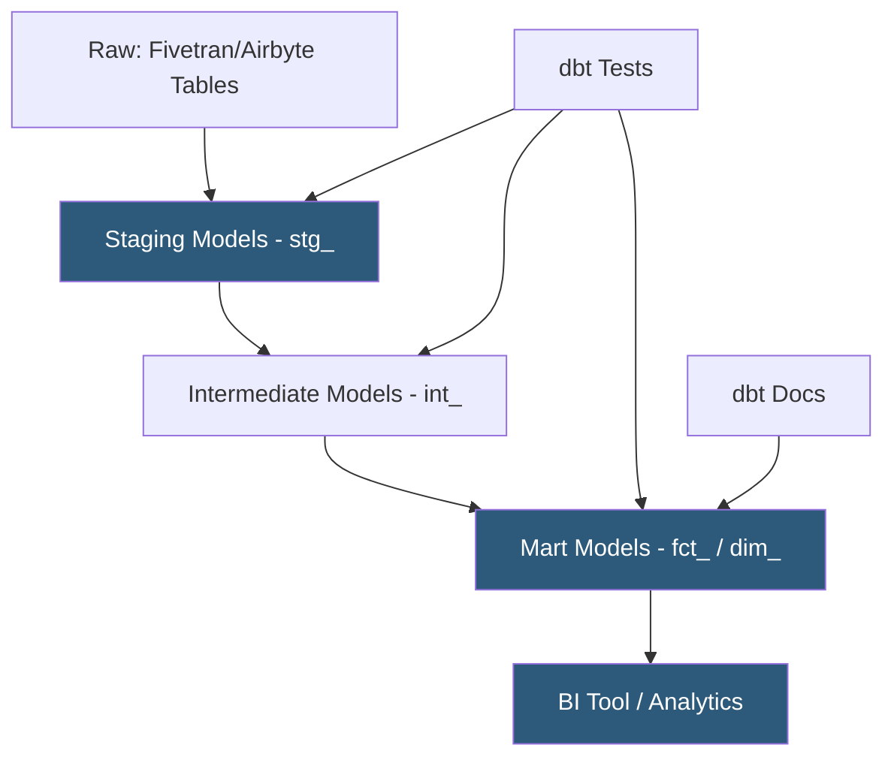

**Category:** Data Integration & ETL Automation
**Difficulty:** Intermediate
**Reading time:** 6 min read

---

dbt (data build tool) is an open-source transformation framework that enables data analysts and engineers to write SQL SELECT statements that dbt compiles and executes as warehouse tables or views, with built-in dependency management, testing, documentation, and version control. It brings software engineering best practices to data transformation, treating SQL models as code managed in Git.

- **Model** — a single `.sql` file containing a SELECT statement; dbt materializes it as a table, view, incremental table, or ephemeral CTE
- **ref()** — dbt macro for referencing other models; enables dbt to build a dependency DAG and execute models in topological order
- **source()** — dbt macro for referencing raw warehouse tables loaded by ELT tools; enables freshness checks and lineage tracking
- **Materialization** — how dbt builds the model: `view` (no storage), `table` (full replace each run), `incremental` (append/merge new rows), `ephemeral` (CTE inlined in dependencies)
- **Test** — assertion that validates model output: `unique`, `not_null`, `accepted_values`, `relationships`, or custom SQL tests
- **Macro** — reusable Jinja snippets that enable DRY SQL (e.g., a surrogate key generation macro used across all dimension models)
- **Packages** — reusable dbt project collections (dbt-utils, dbt-expectations) installable from the dbt Hub package registry
- **Lineage graph** — auto-generated DAG visualization showing model dependencies and data flow from raw sources to final marts

dbt projects are collections of `.sql` model files, YAML configuration files, and Jinja macros organized in a folder structure. Staging models (`stg_`) sit closest to raw source tables—renaming columns, casting types, deduplicating—producing a clean, standardized layer. Intermediate models (`int_`) join and aggregate staging models. Mart models (`fct_` for facts, `dim_` for dimensions) produce the final analytical tables consumed by BI tools.

When `dbt run` executes, dbt parses the project's `ref()` relationships to build a DAG. It topologically sorts models and executes them in parallel where dependencies allow. For each model, dbt compiles the Jinja-templated SQL and executes a CREATE TABLE AS or INSERT INTO statement against the configured warehouse. Incremental models check for new/updated records using a `this` reference (the existing table) and merge only the delta, preventing full table rebuilds on each run.

`dbt test` runs after transformations. Tests execute SQL queries that return rows only when they fail—a `unique` test on user_id returns duplicates; a `not_null` test returns nulls. Test failures can be set to warn (log only) or error (fail the job). dbt-expectations (inspired by Great Expectations) adds statistical tests: column value distributions, regex patterns, quantile ranges.

`dbt docs generate` and `dbt docs serve` build a browsable data catalog with model descriptions, column definitions, and the lineage DAG. Descriptions are written in YAML alongside model definitions, creating documentation that lives in the same repository as the code.

dbt Packages (dbt-utils, dbt-date, dbt_project_evaluator) provide reusable macros, generic tests, and project health checks installable via `packages.yml`.

- Building a unified dimensional model from Fivetran-loaded raw tables across five SaaS sources
- Enforcing not-null and referential integrity tests to catch data quality regressions before BI reports break
- Using incremental models to process only new Kafka event records added since the last run
- Generating a browsable data dictionary for analysts to understand table definitions without asking engineering
- Standardizing date spine logic via a shared macro across all time-series models

| Advantage | Disadvantage |
|-----------|--------------|
| SQL-native; accessible to analysts without Python/Spark expertise | No built-in scheduling; requires Airflow, dbt Cloud, or Fivetran Transformations for orchestration |
| Git-based version control enables code review, CI/CD, and rollback | Incremental model logic requires careful design to handle late-arriving or updated records |
| Auto-generated lineage and documentation reduce onboarding time | Jinja templating in SQL can be hard to read and debug for complex dynamic models |
| dbt Hub packages provide battle-tested reusable patterns | Warehouse costs scale with run frequency; heavy table materializations on large datasets are expensive |

- [dbt Cloud Orchestration](dbt-cloud-orchestration.md)
- [Fivetran Transformation dbt Integration](fivetran-transformation-dbt-integration.md)
- [Dataform Data Transformation](dataform-data-transformation.md)

---
*Part of the [Data Integration & ETL Automation](index.md) category · [Back to Master Index](../../index.md)*
