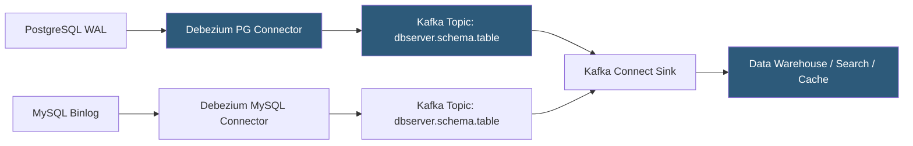

**Category:** Data Integration & ETL Automation
**Difficulty:** Advanced
**Reading time:** 6 min read

---

Debezium is an open-source Change Data Capture (CDC) platform that streams database changes as events to Apache Kafka. It reads database transaction logs (binlog, WAL, redo log) to capture every insert, update, and delete with low latency and exactly-once semantics, enabling real-time data integration without polling-based overhead on production databases.

- **CDC (Change Data Capture)** — technique for capturing row-level database changes at the transaction log level rather than via application-level writes
- **Transaction log** — database-maintained journal of all changes: MySQL binlog, PostgreSQL WAL, MongoDB oplog, Oracle redo log
- **Debezium connector** — Kafka Connect source connector plugin for a specific database; reads the transaction log and publishes change events
- **Change event** — Kafka message representing a single row-level database operation with before/after state and transaction metadata
- **Snapshot** — initial full table read when a connector first starts, establishing baseline state before incremental CDC begins
- **Outbox pattern** — design pattern using CDC to reliably publish domain events from a microservice without dual writes
- **Schema history topic** — internal Kafka topic where Debezium tracks DDL changes (ALTER TABLE, CREATE INDEX) to maintain schema consistency
- **Heartbeat** — periodic keep-alive events written by Debezium to prevent WAL slot lag buildup on low-activity databases

Debezium operates as a Kafka Connect source connector. For PostgreSQL, Debezium uses the logical replication protocol with a replication slot—PostgreSQL's built-in mechanism for streaming WAL changes to external consumers. Debezium registers a replication slot with a logical decoding plugin (pgoutput for native PostgreSQL 10+, or wal2json for older versions). PostgreSQL then sends all committed changes to Debezium in row-level format.

Each change event contains the full before and after state of the row, the operation type (c=create, u=update, d=delete, r=read during snapshot), the transaction ID and timestamp, and the source database metadata. Events are serialized using the configured converter (Avro with Schema Registry for production; JSON for development) and published to a Kafka topic following the naming convention `{serverName}.{schemaName}.{tableName}`.

Consumers receive a complete audit trail. For updates, both the old row state (before) and new state (after) are available, enabling event sourcing patterns, cache invalidation, and audit logging without application-level instrumentation.

Schema changes are handled through the schema history topic. When Debezium detects a DDL change (ALTER TABLE), it logs the DDL event to the history topic and updates its schema model. Subsequent change events use the updated schema, and Avro schemas are registered with Schema Registry to propagate changes to consumers.

Debezium Server is an alternative deployment that runs without Kafka Connect—it reads database changes and routes them directly to sinks like Kinesis, Pub/Sub, or HTTP endpoints, for teams that don't operate Kafka.

- Real-time synchronization of production database changes to a data warehouse without impacting database performance
- Cache invalidation: invalidating Redis entries immediately when the backing PostgreSQL record changes
- Microservice event sourcing: publishing domain events from database changes using the outbox pattern
- Search index synchronization: streaming product catalog changes to Elasticsearch in real-time
- Data lake ingestion: capturing all database changes to an S3 data lake for historical analysis

| Advantage | Disadvantage |
|-----------|--------------|
| Transaction log-based CDC has negligible overhead on source database | Requires enabling logical replication and granting replication permissions on the database |
| Full before/after state enables bidirectional sync and audit logging | PostgreSQL replication slot lag can grow if Debezium falls behind, blocking WAL cleanup |
| Exactly-once delivery achievable with Kafka transactions | Schema evolution requires careful management of schema history topic |
| Outbox pattern eliminates dual-write consistency problems | Initial snapshot of large tables can take hours and requires careful management |

- [Apache Kafka Data Streaming](apache-kafka-data-streaming.md)
- [Kafka Connect Framework](kafka-connect-framework.md)
- [Confluent Cloud Managed Kafka](confluent-cloud-managed-kafka.md)

---
*Part of the [Data Integration & ETL Automation](index.md) category · [Back to Master Index](../../index.md)*
