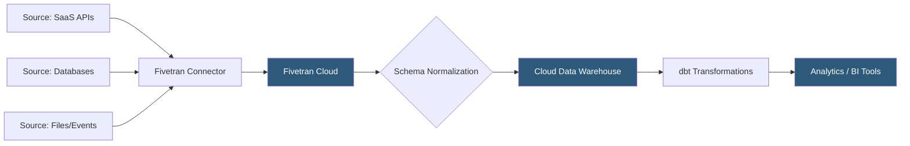

**Category:** Data Integration & ETL Automation
**Difficulty:** Intermediate
**Reading time:** 6 min read

---

Fivetran is a fully managed ELT (Extract, Load, Transform) platform that automates the movement of data from source systems into cloud data warehouses. It handles schema changes, API versioning, and incremental syncs automatically, eliminating the engineering effort traditionally required to maintain data pipelines. Fivetran's zero-maintenance philosophy makes it the dominant choice for teams that want reliable data movement without operational overhead.

- **ELT (Extract, Load, Transform)** — paradigm where raw data is loaded into the warehouse first, then transformed in-place, contrasted with ETL where transformation precedes loading
- **Connector** — pre-built integration for a specific source system (Salesforce, Stripe, PostgreSQL); Fivetran manages API authentication and change detection automatically
- **Incremental sync** — only changed or new records are replicated on each sync run, minimizing API calls and data transfer costs
- **Schema drift** — automatic detection and handling of source schema changes without pipeline breakage
- **Destination** — target data warehouse (Snowflake, BigQuery, Redshift, Databricks) where Fivetran loads normalized tables
- **MAR (Monthly Active Rows)** — Fivetran's pricing unit measuring rows synced and updated in the destination each month
- **Fivetran transformations** — dbt-based SQL transformations that run post-load within the Fivetran platform
- **History mode** — captures full change history for source records, not just current state

Fivetran operates as a managed service that handles the entire data pipeline lifecycle. During setup, users authenticate Fivetran to a source system via OAuth, API keys, or database credentials. Fivetran's connectors then perform an initial historical sync, extracting all available data and loading it into structured tables in the destination warehouse.

For subsequent syncs (typically every 1–24 hours depending on tier), Fivetran uses incremental strategies tailored to each source. For databases, it uses binary log replication (similar to CDC) or high-watermark queries against timestamp/ID columns. For REST APIs, it leverages pagination with cursors and the source's updated_at fields. For event-driven sources, it uses webhooks or streaming ingestion.

Schema changes are handled automatically through schema drift detection. If a source adds a new column, Fivetran alters the destination table and backfills. If a column type changes, Fivetran widens the column type without data loss. This eliminates a major source of pipeline failures in hand-rolled solutions.

Data lands in the warehouse in Fivetran's normalized schema—typically one table per source object with metadata columns (fivetran_synced, fivetran_deleted) added for tracking. Teams then use dbt or the warehouse's native SQL capabilities to build transformation layers on top of this raw data.

Fivetran's operations are entirely server-side; no infrastructure is needed beyond the data warehouse itself. Connectors run in Fivetran's cloud with SOC 2 Type II and GDPR compliance. Private deployments via Fivetran's Hybrid Deployment model allow sensitive data to stay within the customer's VPC.

- Consolidating CRM, billing, and marketing data into a single analytics warehouse
- Replicating production databases to a warehouse for reporting without impacting production performance
- Building a customer 360 view from a dozen SaaS tools without maintaining custom integrations
- Ensuring analysts always have fresh data without depending on engineering to maintain pipelines
- Syncing event data from product analytics tools for cohort analysis

| Advantage | Disadvantage |
|-----------|--------------|
| Zero-maintenance pipelines with automatic schema drift handling | MAR-based pricing can become expensive at high data volumes |
| 500+ pre-built connectors covering virtually all major SaaS tools | Limited transformation capabilities; complex logic still requires dbt or warehouse SQL |
| SOC 2 Type II compliance simplifies security reviews | Sync frequency limited by tier; real-time ingestion requires higher-cost plans |
| Schema normalization is consistent and predictable | Less flexible than custom pipelines for non-standard source semantics |

- [Fivetran Connector Library](fivetran-connector-library.md)
- [Fivetran Transformation dbt Integration](fivetran-transformation-dbt-integration.md)
- [dbt (Data Build Tool) Transformations](dbt-data-build-tool-transformations.md)

---
*Part of the [Data Integration & ETL Automation](index.md) category · [Back to Master Index](../../index.md)*
