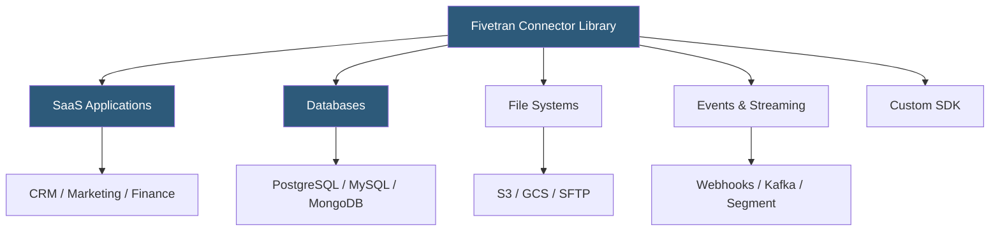

**Category:** Data Integration & ETL Automation
**Difficulty:** Intermediate
**Reading time:** 5 min read

---

Fivetran's connector library is a curated catalog of pre-built integrations covering 500+ data sources, from SaaS applications and databases to files and event streams. Each connector encapsulates the API authentication, pagination logic, rate limit handling, and incremental sync strategy specific to that source, enabling teams to activate new data pipelines in minutes rather than weeks.

- **Managed connector** — fully maintained connector where Fivetran handles API changes, authentication flows, and schema evolution
- **Connector tier** — classification (Free, Standard, Enterprise, Business Critical) affecting price-per-MAR and support SLA
- **Custom connector** — user-built connector using Fivetran's Connector SDK (Python) for sources not in the standard library
- **Connector SDK** — Python framework allowing developers to build and deploy custom connectors that run on Fivetran's infrastructure
- **Priority sync** — on-demand sync trigger available via API for time-sensitive data refresh outside the regular schedule
- **Schema config** — per-connector configuration to include/exclude tables and columns, reducing MAR consumption
- **Source-defined primary keys** — connector-detected composite keys used for upsert operations in the destination
- **Connector health** — monitoring dashboard showing sync status, error rates, and last-successful-sync timestamps

Each Fivetran connector is built on top of a unified connector framework that abstracts source-specific complexity. When a connector syncs, it first authenticates using stored credentials (OAuth tokens are automatically refreshed). It then executes the incremental extraction strategy appropriate for the source: cursor-based pagination for REST APIs, binary log tailing for databases, or file listing for object storage.

The connector handles rate limiting by respecting source API quotas—Fivetran typically implements exponential backoff and distributes requests across sync windows to avoid overwhelming sources. For databases, connections are read-only and short-lived; Fivetran uses connection pooling and snapshot isolation to minimize impact on production systems.

Connectors emit data as a stream of normalized records (inserts, updates, deletes) that Fivetran's ingestion layer routes to the destination warehouse. Before loading, Fivetran applies type mapping—translating source-specific data types (e.g., PostgreSQL numeric, Salesforce currency) to warehouse-compatible types. Fivetran also appends operational metadata columns to every synced table: `_fivetran_synced` (UTC timestamp of last sync), `_fivetran_deleted` (soft-delete marker), and `_fivetran_id` for sources without natural primary keys.

The Connector SDK enables teams to build custom connectors in Python using a simple state + upsert/checkpoint pattern. Custom connectors deploy to Fivetran's infrastructure and benefit from the same scheduling, monitoring, and retry mechanisms as managed connectors.

- Activating a Salesforce-to-Snowflake pipeline in under 15 minutes via OAuth
- Replicating a legacy on-premises MySQL database using the database connector
- Ingesting webhook events from a custom internal microservice via SDK
- Pulling Stripe subscription data for revenue analytics alongside CRM data
- Consolidating Google Analytics and Facebook Ads data for marketing attribution

| Advantage | Disadvantage |
|-----------|--------------|
| 500+ managed connectors eliminate custom integration work | Connector tier pricing means high-volume sources can be expensive |
| Schema configuration reduces unnecessary data and MAR costs | Not all connector fields are available; complex API objects may be flattened differently than expected |
| SDK allows extension without leaving Fivetran's management plane | SDK connectors require Python development expertise |
| Automatic API version upgrades prevent connector breakage | Limited control over sync timing for lower-tier plans |

- [Fivetran Automated Data Pipelines](fivetran-automated-data-pipelines.md)
- [Fivetran Transformation dbt Integration](fivetran-transformation-dbt-integration.md)
- [Airbyte Connector Development Kit](airbyte-connector-development-kit.md)

---
*Part of the [Data Integration & ETL Automation](index.md) category · [Back to Master Index](../../index.md)*
