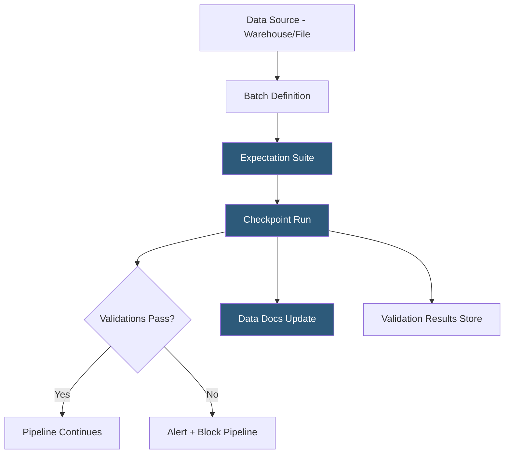

**Category:** Data Integration & ETL Automation
**Difficulty:** Intermediate
**Reading time:** 6 min read

---

Great Expectations is an open-source Python framework for defining, documenting, and validating data quality expectations in data pipelines. It enables data engineers to write declarative assertions about data—column types, value ranges, row counts, uniqueness—that serve simultaneously as data documentation and automated quality gates in CI/CD and production pipelines.

- **Expectation** — a declarative assertion about data: `expect_column_values_to_not_be_null`, `expect_column_values_to_be_between`, `expect_table_row_count_to_be_between`
- **Expectation Suite** — named collection of expectations for a dataset or pipeline checkpoint; stored as JSON
- **Data Source** — connection to a data backend: Pandas DataFrame, Spark DataFrame, SQL database, or cloud warehouse
- **Batch** — a specific slice of data (a table, a SQL query result, a CSV file) validated against an expectation suite
- **Checkpoint** — orchestration unit that pairs a batch with an expectation suite, runs validation, and takes configured actions (save results, send alerts, update Data Docs)
- **Validation Result** — JSON output from running a checkpoint: pass/fail status for each expectation, observed values, and unexpected records
- **Data Docs** — auto-generated HTML site showing expectation suites, validation results, and data quality history
- **Profiler** — utility that automatically generates a candidate expectation suite by inferring statistics from a sample dataset

Great Expectations connects to data through Data Sources that abstract the underlying backend. For SQL databases and warehouses (Snowflake, BigQuery, Redshift), GX compiles expectations into SQL WHERE clauses executed in-database, avoiding data movement. For Pandas DataFrames, validations run in Python memory. For Spark, they run as distributed Spark actions.

An expectation suite is built by writing expectations in Python code or by running the Profiler on a sample dataset. The Profiler analyzes column statistics (min, max, mean, cardinality, null percentage) and generates an initial suite of conservative expectations that reflect the current state of the data. Teams then review and refine—adding business-rule expectations (revenue > 0), removing overly strict auto-generated ones, and adding semantic constraints (values in an accepted enum).

Checkpoints orchestrate validation runs. A checkpoint is configured to run specific expectation suites against specific data batches, and upon completion, execute actions: updating Data Docs (static HTML site), sending Slack alerts on failure, or raising an exception to halt an Airflow DAG. Checkpoints are run programmatically within pipeline code or triggered by Airflow, Prefect, or dbt (via dbt-great-expectations package).

Data Docs provides a browsable validation history. Each run appends a page showing which expectations passed, which failed, the observed values, and sample failing rows. This makes GX the documentation layer for data contracts—the expectation suite is both the specification and the automated test.

GX Cloud (the managed SaaS offering) adds a collaborative UI for managing expectation suites and viewing validation history across multiple pipelines without self-hosting the metadata store.

- Validating that daily ETL output tables meet row count, null rate, and value range expectations before BI tools query them
- Adding data quality gates to dbt projects using the dbt-great-expectations integration
- Documenting data contracts between upstream data producers and downstream consumers
- Profiling a newly ingested dataset to understand its statistical properties before building transformations
- Generating data quality dashboards showing validation pass rates over time for SLA reporting

| Advantage | Disadvantage |
|-----------|--------------|
| In-database validation avoids data movement for warehouse-scale datasets | Configuration complexity is high; setup of Data Context, Sources, and Checkpoints has a steep learning curve |
| Expectations serve as both documentation and automated tests | Profiler-generated suites require significant manual review to add meaningful business-rule constraints |
| Open-source core is free with large community and documentation | GX Cloud (managed SaaS) adds cost for teams that don't want to self-host the metadata store |
| Data Docs provide automatic browsable data quality history | Schema evolution requires updating expectation suites manually to avoid stale assertions |

- [Monte Carlo Data Observability](monte-carlo-data-observability.md)
- [Segment Protocols Data Governance](segment-protocols-data-governance.md)
- [dbt (Data Build Tool) Transformations](dbt-data-build-tool-transformations.md)

---
*Part of the [Data Integration & ETL Automation](index.md) category · [Back to Master Index](../../index.md)*
