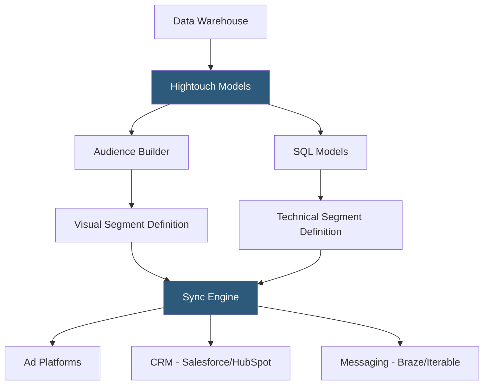

**Category:** Data Integration & ETL Automation
**Difficulty:** Intermediate
**Reading time:** 5 min read

---

Hightouch Data Activation extends Reverse ETL into a full customer data activation platform, adding audience building, journey orchestration, and real-time event streaming capabilities to the core warehouse-sync functionality. It enables non-technical business users to define audiences and trigger campaigns directly from warehouse data without writing SQL or depending on engineering.

- **Audience builder** — visual no-code interface for defining user segments using warehouse attributes and behavioral data without SQL
- **Audience sync** — sending computed audience membership from the warehouse to ad platforms (Facebook, Google Ads) for targeting
- **Journey orchestration** — visual canvas for defining multi-step customer journeys triggered by warehouse data changes
- **Data activation** — umbrella term for making warehouse insights actionable in operational systems (ad platforms, CRMs, messaging tools)
- **Hightouch Audiences** — product layer built on top of Reverse ETL that adds self-serve audience management for marketing teams
- **Match rates** — percentage of audience members successfully matched to profiles in ad platforms (Facebook Custom Audiences, Google Customer Match)
- **Computed traits** — attributes calculated from warehouse data (e.g., days since last purchase) that Hightouch keeps fresh in destination systems
- **Suppression lists** — audiences synced to ad platforms to exclude certain users from campaigns (e.g., existing customers from acquisition campaigns)

Hightouch Audiences presents a visual query builder over warehouse data. Marketing and growth teams select a base entity (users, accounts, events), add conditions using a point-and-click interface (e.g., "purchased in last 30 days AND plan = Pro"), and define the audience output. Under the hood, Hightouch translates these conditions into SQL and executes them against the warehouse.

Audience sync to ad platforms leverages platform-specific matching APIs. For Facebook Custom Audiences, Hightouch hashes PII (email, phone, name) client-side before uploading to the Custom Audiences API, maintaining GDPR/CCPA compliance. Match rates vary by data quality but typically fall between 30–70% for email-based matching. Hightouch updates audience membership incrementally—adding new matching users and removing users who no longer qualify—rather than replacing the full audience on each sync.

Computed traits extend the activation layer beyond binary audience membership. Instead of just syncing "is this user in the high-value segment," computed traits can sync continuous attributes like `predicted_ltv`, `days_since_last_purchase`, or `feature_usage_score` directly to CRM fields. These traits are recalculated on each sync run based on fresh warehouse data.

Journey orchestration adds temporal sequencing: trigger a welcome email 1 day after signup, follow up with an upgrade prompt when a user hits a usage limit, suppress ads once a purchase is completed. Journey steps reference Hightouch models and sync to messaging platforms (Braze, Iterable, Customer.io) via the same Reverse ETL engine.

- Marketing teams building lookalike audiences in Facebook from warehouse-defined high-value customer segments
- Suppressing existing customers from paid acquisition campaigns by syncing a "paying customer" audience
- Personalizing email campaigns with warehouse-computed user attributes synced to Braze as event properties
- Re-engagement campaigns targeting users who were active 30 days ago but silent for 2 weeks
- B2B account-based marketing (ABM) syncing account health scores from warehouse to LinkedIn for targeted outreach

| Advantage | Disadvantage |
|-----------|--------------|
| Non-technical marketing teams can activate data without SQL | Visual audience builder is less expressive than raw SQL for complex segmentation logic |
| Warehouse-based audiences are always based on fresh, accurate data | Ad platform match rates (30–70%) mean not all audience members receive campaigns |
| Incremental sync keeps audiences up-to-date without full re-uploads | Platform-specific API limits slow large audience syncs (Facebook allows ~10K rows/minute) |
| Hashing PII before upload maintains compliance for ad platform audiences | Hightouch Audiences is a premium feature with additional cost beyond base Reverse ETL |

- [Hightouch Reverse ETL](hightouch-reverse-etl.md)
- [Census Reverse ETL Platform](census-reverse-etl-platform.md)
- [Segment Customer Data Platform](segment-customer-data-platform.md)

---
*Part of the [Data Integration & ETL Automation](index.md) category · [Back to Master Index](../../index.md)*
