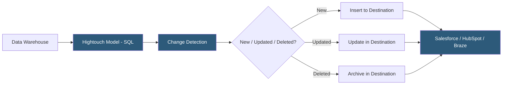

**Category:** Data Integration & ETL Automation
**Difficulty:** Intermediate
**Reading time:** 6 min read

---

Hightouch is the leading Reverse ETL platform, enabling data teams to sync data from their cloud data warehouse directly to operational tools like Salesforce, HubSpot, Braze, and 200+ other destinations. It treats the warehouse as the system of record and makes analytically-computed data available to business tools without building custom integrations or maintaining fragile ETL pipelines in reverse.

- **Reverse ETL** — the process of syncing data from a data warehouse back to operational/business tools (the reverse of traditional ETL which moves data into the warehouse)
- **Model** — a SQL query or dbt model defining the dataset to sync from the warehouse; the source of truth for what data gets activated
- **Sync** — a configured job that maps a model's columns to a destination's fields and runs on a schedule or trigger
- **Primary key** — unique identifier in the model used to detect new, updated, and deleted records across syncs
- **Sync mode** — upsert (insert or update), insert-only, update-only, or mirror (delete records from destination when removed from model)
- **Field mapping** — per-sync configuration aligning warehouse column names to destination-specific field names and types
- **Data activation** — broader term for making warehouse data actionable in business tools; encompasses Reverse ETL
- **Alerting** — Hightouch notifications for sync failures, high error rates, or significant record count changes

Hightouch connects to the data warehouse (Snowflake, BigQuery, Redshift, Databricks) using read-only credentials. A model is defined as a SQL SELECT query or a reference to a dbt model—this defines exactly which rows and columns will be synced. The primary key column tells Hightouch how to identify individual records.

During each sync run, Hightouch executes the model query and compares the results against the previous run's snapshot (stored in Hightouch's internal state store). This diffing process identifies added rows (new records to insert), modified rows (records to update), and removed rows (records to delete or archive, if mirror mode is enabled). Only the delta is forwarded to the destination, making syncs efficient even for large datasets.

The destination connector receives the delta and maps warehouse columns to the destination's API fields using the configured field mappings. Hightouch handles destination-specific API quirks—rate limits, batch sizes, pagination, and retry logic—transparently. For Salesforce, Hightouch uses the Bulk API for large syncs and the REST API for small incremental updates.

Hightouch supports multiple trigger modes: scheduled (every 15 minutes, hourly, daily), event-triggered (triggered by a webhook from dbt Cloud or an orchestrator when a model completes), and real-time (continuous streaming sync for supported warehouse connectors).

For teams using dbt, Hightouch integrates natively—models defined in dbt can be referenced directly in Hightouch without duplicating SQL, ensuring the same business logic definitions power both analytics and operational tooling.

- Syncing a lead score computed in the warehouse to Salesforce's lead score field for SDR prioritization
- Pushing cohort membership from warehouse segments to Braze for targeted email campaigns
- Updating Zendesk customer records with LTV and churn risk scores calculated by data science models
- Keeping HubSpot contact properties in sync with warehouse-computed usage metrics for CS teams
- Activating product-qualified leads (PQLs) in sales tools based on warehouse-defined product usage criteria

| Advantage | Disadvantage |
|-----------|--------------|
| Warehouse as single source of truth eliminates data silos | Sync latency typically 15+ minutes; not suitable for real-time operational requirements |
| SQL-based models are accessible to data analysts without custom code | Change detection at scale requires efficient warehouse queries; poorly optimized models are expensive |
| 200+ destination connectors cover all major business tools | Destination API rate limits constrain sync throughput for large record counts |
| dbt integration ensures analytics and activation use identical business logic | Delete propagation (mirror mode) can cause unintended data loss in destinations if model logic changes |

- [Hightouch Data Activation](hightouch-data-activation.md)
- [Census Reverse ETL Platform](census-reverse-etl-platform.md)
- [dbt (Data Build Tool) Transformations](dbt-data-build-tool-transformations.md)

---
*Part of the [Data Integration & ETL Automation](index.md) category · [Back to Master Index](../../index.md)*
