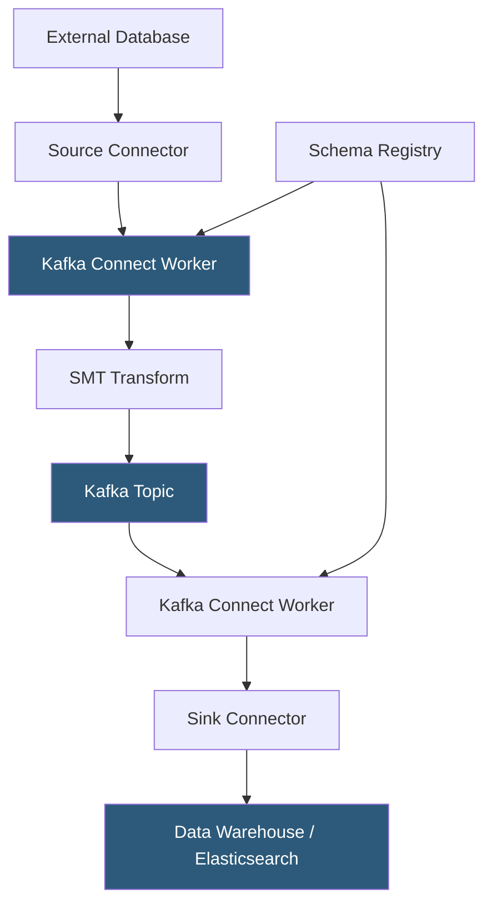

**Category:** Data Integration & ETL Automation
**Difficulty:** Advanced
**Reading time:** 6 min read

---

Kafka Connect is a scalable, fault-tolerant framework for streaming data between Apache Kafka and external systems. It provides a standardized plugin interface for source connectors (importing data into Kafka) and sink connectors (exporting data from Kafka), enabling data engineers to build reliable pipelines without writing custom producer/consumer code.

- **Source connector** — Kafka Connect plugin that reads from an external system (database, API, file) and publishes records to Kafka topics
- **Sink connector** — plugin that consumes records from Kafka topics and writes them to an external system (data warehouse, search index, another database)
- **Worker** — Kafka Connect process that runs connectors; supports standalone (single worker) and distributed (multi-worker cluster) modes
- **Task** — unit of parallelism within a connector; a connector divides its work into tasks executed in parallel by workers
- **Converter** — serialization component that translates records between Java objects and byte arrays; common choices are Avro (with Schema Registry), JSON, and Protobuf
- **Transforms (SMTs)** — Single Message Transforms applied inline to records—masking fields, renaming topics, adding headers—without requiring a separate stream processor
- **Offset storage** — Kafka Connect stores source offsets (last-read position) in a Kafka topic, enabling resumable ingest after failure
- **Schema Registry** — Confluent component storing Avro/Protobuf schemas; connectors use it to ensure producers and consumers agree on record structure

Kafka Connect runs as a cluster of worker processes. In distributed mode, workers form a group (via Kafka's consumer group protocol) and coordinate connector and task assignment. When a connector is deployed via the REST API, the framework divides it into tasks and distributes them across available workers. If a worker fails, remaining workers rebalance and pick up the failed tasks, ensuring continuous operation.

Source connectors implement two methods: `poll()` (returns a list of SourceRecords fetched from the external system) and `commitRecord()` (called after Kafka acknowledges receipt, allowing the connector to commit its offset). The JDBC Source Connector, for example, queries a database table for rows with a timestamp or incrementing ID greater than the last committed offset, converts each row to a SourceRecord, and publishes it to a Kafka topic named after the table.

Sink connectors implement `put()` (receives a batch of SinkRecords from Kafka) and `flush()` (called to commit any buffered writes). The Kafka S3 Sink Connector, for example, buffers records in memory, partitions them by time (hourly/daily), and flushes to S3 as Parquet, Avro, or JSON files when the partition closes or the buffer size limit is reached.

Single Message Transforms (SMTs) run inline between source/sink and the Kafka topic. Common SMTs include `MaskField` (replace sensitive field values with null), `ReplaceField` (rename or drop fields), `TimestampConverter` (change timestamp formats), and `ValueToKey` (promote a field to the record key for partition routing).

- JDBC Source Connector reading MySQL binlog changes and streaming them to Kafka for CDC-based pipelines
- S3 Sink Connector archiving Kafka topics to data lake storage as Parquet files
- Elasticsearch Sink Connector indexing product catalog events for search
- Debezium Source Connector capturing PostgreSQL WAL changes as structured events
- BigQuery Sink Connector streaming Kafka events to BigQuery for real-time analytics

| Advantage | Disadvantage |
|-----------|--------------|
| 200+ community connectors available in Confluent Hub | Distributed mode requires careful sizing; under-provisioned workers become bottlenecks |
| Offset storage in Kafka provides built-in durability and resumability | Connector debugging requires understanding Kafka logs, REST API status, and Java heap dumps |
| SMTs enable lightweight transformation without external stream processor | Complex transformations (joins, aggregations, stateful logic) require Kafka Streams or Flink instead |
| Connector configuration is declarative JSON; easily version-controlled | Schema evolution with Avro requires Schema Registry management and compatibility policies |

- [Apache Kafka Data Streaming](apache-kafka-data-streaming.md)
- [Confluent Cloud Managed Kafka](confluent-cloud-managed-kafka.md)
- [Debezium Change Data Capture](debezium-change-data-capture.md)

---
*Part of the [Data Integration & ETL Automation](index.md) category · [Back to Master Index](../../index.md)*
