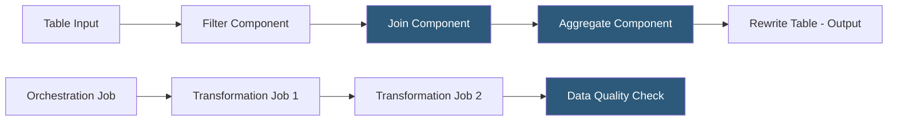

**Category:** Data Integration & ETL Automation
**Difficulty:** Intermediate
**Reading time:** 6 min read

---

Matillion is a cloud-native ELT data transformation platform that runs transformations natively inside data warehouses (Snowflake, BigQuery, Redshift, Databricks). It provides a visual drag-and-drop job builder that generates warehouse-native SQL, enabling data engineers to build complex transformation pipelines without writing raw SQL while maintaining the performance benefits of in-warehouse processing.

- **Matillion ETL** — the original product; visual job builder deployed as a cloud instance (EC2/GCE) that compiles visual pipelines into warehouse SQL
- **Matillion Data Productivity Cloud (DPC)** — newer SaaS offering with a collaborative web-based IDE and CI/CD integration
- **Orchestration job** — Matillion job that sequences and triggers transformation jobs, handles conditionals, and integrates with external systems
- **Transformation job** — Matillion job that executes warehouse SQL generated from visual component configurations
- **Component** — visual building block representing a transformation operation: Join, Aggregate, Filter, SQL Script, Python Script
- **Grid variable** — Matillion's parameterization mechanism; enables a single job to process different tables, dates, or configurations dynamically
- **Environment** — Matillion's deployment unit separating dev, test, and prod configurations (warehouse credentials, schemas, parameters)
- **Project** — version-controlled collection of jobs stored in Git (DPC) or exported as JSON (legacy ETL)

Matillion compiles visual pipelines into warehouse-native SQL that executes inside the data warehouse. When a transformation job runs, Matillion's engine translates each visual component into a SQL clause—a Join component becomes a JOIN, an Aggregate becomes a GROUP BY—and assembles them into a complete CREATE TABLE AS SELECT (CTAS) or INSERT INTO statement. The SQL runs entirely within the warehouse, leveraging its distributed compute without data movement.

The orchestration layer sequences transformation jobs using a DAG of tasks. Orchestration jobs can branch based on row counts (run the error handler if the previous job output zero rows), loop over grid variable values (run the same transformation for each date in a list), or call external APIs between steps. This makes Matillion suitable for full pipeline orchestration, not just individual transformations.

Grid variables are Matillion's parameterization system. A grid variable is a list of values (dates, table names, regions) that an orchestration job iterates over, running a child job once per variable value. This pattern enables a single generic transformation job to process many input tables, making pipelines DRY and maintainable.

Matillion DPC introduces a cloud-based collaborative IDE with Git integration, branching workflows, and a CI/CD pipeline for deploying jobs through dev/test/prod environments. Teams can develop locally in the browser, commit changes to a feature branch, create pull requests for peer review, and deploy through an automated pipeline—treating data transformation jobs like application code.

- Building star-schema dimensional models (facts and dimensions) from raw Fivetran-loaded tables in Snowflake
- Data engineers who want warehouse-native performance without writing hundreds of lines of raw SQL manually
- Organizations migrating from on-premises Informatica PowerCenter to a cloud-native visual ELT tool
- Building parameterized multi-tenant transformation pipelines using grid variables
- Teams requiring full CI/CD for transformation code with branch-based development and automated testing

| Advantage | Disadvantage |
|-----------|--------------|
| Visual pipeline builder accelerates transformation development vs raw SQL | Visual abstraction hides generated SQL; complex generated queries can be hard to debug and optimize |
| Warehouse-native execution leverages Snowflake/BigQuery compute without data movement | Matillion instance (legacy ETL) is a separate EC2/GCE server to manage and size correctly |
| Grid variables enable DRY parameterized pipelines | Grid variable iterations can spawn many warehouse queries; cost management requires discipline |
| DPC's Git integration enables professional software development workflows for data | DPC pricing is higher than legacy ETL; migration from legacy ETL requires rebuild effort |

- [dbt (Data Build Tool) Transformations](dbt-data-build-tool-transformations.md)
- [Fivetran Transformation dbt Integration](fivetran-transformation-dbt-integration.md)
- [Dataform Data Transformation](dataform-data-transformation.md)

---
*Part of the [Data Integration & ETL Automation](index.md) category · [Back to Master Index](../../index.md)*
