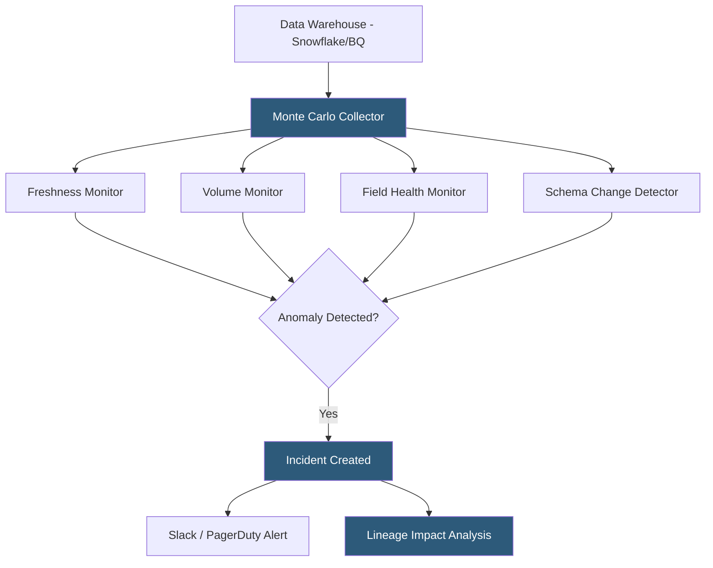

**Category:** Data Integration & ETL Automation
**Difficulty:** Advanced
**Reading time:** 6 min read

---

Monte Carlo is a data observability platform that automatically monitors data warehouses and pipelines for data quality issues—freshness anomalies, volume drops, schema changes, and distribution shifts—without requiring manual test definitions. Using ML-based anomaly detection, it surfaces data incidents before they affect dashboards and business decisions, treating data reliability with the same operational rigor as application uptime.

- **Data observability** — the ability to understand the health, freshness, and accuracy of data across a data platform using automated monitoring
- **Data incident** — detected anomaly indicating a potential data quality issue: table freshness delay, unexpected row count change, schema column removal
- **Field health monitor** — ML model tracking statistical distribution of column values over time; alerts when distributions shift significantly
- **Freshness monitor** — tracks update intervals for tables and alerts when data is stale beyond the expected cadence
- **Volume monitor** — tracks row count changes between pipeline runs; alerts on unexpected drops or spikes
- **Lineage** — automated mapping of table-level and column-level dependencies showing which tables feed which downstream tables and BI assets
- **Circuit breaker** — Monte Carlo feature that pauses pipeline execution when upstream data quality fails, preventing bad data propagation
- **Data catalog integration** — Monte Carlo connects to dbt, Fivetran, Looker, and Tableau to enrich lineage with context about model definitions and dashboard usage

Monte Carlo connects to the data warehouse via read-only SQL access (and optionally to metadata APIs like Snowflake's INFORMATION_SCHEMA or BigQuery's INFORMATION_SCHEMA). It runs metadata queries—not data queries—to collect table statistics: row counts, update timestamps, column null rates, distinct value counts, and distribution statistics. These metadata queries are lightweight and have minimal performance impact.

Monte Carlo's ML models train on each table's historical behavior to establish dynamic thresholds. A table that grows by 10,000 rows each day will trigger an alert if it suddenly grows by 100,000 or fails to update entirely—without requiring a human to specify an explicit threshold. Seasonality (weekly patterns, monthly cycles) is incorporated into the model, preventing false alerts on expected variations.

Lineage is built by parsing query logs from the warehouse (Snowflake Query History, BigQuery INFORMATION_SCHEMA.JOBS) to identify read/write patterns between tables. Monte Carlo combines this with metadata from dbt (model definitions, ref() relationships), Fivetran (source-to-table mappings), and BI tools (Looker, Tableau dashboard dependencies) to construct a full column-level lineage graph. When an incident fires on an upstream table, Monte Carlo immediately shows which downstream tables and dashboards are affected.

Incidents flow to Slack channels or PagerDuty, with context including the anomaly type, affected table, incident timeline, and lineage impact. Data engineers can acknowledge, add root cause notes, and resolve incidents from within Slack without opening the Monte Carlo UI.

Circuit breakers integrate with Airflow, dbt, and other orchestrators—if a configured quality check fails before a transformation runs, Monte Carlo sends a signal to pause the DAG, preventing bad data from flowing to downstream consumers.

- Detecting a Fivetran connector failure that caused a warehouse table to stop updating, before analysts notice stale dashboards
- Catching a schema change (column dropped) in an upstream raw table that would break dependent dbt models
- Identifying row count anomalies in a revenue fact table caused by a payment processor API change
- Understanding which Tableau dashboards will be affected before performing a warehouse table migration
- Replacing manual data quality tests with ML-based automated monitoring for tables too numerous to test individually

| Advantage | Disadvantage |
|-----------|--------------|
| Automatic anomaly detection without defining explicit thresholds reduces setup burden | ML-based detection has a training period (typically 2 weeks) before alerts are reliable |
| Full lineage shows blast radius of data incidents immediately | SaaS pricing is substantial; typically $50K–$200K+/year for enterprise deployments |
| Connects to dbt, Fivetran, Looker for context-rich incident investigation | Read-only metadata queries still require warehouse query credits, adding costs |
| Slack-native incident workflow reduces time-to-resolution for on-call engineers | False positive alerts during training period can erode team trust in the system |

- [Great Expectations Data Quality](great-expectations-data-quality.md)
- [Datafold Data Diffing](datafold-data-diffing.md)
- [dbt Cloud Orchestration](dbt-cloud-orchestration.md)

---
*Part of the [Data Integration & ETL Automation](index.md) category · [Back to Master Index](../../index.md)*
