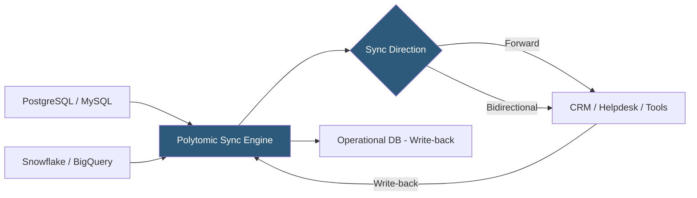

**Category:** Data Integration & ETL Automation
**Difficulty:** Intermediate
**Reading time:** 5 min read

---

Polytomic is a Reverse ETL and data sync platform that enables bidirectional data movement between databases, data warehouses, and business applications. Unlike Hightouch and Census which focus purely on warehouse-to-destination activation, Polytomic supports reading from operational databases directly (not just warehouses) and syncing in both directions, positioning it for use cases requiring two-way data flow between systems.

- **Bidirectional sync** — data movement in both directions between a source and destination; changes in the destination can be written back to the source
- **Bulk sync** — Polytomic's core sync engine that moves datasets on a schedule from any supported source to any supported destination
- **Field sync** — granular column-level sync that maps specific fields between source and destination objects
- **Source** — any supported data store: PostgreSQL, MySQL, Snowflake, BigQuery, Redshift, MongoDB, or 50+ SaaS tools
- **Destination** — target system for data activation: Salesforce, HubSpot, Zendesk, Jira, Slack, and 50+ others
- **Sync schedule** — configurable frequency from continuous (near-real-time) to daily
- **Record matching** — how Polytomic identifies corresponding records across source and destination for updates; by email, ID, or custom fields
- **Backfill** — initial full-data load when a sync is first activated, establishing baseline state before incremental syncs begin

Polytomic connects to sources via read credentials and uses query-based change detection—similar to other Reverse ETL tools—with a high-watermark timestamp column or primary key range to identify new and updated records. For operational databases like PostgreSQL, Polytomic can query tables directly without requiring the data to first land in a warehouse, reducing latency for teams that haven't fully adopted a warehouse-centric architecture.

Each sync maps source columns to destination fields using a visual field mapping interface. Record matching defines how Polytomic links source and destination records—typically by a shared identifier (email, external ID) or a lookup relationship. When a source record's email matches a Salesforce contact, Polytomic updates that specific contact rather than creating duplicates.

Bidirectional sync adds a write-back path: when a destination record changes (a Salesforce rep updates an account stage), Polytomic detects the change via the destination's API and writes it back to the source database. This keeps operational systems in sync without custom webhook integrations or manual data entry duplication.

Conflict resolution handles cases where both source and destination update the same field simultaneously. Polytomic's default is source-wins (the data warehouse or database value takes precedence), but destination-wins mode is available for cases where the CRM is authoritative.

Polytomic is deployed as a fully managed cloud service. All connections are secured with TLS; database connectors use SSH tunneling or VPN for private network access. SOC 2 Type II compliance covers the platform.

- Syncing product usage data from a PostgreSQL OLTP database directly to Salesforce without going through a warehouse
- Bidirectional sync between HubSpot and an internal CRM so both teams see consistent data
- Keeping Zendesk customer tier information updated based on billing records from a MySQL database
- Activating Jira ticket data in Slack by syncing issue status changes to a Slack channel destination
- Small data teams without a warehouse that need operational database data in business tools

| Advantage | Disadvantage |
|-----------|--------------|
| Reads directly from operational databases without requiring a warehouse | Query-based change detection adds load to production databases; read replicas recommended |
| Bidirectional sync enables two-way system synchronization | Bidirectional syncs introduce conflict complexity; incorrect configuration can cause data loops |
| Visual field mapping accessible to non-SQL users | Fewer connectors (50+) than Hightouch or Fivetran (200–500+) |
| No warehouse required reduces infrastructure complexity for smaller teams | Limited transformation capabilities; complex business logic still requires external SQL or code |

- [Hightouch Reverse ETL](hightouch-reverse-etl.md)
- [Census Reverse ETL Platform](census-reverse-etl-platform.md)
- [Hightouch Data Activation](hightouch-data-activation.md)

---
*Part of the [Data Integration & ETL Automation](index.md) category · [Back to Master Index](../../index.md)*
