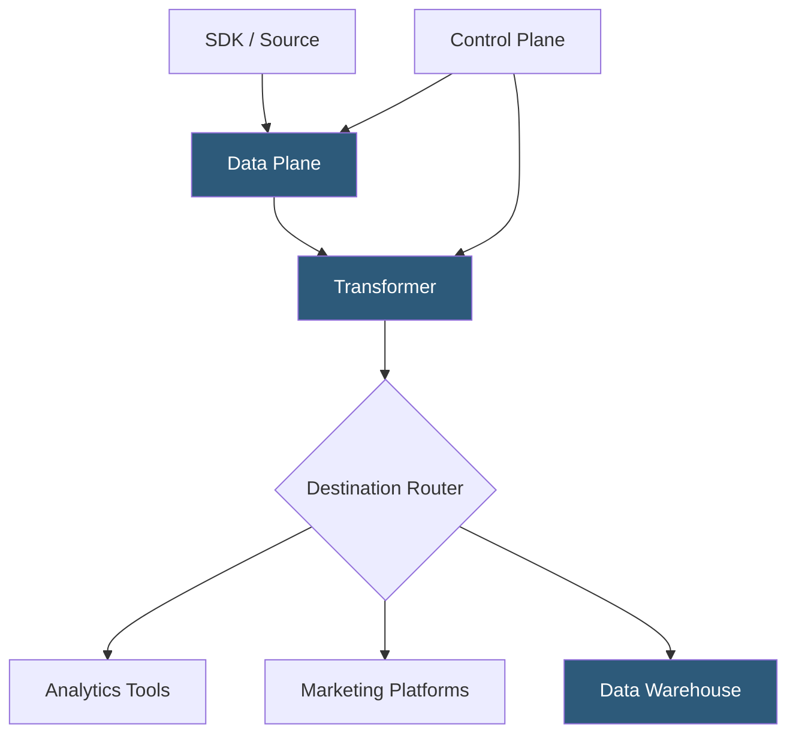

**Category:** Data Integration & ETL Automation
**Difficulty:** Intermediate
**Reading time:** 6 min read

---

RudderStack is an open-source, warehouse-native Customer Data Platform (CDP) that provides Segment-compatible APIs for event collection and routing while emphasizing data ownership, self-hosting capabilities, and direct warehouse integration. Unlike Segment, RudderStack stores no data itself—events flow through to customer-owned destinations, making it popular with data-privacy-conscious engineering teams.

- **Warehouse-native CDP** — architecture where the data warehouse is the primary store of truth; RudderStack syncs identity and event data directly to the warehouse rather than maintaining its own profile store
- **Data plane** — RudderStack component that receives events, transforms them, and routes to destinations; can be self-hosted or cloud-managed
- **Control plane** — RudderStack UI and configuration management layer; handles source/destination config, transformations, and routing rules
- **Rudder Transformer** — service running user-defined JavaScript transformations applied to events before they reach destinations
- **Segment compatibility** — RudderStack implements the same Identify/Track/Page/Group/Alias API spec, enabling migration from Segment by changing the SDK endpoint
- **Sources** — event emitters: web, mobile, server SDKs, and cloud extract sources (similar to Fivetran connectors for batch data)
- **Profiles** — RudderStack's identity resolution feature that builds unified user profiles in the warehouse from cross-device events
- **Retl (Reverse ETL)** — RudderStack feature that reads from the warehouse and activates data to destinations like Salesforce or ad platforms

RudderStack's data plane is a stateless event router that can be self-deployed on Kubernetes or Docker, or used as RudderStack Cloud. Events arrive via HTTPS at the data plane, are persisted to a backing store (PostgreSQL or BadgerDB) for durability, and then routed to configured destinations.

Before delivery, events pass through the Rudder Transformer—a Node.js service hosting user-defined transformation functions. Transformations are JavaScript snippets that modify event properties, filter events, or create synthetic events from a single incoming event. Multiple transformations can be chained per destination. Transformations run in a sandboxed V8 context with access to standard JavaScript but no network calls, ensuring low latency.

Because RudderStack processes events in a streaming fashion without persisting profiles internally, the warehouse becomes the single source of truth. The warehouse destination loads every event in real-time using streaming inserts (BigQuery) or micro-batching (Snowflake, Redshift). Identity resolution—merging anonymous and identified user events—runs as a SQL-based job in the warehouse rather than in RudderStack's application layer.

RudderStack's Cloud Extract feature (batch sources similar to Fivetran) lets teams pull data from SaaS APIs (Salesforce, HubSpot, Stripe) directly into the warehouse alongside event data, creating a unified analytical foundation without a separate ELT tool.

The self-hosted data plane enables organizations to keep all event data within their VPC. No raw events are stored on RudderStack's infrastructure—only connection configuration lives in the control plane.

- Replacing Segment to reduce costs while maintaining the same tracking API and SDK compatibility
- Organizations with strict data residency requirements that must keep event data in their own cloud account
- Teams wanting a unified platform for both event streaming and batch data integration (Cloud Extract)
- Companies building a warehouse-first CDP where profiles live in Snowflake/BigQuery rather than a third-party system
- Engineering teams comfortable with self-hosting who want full control over transformation logic

| Advantage | Disadvantage |
|-----------|--------------|
| Segment-API compatibility enables migration without re-instrumentation | Self-hosted data plane requires DevOps expertise for deployment and maintenance |
| No data storage on RudderStack servers; full data ownership | Fewer pre-built destination integrations than Segment's 400+ catalog |
| Open-source core is free; only cloud management has a cost | Identity resolution (Profiles) is more complex when warehouse-based vs managed CDP approach |
| JavaScript transformations provide flexible event manipulation | Transformation debugging requires understanding of V8 sandbox limitations |

- [RudderStack Event Streaming](rudderstack-event-streaming.md)
- [Segment Customer Data Platform](segment-customer-data-platform.md)
- [Hightouch Reverse ETL](hightouch-reverse-etl.md)

---
*Part of the [Data Integration & ETL Automation](index.md) category · [Back to Master Index](../../index.md)*
