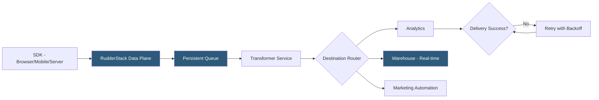

**Category:** Data Integration & ETL Automation
**Difficulty:** Intermediate
**Reading time:** 5 min read

---

RudderStack's event streaming pipeline ingests behavioral events from web, mobile, and server sources in real-time and routes them to downstream analytics, marketing, and data warehouse destinations. Built for high throughput and low latency, the streaming architecture handles millions of events per day while providing configurable retry logic, transformation middleware, and per-destination delivery guarantees.

- **Event stream** — real-time flow of Track, Identify, Page, Screen, and Group calls from instrumented sources
- **Write key** — source-specific authentication token embedded in SDK calls, scoped to a single source
- **Payload buffering** — SDK-side queuing that persists events locally before flushing to the data plane, preventing event loss during network interruptions
- **Event routing** — configurable rules that direct events from a source to one or more destinations based on event type or properties
- **Delivery guarantee** — at-least-once delivery ensured by data plane's persistent queue and retry logic
- **Dead letter queue** — events that fail all retry attempts are written to a DLQ for manual inspection and replay
- **Webhook source** — RudderStack endpoint that accepts arbitrary JSON payloads from any external service and converts them into RudderStack events
- **Event replay** — ability to re-process historical events from a source against new or updated destination configurations

RudderStack's streaming pipeline begins at the SDK layer. Browser SDKs use an in-memory queue with localStorage persistence, ensuring events survive page refreshes. When the network is unavailable, events accumulate locally and flush in batches when connectivity resumes. Server-side SDKs use configurable batch sizes and flush intervals to optimize throughput vs latency trade-offs.

Events arrive at the data plane via HTTPS. The data plane writes each event to a durable backing store (BadgerDB for embedded, or PostgreSQL for production deployments) before acknowledging receipt. This persistence ensures no events are lost even if the data plane restarts mid-stream. Worker goroutines then pull events from the queue, apply any configured transformations, and deliver to each destination concurrently.

Destination delivery uses exponential backoff with jitter for retries. Destinations that return 429 (rate limit) or 5xx errors trigger retries up to a configurable maximum. Events exhausting retry attempts go to the dead letter queue, where they can be inspected and replayed once the destination issue is resolved. This is critical for warehouse destinations—Snowflake maintenance windows shouldn't result in lost events.

For real-time warehouse loading, RudderStack uses destination-native bulk loading APIs: BigQuery streaming inserts land data within seconds; Snowflake uses micro-batch COPY INTO operations every few minutes. The warehouse destination receives every event, not just a sample, providing a complete audit trail of user behavior.

- High-traffic e-commerce sites streaming purchase events to both a warehouse and Facebook CAPI simultaneously
- Mobile apps with unreliable connections using SDK buffering to prevent event loss
- Serverless functions emitting backend events via the Node.js SDK with batch flushing
- Integrating a third-party webhook (Stripe payment events) with RudderStack's webhook source
- Replaying six months of historical events against a newly configured marketing destination

| Advantage | Disadvantage |
|-----------|--------------|
| At-least-once delivery with DLQ prevents silent event loss | At-least-once means duplicates; destinations must handle idempotency |
| SDK buffering handles network interruptions gracefully | Buffer size limits mean very long offline periods can still lose events |
| Concurrent destination delivery minimizes end-to-end latency | High destination count multiplies data plane load; requires appropriate sizing |
| Event replay enables retroactive destination activation without re-instrumentation | Replay requires storage of raw events in warehouse; additional storage cost |

- [RudderStack Customer Data Platform](rudderstack-customer-data-platform.md)
- [Segment Connections Integrations](segment-connections-integrations.md)
- [Apache Kafka Data Streaming](apache-kafka-data-streaming.md)

---
*Part of the [Data Integration & ETL Automation](index.md) category · [Back to Master Index](../../index.md)*
