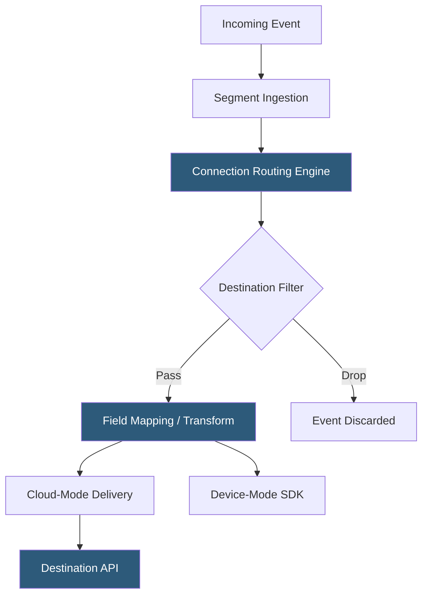

**Category:** Data Integration & ETL Automation
**Difficulty:** Intermediate
**Reading time:** 5 min read

---

Segment Connections is the core integration layer of the Segment platform, managing the routing of event data from sources to destinations. It provides a catalog of 400+ pre-built destination integrations and a flexible mapping engine that transforms, filters, and forwards events to downstream tools without custom code.

- **Source** — any system emitting events to Segment: web, mobile, server, or third-party cloud tools via webhook sources
- **Destination** — downstream service receiving Segment events; supports cloud-mode (server-side forwarding) and device-mode (client-side SDK bundling)
- **Cloud-mode destination** — Segment's servers forward events to the destination API, keeping client payload lightweight
- **Device-mode destination** — destination's JavaScript SDK is loaded in the browser; required for features needing direct cookie or DOM access
- **Functions** — custom JavaScript code that transforms or routes events to destinations not in Segment's catalog
- **Event delivery** — Segment guarantees at-least-once delivery with retry logic for failed destination calls
- **Destination filters** — conditional logic applied per destination to drop events, filter properties, or route specific events to specific tools
- **Mappings** — field-level transformations that rename, compute, or drop properties before forwarding to a destination

Segment Connections routes events through a pipeline of filtering, transformation, and delivery. When an event arrives, the routing engine evaluates it against every active connection for that source. Each connection has optional destination filters—FQL (Filter Query Language) expressions that can drop events based on type, property values, or user traits. For example: "Only send `Purchase` events to Facebook Conversions API; drop all others."

Passing events go through the mapping layer. Mappings allow teams to rename properties (Segment's `revenue` → Salesforce's `Amount`), compute new fields using templates, or drop sensitive PII before forwarding. Mappings are configured in the Segment UI without code and persist per destination.

Cloud-mode delivery uses Segment's servers as an intermediary, which protects client performance—the browser fires one request to Segment, and Segment handles all downstream API calls asynchronously. This improves page load times and insulates the client from destination availability issues. Cloud-mode also enables server-side enrichment (adding IP-based geolocation, for example) before forwarding.

For destinations requiring browser-side access—remarketing pixels that set cookies, session recording tools that observe the DOM—device-mode loads the destination's SDK via Segment's Analytics.js bundler. This maintains Segment as the instrumentation single point but preserves the destination's browser-level capabilities.

Segment Functions extend the catalog for custom destinations. Functions are Node.js scripts deployed to Segment's serverless runtime that receive events via webhook and can call arbitrary APIs, enabling integrations with internal tools or destinations not in Segment's catalog.

- Routing purchase events to Facebook Conversions API and Google Ads while filtering page views from those destinations
- Stripping PII from events before forwarding to a third-party analytics destination
- Building a custom destination using Functions for an internal data processing API
- Configuring field mappings so Segment event properties align with Salesforce's field schema
- Using device-mode destinations for session recording tools that need DOM access

| Advantage | Disadvantage |
|-----------|--------------|
| 400+ pre-built destinations eliminate custom integration code | Cloud-mode adds 100–500ms latency for real-time destinations |
| Destination filters and mappings enable fine-grained data control without code | Device-mode destinations load third-party JavaScript, affecting page performance |
| Functions allow unlimited extensibility for custom destinations | Functions require JavaScript expertise and add cold-start latency |
| At-least-once delivery with retry ensures events reach destinations | Duplicate delivery requires idempotency handling on the destination side |

- [Segment Customer Data Platform](segment-customer-data-platform.md)
- [Segment Protocols Data Governance](segment-protocols-data-governance.md)
- [RudderStack Event Streaming](rudderstack-event-streaming.md)

---
*Part of the [Data Integration & ETL Automation](index.md) category · [Back to Master Index](../../index.md)*
