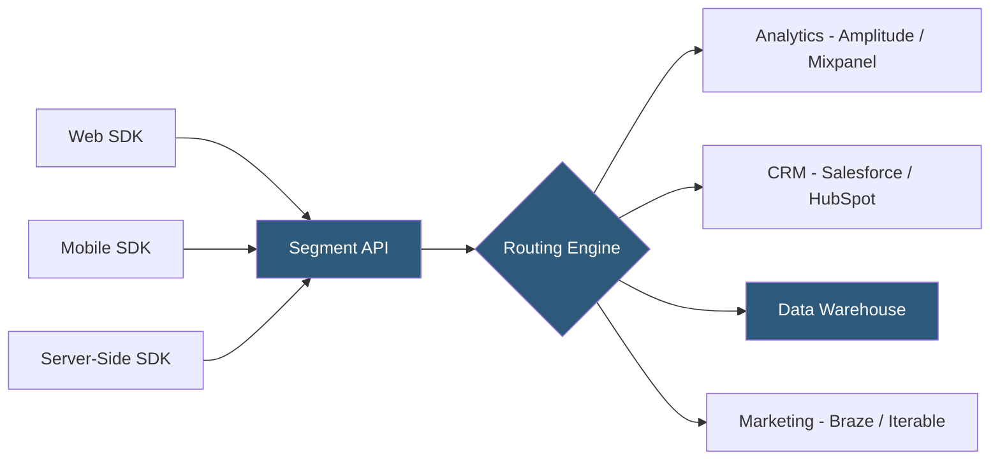

**Category:** Data Integration & ETL Automation
**Difficulty:** Intermediate
**Reading time:** 6 min read

---

Segment is a Customer Data Platform (CDP) that collects behavioral event data from websites, mobile apps, and server-side sources through a unified API, then routes that data to hundreds of downstream destinations including analytics tools, CRMs, data warehouses, and marketing automation platforms. It serves as the central data layer that decouples data collection from data consumption.

- **Track call** — event-based API call recording a user action (e.g., "Order Completed" with properties like revenue, items)
- **Identify call** — associates a user ID with traits (email, name, plan) to build a persistent customer profile
- **Page/Screen call** — records a page view (web) or screen view (mobile) with URL and context properties
- **Source** — data emitter (website, app, server) that sends events to Segment via an SDK or HTTP API
- **Destination** — downstream tool (Amplitude, Salesforce, Snowflake) that receives events routed by Segment
- **Connection** — a configured source-to-destination routing with optional filtering and field transformation
- **Personas (Twilio Engage)** — Segment's identity resolution and audience-building layer that merges anonymous and known user events
- **Warehouses** — Segment's native warehouse destination that loads raw event data into Snowflake, BigQuery, or Redshift

Segment provides SDKs for JavaScript (Analytics.js), iOS, Android, and server-side libraries (Python, Node.js, Ruby, Go, Java). Instrumentation involves replacing direct calls to individual analytics tools with a single set of Segment calls. Instead of firing separate tracking pixels for Google Analytics, Amplitude, and Facebook simultaneously, code calls `analytics.track("Button Clicked", { label: "signup" })` once, and Segment fans the event out to all configured destinations.

The Segment API receives events at ingest.segment.com and persists them in a durable queue. Each event is enriched with context automatically: browser user-agent, IP, page URL, library version. The routing engine evaluates each event against connection configurations—destinations can filter by event type, apply field mappings (rename properties), and transform values before forwarding.

Destinations receive events in their native format. Cloud-mode destinations (server-to-server) receive events via Segment's servers, keeping the client payload small. Device-mode destinations (bundled SDKs) load the destination's JavaScript directly in the browser for features requiring direct browser access (cookies, DOM manipulation).

The Segment warehouse destination loads a copy of every event into the warehouse using Segment's structured schema: events land in tables named by their type (e.g., `order_completed`, `page_viewed`), with one row per event and a consistent column structure (anonymous_id, user_id, timestamp, context, properties).

Personas adds identity resolution: Segment merges anonymous session events with identified user events using a deterministic + probabilistic matching algorithm, building unified profiles that can be exported as audiences to ad platforms or activation tools.

- Instrumenting a product once and routing data to 5+ analytics and marketing tools without multiple SDKs
- Building a first-party data warehouse by warehousing all product events for SQL analysis
- Creating behavioral audience segments (users who viewed pricing but didn't convert) for targeted campaigns
- Replacing fragmented marketing tag management with a single data collection layer
- Enforcing consistent event naming and schema through Protocols data governance

| Advantage | Disadvantage |
|-----------|--------------|
| Single instrumentation point for all downstream tools reduces engineering burden | Costs scale with monthly tracked users (MTUs), becoming expensive at growth stage |
| 400+ destination integrations cover virtually all marketing and analytics tools | Device-mode destinations still load third-party JavaScript, affecting page performance |
| Warehouse destination provides durable raw event archive | Learning curve for event schema design; poor taxonomy is hard to fix retroactively |
| Personas unifies fragmented user identity across sessions and devices | Personas is a premium add-on with significant additional cost |

- [Segment Connections Integrations](segment-connections-integrations.md)
- [Segment Protocols Data Governance](segment-protocols-data-governance.md)
- [RudderStack Customer Data Platform](rudderstack-customer-data-platform.md)

---
*Part of the [Data Integration & ETL Automation](index.md) category · [Back to Master Index](../../index.md)*
