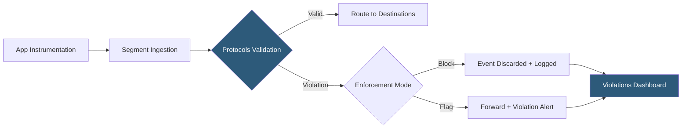

**Category:** Data Integration & ETL Automation
**Difficulty:** Advanced
**Reading time:** 6 min read

---

Segment Protocols is the data governance layer of the Segment platform, providing schema enforcement, event validation, and data quality controls for event streams. It ensures that tracking plans—the agreed-upon specifications for what events to track and what properties they should contain—are enforced in real-time as events flow through Segment, preventing bad data from polluting downstream analytics and reporting.

- **Tracking plan** — documented specification of all events a team should track, their properties, types, and required vs optional status
- **Schema enforcement** — real-time validation of incoming events against the tracking plan; non-conforming events can be blocked or flagged
- **Violation** — an event property that fails a schema rule (wrong type, missing required field, unexpected event name)
- **Event omission** — Protocols action that blocks a violating event from reaching destinations while logging it for review
- **Unplanned events** — events not defined in the tracking plan; Protocols can block, forward with a flag, or simply log them
- **Data quality score** — aggregate metric showing the percentage of events conforming to the tracking plan over time
- **Typewriter** — Protocols code generation tool that produces strongly-typed SDK wrappers from the tracking plan, preventing instrumentation errors at compile time
- **Protocols API** — REST API for programmatically managing tracking plans, enabling GitOps workflows for schema management

Protocols enforces data quality through a tracking plan defined collaboratively between product, engineering, and analytics teams. The tracking plan specifies every event name (e.g., "Order Completed"), its required and optional properties (order_id: string required; revenue: number optional), property value constraints (enum values, regex patterns, numeric ranges), and the sources from which each event is expected.

When an event arrives at Segment, Protocols validates it against the tracking plan in real-time. Validation checks include: is the event name in the plan (or should unplanned events be blocked?), are all required properties present, are property types correct (string vs number), and do values satisfy any constraints defined. Violations are categorized by severity and logged with the full event payload for debugging.

Enforcement modes allow teams to balance data quality against development velocity. "Block" mode prevents violating events from reaching any destination, protecting analytics tools from corrupt data but risking lost events during active development. "Flag" mode forwards all events but adds a `context.violations` property listing the violations, allowing destination tools to handle them appropriately. Monitoring-only mode logs violations without blocking, ideal for teams instrumenting new events.

Typewriter generates client-side SDK wrappers from the tracking plan. Instead of calling `analytics.track("Order Completed", { orderId, reveneu })` (note the typo), developers call type-safe auto-generated functions like `analytics.orderCompleted({ orderId, revenue })`. The TypeScript/JavaScript types are derived from the tracking plan schema, catching instrumentation errors at compile time before they reach production.

The Protocols API and Terraform provider enable tracking plan management as code, allowing teams to version control their event schema and deploy plan changes through CI/CD pipelines with review and approval workflows.

- Preventing `revenue: "49.99"` (string instead of number) from corrupting financial reporting in BI tools
- Enforcing consistent event naming conventions across 5 engineering squads contributing to the same tracking plan
- Blocking PII fields from being accidentally added to events before they reach third-party destinations
- Using Typewriter to give mobile developers compile-time safety for tracking calls
- Auditing which team introduced a tracking violation using the violations dashboard's source attribution

| Advantage | Disadvantage |
|-----------|--------------|
| Prevents bad data from polluting warehouses and analytics tools | Initial tracking plan creation requires significant cross-team coordination |
| Typewriter eliminates instrumentation errors before they reach production | Block mode can drop valid events during rapid iteration if plans aren't updated promptly |
| Violations dashboard provides actionable data quality monitoring | Protocols is a premium Segment add-on with significant additional cost |
| Tracking plan API enables GitOps schema management workflows | Maintaining tracking plan accuracy as the product evolves requires ongoing governance discipline |

- [Segment Customer Data Platform](segment-customer-data-platform.md)
- [Segment Connections Integrations](segment-connections-integrations.md)
- [Great Expectations Data Quality](great-expectations-data-quality.md)

---
*Part of the [Data Integration & ETL Automation](index.md) category · [Back to Master Index](../../index.md)*
