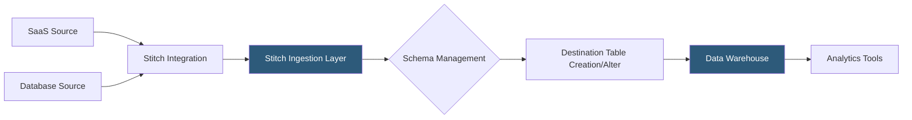

**Category:** Data Integration & ETL Automation
**Difficulty:** Beginner
**Reading time:** 5 min read

---

Stitch is a simple, cloud-hosted ELT pipeline platform (acquired by Talend in 2018, now part of Qlik) designed for fast setup and predictable row-based pricing. It provides 100+ pre-built integrations that extract data from SaaS tools and databases and load it into cloud data warehouses with minimal configuration, targeting data teams that need reliable pipelines without deep engineering involvement.

- **Row-based pricing** — Stitch charges per million rows replicated per month, making cost predictable for stable, low-volume pipelines
- **Replication frequency** — configurable sync interval from 30 minutes to 24 hours depending on the plan tier
- **Replication method** — extraction strategy per integration: log-based (CDC), key-based incremental, or full table
- **Integration** — Stitch's term for a source connector (e.g., Salesforce, MySQL, Google Analytics)
- **Destination** — supported data warehouse targets including Snowflake, BigQuery, Redshift, PostgreSQL, and Databricks
- **Schema loading** — Stitch creates and manages destination tables automatically, adding columns as source schemas evolve
- **Extraction logs** — per-sync logs showing records extracted and any field-level errors
- **Free tier** — 5 million rows/month free with limited integrations and replication frequency

Stitch operates as a fully hosted SaaS with no infrastructure to deploy. Users connect sources through an OAuth or credential-based flow in the Stitch UI and select a replication key (usually an updated_at timestamp) and frequency. Stitch handles all extraction, loading, and schema management automatically.

During replication, Stitch extracts records from the source using the configured replication method. For SaaS APIs, it uses key-based incremental extraction—querying for records with an updated_at greater than the last replication run's maximum value. For databases, Stitch supports log-based replication (MySQL binlog, PostgreSQL WAL) via the open-source Singer tap framework, which provides CDC-level accuracy without requiring full table scans.

Extracted records are buffered and bulk-loaded to the destination warehouse using native bulk-insert mechanisms (Snowflake COPY INTO, BigQuery streaming inserts, Redshift COPY). Stitch manages table creation, column addition for new fields, and type widening for changing schemas—a column that becomes a string after being an integer gets altered automatically. Data arrives in a raw schema named after the integration, with one table per source object.

Stitch is built on the Singer specification, the same open-source standard underlying many community connectors. This means Singer taps built outside Stitch can often be adapted, and Stitch exports are portable if teams later migrate to Meltano or other Singer-based runners.

- Small data teams standing up their first data warehouse pipeline in under an hour
- Non-technical analysts connecting SaaS tools to a warehouse without engineering help
- Organizations needing predictable billing based on row counts rather than MAR calculations
- Startups on tight budgets using the free tier for low-volume pipelines
- Teams that have outgrown manual CSV exports and need automated scheduled syncs

| Advantage | Disadvantage |
|-----------|--------------|
| Extremely fast setup; pipelines live in minutes not days | Fewer connectors than Fivetran; gap for niche sources is significant |
| Simple row-based pricing easy to budget and forecast | Limited customization; no connector SDK for extending or building custom connectors |
| Free tier covers many small-team use cases | Replication frequency limited on lower tiers; no real-time or sub-30-minute syncs |
| Singer-based architecture enables connector portability | Acquired by Talend/Qlik; product investment trajectory less certain than pure-play competitors |

- [Fivetran Automated Data Pipelines](fivetran-automated-data-pipelines.md)
- [Airbyte Open-Source Data Integration](airbyte-open-source-data-integration.md)
- [Segment Customer Data Platform](segment-customer-data-platform.md)

---
*Part of the [Data Integration & ETL Automation](index.md) category · [Back to Master Index](../../index.md)*
