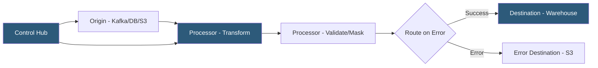

**Category:** Data Integration & ETL Automation
**Difficulty:** Advanced
**Reading time:** 6 min read

---

StreamSets (now part of Software AG) is an enterprise data integration platform focused on DataOps—treating data pipelines with the same operational discipline as software systems. It provides a visual pipeline builder for streaming and batch data flows, with built-in drift handling, data quality monitoring, and pipeline versioning designed for production-scale enterprise environments.

- **DataOps** — practice of applying DevOps principles (CI/CD, monitoring, testing) to data pipelines for reliability and agility
- **Pipeline** — visual directed acyclic graph of stages (origins, processors, destinations) defining a data flow
- **Origin** — source stage that reads data: Kafka, JDBC, S3, Salesforce, HTTP, and 100+ others
- **Processor** — transformation stage: field mapping, masking, expression evaluation, JavaScript executor, Jython
- **Destination** — sink stage writing to Kafka, databases, data lakes, or REST APIs
- **Data drift** — unexpected schema changes in source data that would break downstream pipelines; StreamSets detects and handles drift automatically
- **Control Hub** — StreamSets' central management plane for deploying, monitoring, and versioning pipelines across multiple engines
- **Transformer** — StreamSets engine for Spark-based batch transformations, complementing the streaming Data Collector engine

StreamSets Data Collector is a lightweight Java engine deployed on-premises or in the cloud. Pipelines are defined visually by connecting stage blocks representing origins, processors, and destinations. Each stage is configured through a form-based UI rather than code, making it accessible to data engineers without deep programming expertise.

Data Collector processes records in micro-batches: records flow from origin through the processor chain and land at destinations continuously. Each processor can transform, filter, route, or enrich records. Error lanes route problematic records to a dedicated error destination (S3, Kafka) rather than halting the pipeline, enabling partial failure recovery without manual intervention.

Drift synchronization is StreamSets' differentiating feature. When a source schema changes—a new column appears in a database table, a JSON payload adds a new field—StreamSets detects the drift during runtime and either propagates it downstream automatically (creating a new column in the destination) or routes the drifted record to an alert queue for review. This prevents the pipeline from silently dropping data or failing entirely.

Control Hub provides centralized governance across many Data Collector instances. Teams publish pipeline versions to Control Hub and deploy them to specific engines via environments (dev/staging/prod). Pipeline metrics—records per second, error rate, stage latency—stream into Control Hub's monitoring dashboards. Topology views show how pipelines interconnect across the data infrastructure.

StreamSets Transformer adds Spark integration for batch transformations, enabling SQL-based or code-based heavy transformations that run on existing Hadoop or Databricks clusters without spinning up new infrastructure.

- Enterprise ETL modernization replacing legacy Informatica or DataStage pipelines with a cloud-native visual tool
- Multi-region data center pipeline replication with drift handling for heterogeneous database schemas
- Healthcare or financial data pipelines requiring field-level masking and audit logging in every transformation
- Parallel migration strategies where the same data flows to both old and new destination systems simultaneously
- Large enterprises needing centralized pipeline governance across 50+ deployed pipeline engines

| Advantage | Disadvantage |
|-----------|--------------|
| Automatic drift handling prevents pipeline failures from schema changes | Enterprise licensing costs are significant compared to open-source alternatives |
| Control Hub provides centralized governance for large pipeline estates | Steeper learning curve than simpler tools; complex pipelines require significant configuration |
| Visual pipeline builder reduces development time for standard transformations | Less flexible than code-based tools for highly custom transformation logic |
| DataOps-native design includes versioning, testing, and CI/CD integration | Acquired by Software AG; product roadmap and community activity less transparent |

- [Apache Kafka Data Streaming](apache-kafka-data-streaming.md)
- [Matillion Data Transformation](matillion-data-transformation.md)
- [Apache Beam Unified Data Processing](apache-beam-unified-data-processing.md)

---
*Part of the [Data Integration & ETL Automation](index.md) category · [Back to Master Index](../../index.md)*
