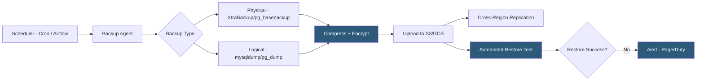

**Category:** Database Hosting
**Difficulty:** Intermediate
**Reading time:** 5 min read

---

Database backup automation schedules, executes, verifies, and stores database backups without manual intervention, ensuring consistent recovery points are available when needed. Automated backup pipelines include logical exports, physical snapshots, offsite replication, and regular restore testing to meet RPO requirements and compliance obligations.

- **Logical backup** — export of SQL INSERT statements or CSV data; portable but slow for large databases (mysqldump, pg_dump)
- **Physical backup** — copy of database binary files; faster for large databases but less portable (Percona XtraBackup, pg_basebackup)
- **Incremental backup** — backs up only changes since the last full or incremental backup; reduces backup window and storage
- **pg_basebackup** — PostgreSQL's built-in physical backup tool; captures a consistent base backup with WAL for recovery
- **Percona XtraBackup** — open-source hot backup tool for MySQL/MariaDB; takes physical backups without locking tables
- **Backup verification** — automated process of restoring a backup to a test environment and running integrity checks; confirms backup usability
- **Offsite replication** — copying backups to a geographically separate location (S3 cross-region, different cloud provider) to protect against datacenter failures
- **Retention policy** — rules defining how long each backup type is kept (daily for 7 days, weekly for 4 weeks, monthly for 12 months)

Database backup automation begins with a scheduler (cron, Airflow, cloud-native schedulers) triggering backup scripts at defined intervals. For MySQL hosting environments, Percona XtraBackup performs hot physical backups by copying InnoDB data files while the server is running, using undo logs to ensure a consistent point-in-time snapshot without table locks. For PostgreSQL, `pg_basebackup` captures the data directory in a consistent state while WAL archiving captures all changes during the backup window for point-in-time recovery.

Backups are immediately compressed (gzip, zstd for better ratios) and encrypted (AES-256) before upload to object storage. Encryption keys should be managed separately from the backup storage—AWS KMS or HashiCorp Vault for key management. Upload to S3 or GCS uses multipart upload for large files with checksums to detect transmission corruption.

Cross-region replication applies automatically: S3 Cross-Region Replication or GCS multi-region storage copies backups to a second region independently of the backup process, ensuring geographic redundancy without additional scripting.

Backup verification is the most frequently skipped but most critical step. An automated weekly restore test downloads the latest backup to a separate database server or cloud instance, runs the restore procedure, and executes verification queries (row counts, spot-check data integrity, application smoke tests). If the restore fails or data checks fail, an alert fires before the backup is needed in an emergency.

Retention management deletes old backups per the retention policy, balancing storage cost against recovery flexibility. The Grandfather-Father-Son (GFS) rotation pattern retains daily backups for 7 days, weekly backups for 4 weeks, and monthly backups for 12 months.

- Automated nightly full backup + hourly WAL archiving for a SaaS platform's PostgreSQL database
- Percona XtraBackup scheduled on MySQL replicas to avoid backup I/O impacting the primary
- Automated weekly restore test to a separate RDS instance, running application schema validation
- S3 lifecycle rules implementing GFS retention: deleting daily backups after 7 days automatically
- Immutable S3 Object Lock enabling WORM (Write Once, Read Many) backups for ransomware protection

| Advantage | Disadvantage |
|-----------|--------------|
| Automated scheduling eliminates human error and ensures consistent backup cadence | Automation failures (disk full, cloud credential expiry) may silently skip backups without monitoring |
| Physical backups of multi-TB databases complete in hours vs days for logical exports | Physical backups are version-specific; restoring to a different major database version requires logical backup |
| Compression and encryption reduce storage costs while meeting compliance requirements | Encrypted backups require secure key management; losing the key means losing the backup |
| Cross-region replication protects against datacenter failures | Cross-region storage and egress costs can be significant for large databases |

- [Point-in-Time Recovery](point-in-time-recovery.md)
- [Database Disaster Recovery](database-disaster-recovery.md)
- [Database High Availability](database-high-availability.md)

---
*Part of the [Database Hosting](index.md) category · [Back to Master Index](../../index.md)*
