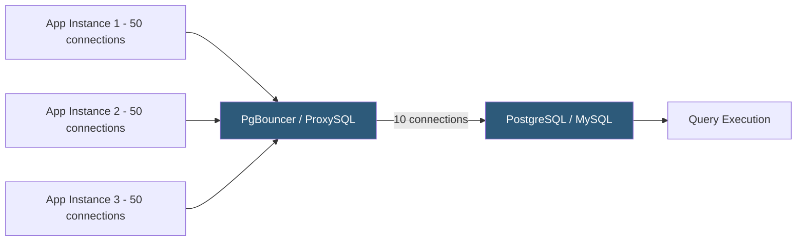

**Category:** Database Hosting
**Difficulty:** Intermediate
**Reading time:** 6 min read

---

Database connection pooling maintains a pool of pre-established database connections that application instances reuse, eliminating the latency and resource overhead of creating new connections for each query. In high-concurrency hosting environments, pooling is essential for preventing connection exhaustion and reducing database server memory consumption from thousands of idle connections.

- **Connection pool** — a cache of established, ready-to-use database connections managed by pooler software or application frameworks
- **PgBouncer** — lightweight PostgreSQL connection pooler with transaction, session, and statement pooling modes
- **ProxySQL** — advanced MySQL/MariaDB proxy providing connection pooling, read/write splitting, query routing, and caching
- **Transaction pooling** — reuses a connection for the duration of a transaction only; maximum efficiency but incompatible with session-level settings
- **Session pooling** — dedicates a backend connection to a client connection for its entire lifetime; safest but least efficient
- **Pool size** — number of backend database connections the pooler maintains; should match database's optimal concurrent query count
- **Max client connections** — maximum application connections the pooler accepts; much larger than pool size, with overflow queued
- **Connection timeout** — maximum time a client waits for a pool connection; exceeding this returns an error to the application

Without connection pooling, each application thread creates a new database connection for each request or maintains a persistent idle connection. A web server with 500 worker processes maintaining persistent connections means 500 open PostgreSQL backends, each consuming ~5–10MB RAM. At 1,000 connections, that's 5–10GB of RAM just for idle connections—a significant portion of a database server's memory budget.

PgBouncer sits between the application and PostgreSQL as a transparent proxy. Applications connect to PgBouncer on the standard PostgreSQL port; PgBouncer maintains a pool of real PostgreSQL connections. In transaction pooling mode (most efficient), a backend connection is assigned to a client only for the duration of a transaction—as soon as `COMMIT` or `ROLLBACK` executes, the connection returns to the pool and can immediately serve another client. This means 50 backend connections can serve 2,000 concurrent clients, as long as each client's average transaction time is short.

Transaction pooling has limitations: session-level settings (`SET search_path`, advisory locks, prepared statements) don't persist across transactions since different backend connections serve each transaction. Applications must avoid session-level state or use PgBouncer's prepared statement tracking feature (Bouncer 1.21+).

ProxySQL offers similar pooling for MySQL with additional features: query routing rules that send writes to the primary and reads to replicas, query caching for repeated identical queries, and circuit breaking that detects failing backends and routes around them. ProxySQL's rule engine can also rewrite queries, add query hints, or throttle specific query patterns.

Connection pool sizing is critical: too few backend connections underutilizes the database, while too many creates excessive context switching. A common starting point for PostgreSQL is `2 * CPU_cores + effective_spindle_count`, typically 8–32 connections for most workloads.

- PgBouncer between a Rails application and PostgreSQL, reducing backend connections from 500 to 20
- ProxySQL proxying all MySQL traffic in a LAMP stack, enabling transparent read/write splitting
- Kubernetes environments where ephemeral pods create and destroy database connections frequently
- Serverless functions (AWS Lambda) where each invocation creates a new connection; poolers like RDS Proxy maintain persistent pools
- Multi-tenant SaaS platforms sharing a database server across hundreds of tenants without per-tenant connection overhead

| Advantage | Disadvantage |
|-----------|--------------|
| Reduces database server memory usage from thousands of connections to tens | Transaction pooling mode incompatible with session-level PostgreSQL features |
| Eliminates connection establishment latency (~5–50ms per new connection) | Adds a proxy hop; pooler failure becomes a single point of failure requiring its own HA |
| Enables much higher application concurrency without scaling the database | Pool size tuning requires understanding workload; wrong sizing causes queuing or underutilization |
| ProxySQL enables transparent read/write splitting without application changes | Serverless functions require managed poolers (RDS Proxy, PgBouncer as a service) |

- [MySQL Optimization for Hosting](mysql-optimization-for-hosting.md)
- [PostgreSQL Performance Tuning](postgresql-performance-tuning.md)
- [Database High Availability](database-high-availability.md)

---
*Part of the [Database Hosting](index.md) category · [Back to Master Index](../../index.md)*
