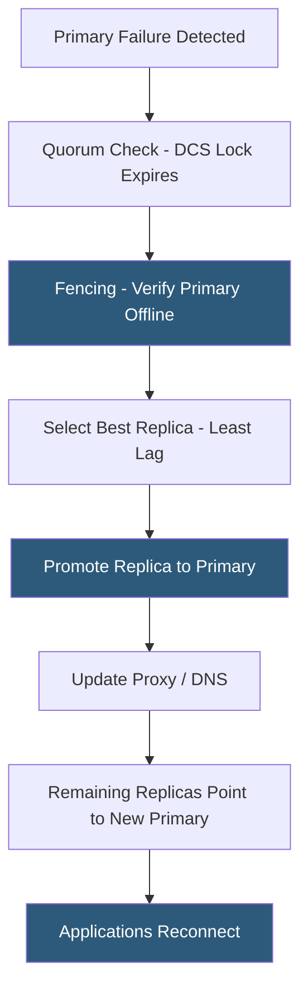

**Category:** Database Hosting
**Difficulty:** Advanced
**Reading time:** 5 min read

---

Database failover mechanisms are the automated or manual procedures that promote a standby database to become the new primary when the original primary fails. Effective failover mechanisms minimize downtime, prevent data loss, and ensure a consistent, writable database is available to applications within the target RTO without human intervention.

- **Automatic failover** — system-initiated promotion of a replica triggered by failure detection without operator action
- **Manual failover (switchover)** — operator-initiated controlled promotion, typically for planned maintenance with zero data loss
- **Failover candidate** — replica eligible for promotion; selection criteria include replication lag, replica priority, and data completeness
- **Promotion** — process of reconfiguring a replica to become the primary: stopping replication, enabling writes, and updating topology records
- **Split-brain prevention** — ensuring only one primary exists at any time; implemented via quorum, fencing, or lock-based mechanisms
- **DNS failover** — updating a CNAME or A record to point to the new primary's IP; simple but limited by DNS TTL delay
- **Proxy-based failover** — HAProxy or ProxySQL detects the new primary via health checks and re-routes connections instantly
- **Connection draining** — gracefully completing in-flight transactions before rerouting connections during a planned switchover

Automatic failover proceeds through a sequence of steps governed by HA software. Failure detection begins when the monitoring agent (Patroni, Orchestrator, MHA) fails to receive heartbeats from the primary within the configured threshold (typically 10–30 seconds). Multiple agents cross-check to avoid false positives—a single monitor declaring failure could be due to a network partition between the monitor and primary, not actual primary failure.

Fencing is executed before any promotion occurs. STONITH mechanisms (cloud API calls to stop/restart the failed instance, IPMI power-off, or hypervisor-level commands) verify the old primary is genuinely offline. Without fencing, the old primary could recover mid-failover while the new primary is already accepting writes, creating a split-brain scenario with two primaries writing conflicting data.

Replica selection evaluates candidates by replication lag (measured in bytes of unapplied WAL/binlog), configured priority, and replication mode (synchronous replicas are preferred as they have zero data divergence). The selected replica performs promotion: PostgreSQL standbys stop recovery mode and create a `standby.signal` removal; MySQL replicas execute `STOP REPLICA; RESET REPLICA ALL; SET GLOBAL read_only=OFF`.

After promotion, traffic is redirected via proxy reconfiguration (HAProxy detects the new primary through health check polling within seconds) or DNS updates (slower due to TTL). Remaining replicas must be repointed to the new primary. In GTID-based MySQL replication, replicas automatically calculate their position relative to the new primary. In non-GTID setups or PostgreSQL pre-Patroni, this requires manual `CHANGE REPLICATION SOURCE` commands or automated topology management.

RTO for automated failover typically ranges from 15 seconds (Patroni with fast DCS timeouts) to 2 minutes (cloud managed service failover like RDS Multi-AZ).

- Patroni automated failover for a SaaS platform's PostgreSQL cluster during an availability zone failure
- MySQL Orchestrator coordinating failover across a 10-node topology when the primary crashes
- AWS RDS Multi-AZ automated failover completing in under 60 seconds for a production RDS instance
- Planned switchover during a primary server maintenance window with zero data loss using synchronous replication
- Testing failover procedures monthly in a staging environment to validate RTO objectives

| Advantage | Disadvantage |
|-----------|--------------|
| Automated failover achieves RTO of seconds to minutes without human intervention | Automated failover complexity introduces potential for cascading failures if misconfigured |
| Proxy-based traffic re-routing is instantaneous vs minutes for DNS TTL propagation | Applications experience connection resets during failover; must implement reconnection with retry logic |
| Fencing prevents split-brain even if the failed primary self-recovers | Fencing requires integration with cloud APIs or IPMI; misconfigured fencing can block legitimate failovers |
| GTID simplifies replica repointing after failover without manual position calculation | Non-GTID MySQL topologies require careful manual coordination of replica repointing post-failover |

- [Database High Availability](database-high-availability.md)
- [Master-Slave Replication](master-slave-replication.md)
- [Database Disaster Recovery](database-disaster-recovery.md)

---
*Part of the [Database Hosting](index.md) category · [Back to Master Index](../../index.md)*
