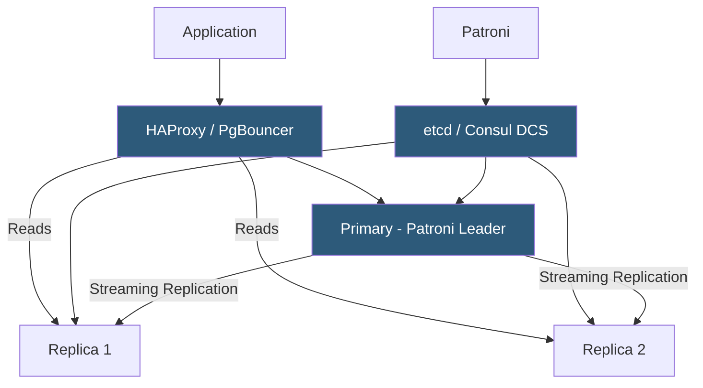

**Category:** Database Hosting
**Difficulty:** Advanced
**Reading time:** 6 min read

---

Database high availability (HA) architecture eliminates single points of failure through redundancy, automated failover, and health monitoring, ensuring databases continue serving applications despite hardware failures, software crashes, or planned maintenance. Modern HA designs achieve 99.99%+ uptime by combining synchronous replication, quorum-based failure detection, and automated recovery orchestration.

- **RTO (Recovery Time Objective)** — maximum acceptable time for a database to be unavailable after a failure; drives HA architecture choices
- **RPO (Recovery Point Objective)** — maximum acceptable data loss measured in time; drives replication synchrony requirements
- **Patroni** — Python-based PostgreSQL HA framework using etcd/Consul/ZooKeeper for leader election and automated failover
- **Orchestrator** — MySQL topology manager providing automated failover, replication topology visualization, and anti-split-brain protection
- **HAProxy** — load balancer commonly fronting database clusters; health checks remove failed nodes from the pool instantly
- **VIP (Virtual IP)** — floating IP address that always points to the current primary; Pacemaker or keepalived manages VIP assignment
- **Fencing (STONITH)** — "Shoot The Other Node In The Head"; mechanism to ensure a failed primary is truly offline before promoting a replica, preventing split-brain
- **Heartbeat** — periodic signal exchanged between HA nodes to detect failures; missed heartbeats trigger failover procedures

Modern database HA relies on three components working together: replication for data redundancy, a distributed consensus system for failure detection and leader election, and an orchestration layer for automated failover.

Patroni (for PostgreSQL) runs as a daemon on each cluster node. Each Patroni instance registers with a Distributed Configuration Store (DCS)—typically etcd, Consul, or ZooKeeper—and competes for a primary lock. The node holding the lock runs as primary; others run as streaming replicas. Patroni writes heartbeats to the DCS every few seconds; if the primary fails to renew its lock (heartbeat timeout), the lock expires, and a replica acquires it, triggering automatic promotion. Fencing ensures the old primary is demoted before the new primary starts accepting writes—Patroni can call a fencing script that powers off the failed server via IPMI or cloud API before promotion completes.

HAProxy or a load balancer sits in front of the cluster. It checks each Patroni endpoint's health API (`/primary` returns 200 for the active primary, 503 otherwise) and routes writes to the primary and reads to any healthy replica. When failover occurs, HAProxy's health checks detect the new primary within seconds and update routing automatically—applications experience a brief connection error during failover but reconnect to the new primary without configuration changes.

For MySQL, Orchestrator provides topology visualization and automated failover. It monitors all MySQL instances via replication status polling, constructs a topology graph, and on primary failure, selects the most up-to-date replica (least replication lag) as the new primary. Orchestrator applies anti-split-brain protection by blocking promotions if the original primary is still reachable from other parts of the network.

Cloud-native HA solutions (AWS RDS Multi-AZ, Cloud SQL HA, Azure Database for PostgreSQL Flexible Server HA) implement similar patterns within managed services, providing automated failover within 30–60 seconds with no infrastructure management.

- Production SaaS databases requiring sub-60-second automatic failover without manual intervention
- Hosting control panel databases (cPanel, Plesk) where database downtime blocks all customer operations
- E-commerce platforms requiring continuous availability during peak traffic periods
- Multi-AZ PostgreSQL clusters using Patroni + etcd for cloud-agnostic HA independent of cloud managed services
- Scheduled maintenance windows requiring zero-downtime: promote replica to primary, patch original, promote back

| Advantage | Disadvantage |
|-----------|--------------|
| Automatic failover achieves sub-60-second recovery without human intervention | HA infrastructure (Patroni, etcd, HAProxy) adds operational complexity compared to single-instance |
| Synchronous replication (RPO=0) prevents data loss on primary failure | Synchronous replication adds write latency proportional to network round-trip to synchronized replica |
| HAProxy health checks provide instant traffic rerouting on failure | Fencing misconfiguration can cause split-brain; DCS quorum loss can block legitimate failovers |
| Cloud managed HA (RDS Multi-AZ) eliminates infrastructure management | Cloud managed HA within single region doesn't protect against regional outages |

- [Database Failover Mechanisms](database-failover-mechanisms.md)
- [Master-Slave Replication](master-slave-replication.md)
- [Database Disaster Recovery](database-disaster-recovery.md)

---
*Part of the [Database Hosting](index.md) category · [Back to Master Index](../../index.md)*
